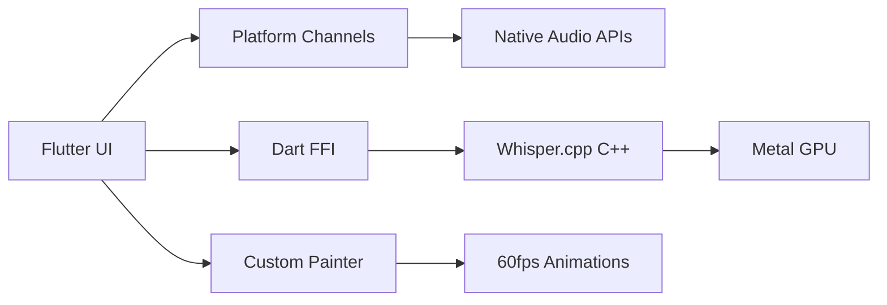

# 🎙️ Flutter Voice Bridge

> **A production-ready Flutter app demonstrating advanced platform integrations with offline AI transcription**

[](https://flutter.dev/)
[](https://flutter.dev/)
[](LICENSE)
[](https://github.com/ggerganov/whisper.cpp)

## ⚡ Quick Demo

1. **Clone & Run** (60 seconds):
   ```bash
   git clone https://github.com/esrakadah/flutter_voice_bridge.git
   cd flutter_voice_bridge
   flutter pub get
   ./scripts/build_whisper.sh  # Downloads AI model + compiles native library
   flutter run -d macos        # Or iOS/Android
   ```

2. **Try It Out**:
   - 🎤 Tap record → speak for 10 seconds → tap stop
   - 🤖 Watch console logs for AI transcription results
   - 🎨 Tap animation preview for fullscreen visualizations
   - ⚡ GPU-accelerated on Apple Silicon (M1/M2/M3)

## 🏆 What Makes This Special

### **✅ Production-Ready Features**
- **Offline AI**: 147MB Whisper model, no internet required
- **Cross-Platform**: iOS, macOS, Android native integration
- **GPU Acceleration**: Metal GPU support on Apple Silicon
- **Advanced Animations**: 4 modes with 60fps hardware acceleration
- **Clean Architecture**: MVVM with dependency injection

### **🔧 Advanced Flutter Techniques**
- **Platform Channels**: Bidirectional native communication
- **Dart FFI**: Direct C++ library integration
- **Custom Renderers**: Hardware-accelerated custom painters
- **Process.run**: System command execution
- **BLoC State Management**: Reactive programming patterns

## 📚 Learning Resources

| Document | Purpose | For Who |
|----------|---------|---------|
| [SETUP.md](SETUP.md) | Complete setup guide | New contributors |
| [ARCHITECTURE.md](ARCHITECTURE.md) | Technical deep dive | Advanced developers |
| [WORKSHOP_GUIDE.md](WORKSHOP_GUIDE.md) | Learning modules | Students/educators |
| [FEATURE_STATUS.md](FEATURE_STATUS.md) | Implementation status | Project managers |

## 🚀 Perfect For

- **Flutter Developers** learning advanced platform integration
- **AI Enthusiasts** exploring offline speech recognition
- **Students** studying clean architecture patterns
- **Educators** teaching advanced mobile development
- **Companies** building offline-first apps

## 🎯 Technical Highlights



- **Platform Channels**: iOS/Android audio recording integration
- **FFI Performance**: Direct C++ calls for AI processing
- **GPU Computing**: Metal acceleration on Apple devices
- **Memory Safety**: Proper resource management across boundaries

## ⭐ Star & Contribute

If this project helps you learn something new:
1. ⭐ **Star this repository**
2. 🐛 **Report issues** you find
3. 💡 **Suggest improvements**
4. 🔧 **Submit pull requests**

## 📞 Support

- 🐛 **Issues**: [GitHub Issues](https://github.com/esrakadah/flutter_voice_bridge/issues)
- 💬 **Discussions**: [GitHub Discussions](https://github.com/esrakadah/flutter_voice_bridge/discussions)
- 📖 **Documentation**: Complete guides in repository

---

**Built with ❤️ for the Flutter community** 