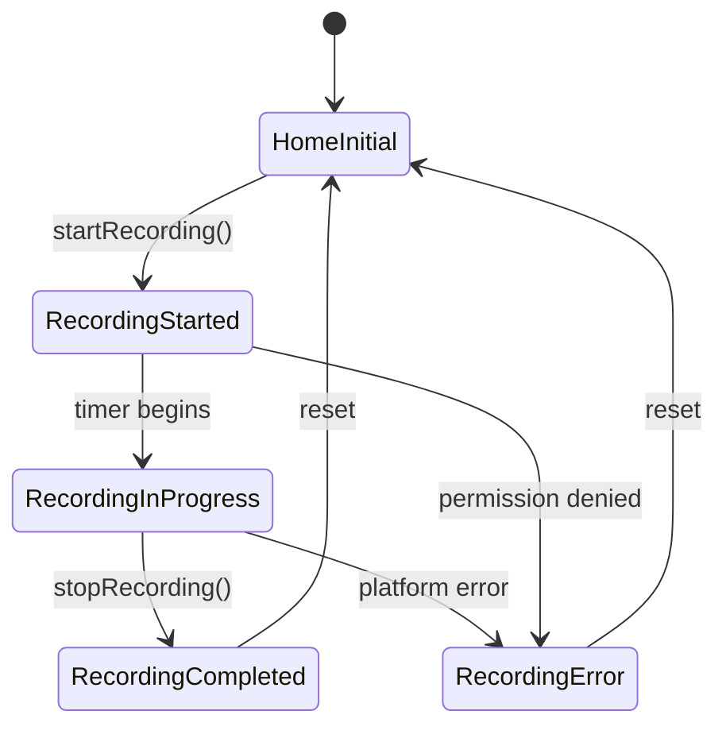

# 🏗️ Architecture Deep Dive

Technical implementation guide for Voice Bridge AI's advanced Flutter integrations.

> **Current Status**: ✅ **Production Ready** - Transcription working on iOS/macOS  
> **For Overview**: See [README.md](./README.md) for project setup and [FEATURE_STATUS.md](./FEATURE_STATUS.md) for implementation checklist

## 🎯 Technical Architecture

### System Design Principles

**Clean Architecture (MVVM)** with **Reactive Programming**:

```
┌─────────────────────────────────────────────────────────────┐
│                    PRESENTATION LAYER                      │
│  ┌─────────────────┐  ┌─────────────────┐  ┌──────────────┐ │
│  │   HomeView      │  │   Components    │  │   Widgets    │ │
│  │  (BlocBuilder)  │  │   (Reusable)    │  │   (Atomic)   │ │
│  └─────────────────┘  └─────────────────┘  └──────────────┘ │
└─────────────────────────────────────────────────────────────┘
                               │ User Events
                               ▼
┌─────────────────────────────────────────────────────────────┐
│                   BUSINESS LOGIC LAYER                     │
│  ┌─────────────────┐  ┌─────────────────┐  ┌──────────────┐ │
│  │   HomeCubit     │  │   HomeState     │  │  Transitions │ │
│  │ (State Mgmt)    │  │  (Immutable)    │  │  (Events)    │ │
│  └─────────────────┘  └─────────────────┘  └──────────────┘ │
└─────────────────────────────────────────────────────────────┘
                               │ Business Logic
                               ▼
┌─────────────────────────────────────────────────────────────┐
│                      DATA LAYER                           │
│  ┌─────────────────┐  ┌─────────────────┐  ┌──────────────┐ │
│  │ AudioService    │  │  VoiceMemo      │  │ VoiceMemo    │ │
│  │ (Interface)     │  │   (Model)       │  │  Service     │ │
│  └─────────────────┘  └─────────────────┘  └──────────────┘ │
└─────────────────────────────────────────────────────────────┘
                               │ Platform Integration
                               ▼
┌─────────────────────────────────────────────────────────────┐
│                    PLATFORM LAYER                         │
│  ┌─────────────────┐  ┌─────────────────┐  ┌──────────────┐ │
│  │PlatformChannels │  │  iOS Native     │  │Android Native│ │
│  │ (Method Bridge) │  │(AVAudioRecorder)│  │(MediaRecorder)│ │
│  └─────────────────┘  └─────────────────┘  └──────────────┘ │
└─────────────────────────────────────────────────────────────┘
```

## 📁 Code Organization

### Project Structure
```
lib/
├── core/                           # Platform abstractions
│   ├── audio/
│   │   ├── audio_service.dart      # Abstract interface (ISP)
│   │   └── platform_audio_service.dart # Platform Channel impl
│   ├── transcription/              # ✅ WORKING: AI services
│   │   ├── transcription_service.dart   # Transcription interface
│   │   └── whisper_ffi_service.dart     # Whisper FFI implementation
│   └── platform/
│       └── platform_channels.dart  # Native method bridge
├── data/
│   ├── models/
│   │   └── voice_memo.dart         # Domain entity
│   └── services/
│       └── voice_memo_service.dart # Data persistence contract
├── ui/
│   ├── views/home/
│   │   ├── home_view.dart          # UI Component (Stateless)
│   │   ├── home_cubit.dart         # Business Logic
│   │   └── home_state.dart         # State Definitions
│   ├── widgets/                    # Reusable components
│   └── components/                 # Atomic UI elements
├── app.dart                        # App configuration
├── main.dart                       # DI setup + App bootstrap
└── di.dart                         # Service locator config
```

### Design Pattern Implementation

#### 1. Interface Segregation (SOLID)
```dart
// Abstract contract - no platform dependencies
abstract class AudioService {
  Future<String> startRecording();
  Future<String> stopRecording();
  Future<String> playRecording(String filePath);
  Future<bool> hasPermission();
  Future<void> requestPermission();
}

// Platform-specific implementation
class PlatformAudioService implements AudioService {
  @override
  Future<String> startRecording() async {
    return await PlatformChannels.startRecording();
  }
}
```

**Benefits:**
- ✅ Testable with mock implementations
- ✅ Platform-agnostic business logic
- ✅ Easy to swap implementations (FFI, Web, etc.)

#### 2. Dependency Injection Pattern
```dart
// Service registration
final getIt = GetIt.instance;

void setupDependencies() {
  // Singletons for stateless services
  getIt.registerSingleton<AudioService>(PlatformAudioService());
  getIt.registerSingleton<VoiceMemoService>(VoiceMemoServiceImpl());
  
  // Factories for stateful components
  getIt.registerFactory<HomeCubit>(() => HomeCubit(
    audioService: getIt<AudioService>(),
    voiceMemoService: getIt<VoiceMemoService>(),
  ));
}
```

**Benefits:**
- ✅ Loose coupling between layers
- ✅ Easy mocking for unit tests
- ✅ Single source of truth for dependencies

#### 3. BLoC/Cubit State Management
```dart
// State definitions - immutable
abstract class HomeState extends Equatable {
  const HomeState();
  @override
  List<Object?> get props => [];
}

class HomeInitial extends HomeState {
  const HomeInitial();
}

class RecordingInProgress extends HomeState {
  final Duration recordingDuration;
  final String? recordingPath;
  
  const RecordingInProgress({
    this.recordingDuration = Duration.zero,
    this.recordingPath,
  });
  
  @override
  List<Object?> get props => [recordingDuration, recordingPath];
}

// Business logic container
class HomeCubit extends Cubit<HomeState> {
  final AudioService _audioService;
  
  HomeCubit({required AudioService audioService}) 
      : _audioService = audioService,
        super(const HomeInitial());
        
  Future<void> startRecording() async {
    try {
      emit(const RecordingStarted());
      final String filePath = await _audioService.startRecording();
      emit(RecordingInProgress(recordingPath: filePath));
    } catch (e) {
      emit(RecordingError(errorMessage: e.toString()));
    }
  }
}
```

## 🔌 Platform Channel Implementation

### Channel Configuration
```dart
class PlatformChannels {
  static const String _audioChannelName = 'voice.bridge/audio';
  static const MethodChannel _audioChannel = MethodChannel(_audioChannelName);
  
  static Future<String> startRecording() async {
    developer.log('🎤 [PlatformChannels] Starting recording', 
                  name: 'VoiceBridge.Audio');
    
    try {
      final String result = await _audioChannel.invokeMethod('startRecording');
      developer.log('✅ [PlatformChannels] Success: $result', 
                    name: 'VoiceBridge.Audio');
      return result;
    } on PlatformException catch (e) {
      developer.log('❌ [PlatformChannels] Error: ${e.code} - ${e.message}', 
                    name: 'VoiceBridge.Audio', error: e);
      rethrow;
    }
  }
  
  static Future<String> playRecording(String filePath) async {
    developer.log('🔊 [PlatformChannels] Playing recording: $filePath', 
                  name: 'VoiceBridge.Audio');
    
    try {
      final String result = await _audioChannel.invokeMethod('playRecording', {
        'path': filePath,
      });
      developer.log('✅ [PlatformChannels] Playback started: $result', 
                    name: 'VoiceBridge.Audio');
      return result;
    } on PlatformException catch (e) {
      developer.log('❌ [PlatformChannels] Playback error: ${e.code} - ${e.message}', 
                    name: 'VoiceBridge.Audio', error: e);
      rethrow;
    }
  }
}
```

### iOS Native Implementation
```swift
// AppDelegate.swift - Platform channel handler
private func startRecording(result: @escaping FlutterResult) {
    NSLog("🎤 [iOS] startRecording called")
    
    switch audioSession.recordPermission {
    case .granted:
        NSLog("✅ [iOS] Permission granted")
        beginRecording(result: result)
    case .denied:
        NSLog("❌ [iOS] Permission denied")
        result(FlutterError(code: "PERMISSION_DENIED", 
                           message: "Microphone access denied", 
                           details: nil))
    case .undetermined:
        NSLog("❓ [iOS] Requesting permission...")
        audioSession.requestRecordPermission { [weak self] granted in
            DispatchQueue.main.async {
                if granted {
                    self?.beginRecording(result: result)
                } else {
                    result(FlutterError(code: "PERMISSION_DENIED", 
                                       message: "User denied permission", 
                                       details: nil))
                }
            }
        }
    }
}

private func beginRecording(result: @escaping FlutterResult) {
    do {
        // Configure AVAudioSession
        try audioSession.setCategory(.playAndRecord, mode: .default)
        try audioSession.setActive(true)
        
        // Setup recording parameters (WAV format for Whisper compatibility)
        let settings = [
            AVFormatIDKey: Int(kAudioFormatLinearPCM),
            AVSampleRateKey: 16000.0,  // 16kHz is optimal for speech recognition
            AVNumberOfChannelsKey: 1,   // Mono for speech
            AVLinearPCMBitDepthKey: 16, // 16-bit depth
            AVLinearPCMIsFloatKey: false,
            AVLinearPCMIsBigEndianKey: false
        ]
        
        // Generate file path (using WAV format for Whisper compatibility)
        let documentsPath = FileManager.default.urls(for: .documentDirectory, 
                                                    in: .userDomainMask)[0]
        let audioDir = documentsPath.appendingPathComponent("audio")
        
        // Create audio directory if it doesn't exist
        if !FileManager.default.fileExists(atPath: audioDir.path) {
            try FileManager.default.createDirectory(at: audioDir, withIntermediateDirectories: true, attributes: nil)
        }
        
        let timestamp = Int64(Date().timeIntervalSince1970 * 1000)
        let audioFilename = audioDir.appendingPathComponent("voice_memo_\(timestamp).wav")
        
        // Create and start recorder
        audioRecorder = try AVAudioRecorder(url: audioFilename, settings: settings)
        audioRecorder?.record()
        
        NSLog("✅ [iOS] Recording started: \(audioFilename.path)")
        result(audioFilename.path)
        
    } catch {
        NSLog("💥 [iOS] Recording error: \(error)")
        result(FlutterError(code: "RECORDING_ERROR", 
                           message: error.localizedDescription, 
                           details: nil))
    }
}
```

### Android Native Implementation
```kotlin
// MainActivity.kt - Platform channel handler with MediaPlayer integration
class MainActivity: FlutterActivity(), MediaPlayer.OnCompletionListener, MediaPlayer.OnErrorListener {
    private val CHANNEL = "voice.bridge/audio"
    private val TAG = "FlutterVoiceBridge"
    
    // Playback related
    private var mediaPlayer: MediaPlayer? = null
    private var audioManager: AudioManager? = null
    private var isPlaying = false

    private fun playRecording(path: String, result: MethodChannel.Result) {
        Log.d(TAG, "🔊 [Android] playRecording called with path: $path")
        
        // Stop any current playback first (idempotent behavior)
        if (mediaPlayer != null && isPlaying) {
            Log.d(TAG, "⏹️ [Android] Stopping current playback before starting new one")
            stopPlayback()
        }
        
        // Validate file existence
        val file = File(path)
        if (!file.exists()) {
            Log.e(TAG, "❌ [Android] File does not exist at path: $path")
            result.error("FILE_NOT_FOUND", "Audio file not found at specified path", path)
            return
        }
        
        // Request audio focus
        val audioFocusResult = audioManager?.requestAudioFocus(
            null, 
            AudioManager.STREAM_MUSIC, 
            AudioManager.AUDIOFOCUS_GAIN_TRANSIENT
        )
        
        if (audioFocusResult != AudioManager.AUDIOFOCUS_REQUEST_GRANTED) {
            Log.e(TAG, "❌ [Android] Failed to gain audio focus")
            result.error("AUDIO_FOCUS_ERROR", "Failed to gain audio focus for playback", null)
            return
        }
        
        // Create and start MediaPlayer
        try {
            mediaPlayer = MediaPlayer().apply {
                setDataSource(path)
                setOnCompletionListener(this@MainActivity)
                setOnErrorListener(this@MainActivity)
                setAudioStreamType(AudioManager.STREAM_MUSIC)
                prepare()
                start()
            }
            
            isPlaying = true
            Log.d(TAG, "✅ [Android] Playback started successfully")
            result.success("Playback started")
            
        } catch (e: Exception) {
            Log.e(TAG, "💥 [Android] Error creating media player: ${e.message}")
            audioManager?.abandonAudioFocus(null)
            result.error("PLAYER_ERROR", "Failed to create audio player: ${e.message}", e.message)
        }
    }
    
    // MediaPlayer.OnCompletionListener implementation
    override fun onCompletion(mp: MediaPlayer?) {
        Log.d(TAG, "🏁 [Android] Playback completed successfully")
        isPlaying = false
        mediaPlayer?.release()
        mediaPlayer = null
        audioManager?.abandonAudioFocus(null)
    }
    
    // MediaPlayer.OnErrorListener implementation
    override fun onError(mp: MediaPlayer?, what: Int, extra: Int): Boolean {
        Log.e(TAG, "💥 [Android] MediaPlayer error occurred - what: $what, extra: $extra")
        isPlaying = false
        mediaPlayer?.release()
        mediaPlayer = null
        audioManager?.abandonAudioFocus(null)
        return true // Handled the error
    }
}
```

## 🔄 Data Flow Architecture

### User Interaction Flow
```
1. User taps microphone button
   └─> HomeView onPressed()
       └─> BlocProvider.of<HomeCubit>(context).startRecording()
           └─> HomeCubit.startRecording()
               └─> AudioService.startRecording()
                   └─> PlatformChannels.startRecording()
                       └─> MethodChannel.invokeMethod('startRecording')
                           └─> iOS AppDelegate.startRecording()
                               └─> AVAudioRecorder.record()
                           └─> Android MainActivity.startRecording()
                               └─> MediaRecorder.start()

2. Native response flows back
   └─> Flutter Result<String> (file path)
       └─> PlatformChannels returns path
           └─> AudioService returns path
               └─> HomeCubit.emit(RecordingInProgress(path))
                   └─> BlocBuilder rebuilds UI
                       └─> HomeView shows recording state

3. Playback flow (cross-platform)
   └─> User taps play button for recording
       └─> HomeCubit.playRecording(path)
           └─> AudioService.playRecording(path)
               └─> PlatformChannels.playRecording(path)
                   └─> MethodChannel.invokeMethod('playRecording', {'path': path})
                       └─> iOS AppDelegate.playRecording()
                           └─> AVAudioPlayer.play()
                       └─> Android MainActivity.playRecording()
                           └─> MediaPlayer.start()
```

### State Transition Diagram


## 🔍 Error Handling Strategy

### Layered Error Management
```dart
// Platform layer - catches native exceptions
try {
  final result = await _audioChannel.invokeMethod('startRecording');
  return result;
} on PlatformException catch (e) {
  if (e.code == 'PERMISSION_DENIED') {
    throw AudioPermissionException(e.message ?? 'Microphone access denied');
  }
  throw AudioRecordingException('Recording failed: ${e.message}');
}

// Android-specific playback error handling
try {
  final result = await _audioChannel.invokeMethod('playRecording', {'path': filePath});
  return result;
} on PlatformException catch (e) {
  switch (e.code) {
    case 'FILE_NOT_FOUND':
      throw AudioFileNotFoundException(e.message ?? 'Audio file not found');
    case 'AUDIO_FOCUS_ERROR':
      throw AudioFocusException(e.message ?? 'Failed to gain audio focus');
    case 'PLAYER_ERROR':
      throw AudioPlayerException(e.message ?? 'MediaPlayer initialization failed');
    default:
      throw AudioPlaybackException('Playback failed: ${e.message}');
  }
}

// Business logic layer - handles domain errors
try {
  final path = await _audioService.startRecording();
  emit(RecordingInProgress(recordingPath: path));
} on AudioPermissionException catch (e) {
  emit(const RecordingError(errorMessage: 'PERMISSION_DENIED'));
} on AudioRecordingException catch (e) {
  emit(RecordingError(errorMessage: e.message));
}

// UI layer - presents user-friendly messages
BlocBuilder<HomeCubit, HomeState>(
  builder: (context, state) {
    if (state is RecordingError) {
      if (state.errorMessage == 'PERMISSION_DENIED') {
        return const ErrorWidget(message: 'Please allow microphone access');
      }
      return ErrorWidget(message: 'Recording failed: ${state.errorMessage}');
    }
    // ... other states
  },
)
```

## 📊 Performance Optimizations

### Memory Management
```dart
class HomeCubit extends Cubit<HomeState> {
  Timer? _recordingTimer;
  
  // Proper resource cleanup
  @override
  Future<void> close() {
    _recordingTimer?.cancel();
    return super.close();
  }
  
  // Efficient state updates
  void _updateRecordingDuration() {
    final currentState = state;
    if (currentState is RecordingInProgress) {
      emit(currentState.copyWith(
        recordingDuration: Duration(seconds: _recordingSeconds)
      ));
    }
  }
}
```

### iOS Native Optimizations
```swift
// Efficient audio session management
private func configureAudioSession() {
    do {
        try audioSession.setCategory(.playAndRecord, 
                                   mode: .default, 
                                   options: [.defaultToSpeaker])
        try audioSession.setActive(true)
    } catch {
        NSLog("Audio session configuration failed: \(error)")
    }
}

// Memory-efficient file handling
private func cleanupRecording() {
    audioRecorder?.stop()
    audioRecorder = nil
    
    do {
        try audioSession.setActive(false, options: .notifyOthersOnDeactivation)
    } catch {
        NSLog("Failed to deactivate audio session: \(error)")
    }
}
```

### Android Native Optimizations
```kotlin
// Efficient AudioManager and MediaPlayer lifecycle
private fun stopPlayback() {
    mediaPlayer?.apply {
        if (isPlaying) {
            stop()
        }
        release()
    }
    
    mediaPlayer = null
    isPlaying = false
    
    // Release audio focus immediately
    audioManager?.abandonAudioFocus(null)
}

// Proper resource cleanup in Activity lifecycle
override fun onDestroy() {
    super.onDestroy()
    
    // Clean up recording
    if (isRecording) {
        try {
            stopRecording()
        } catch (e: Exception) {
            Log.e(TAG, "Error stopping recording on destroy: ${e.message}")
        }
    }
    
    // Clean up playback
    if (isPlaying || mediaPlayer != null) {
        try {
            stopPlayback()
        } catch (e: Exception) {
            Log.e(TAG, "Error stopping playback on destroy: ${e.message}")
        }
    }
}

// Audio focus management for better user experience
private fun requestAudioFocus(): Boolean {
    val result = audioManager?.requestAudioFocus(
        null,
        AudioManager.STREAM_MUSIC,
        AudioManager.AUDIOFOCUS_GAIN_TRANSIENT
    )
    return result == AudioManager.AUDIOFOCUS_REQUEST_GRANTED
}
```

## 🧪 Testing Architecture

### Unit Testing Strategy
```dart
// Service layer testing with mocks
class MockAudioService extends Mock implements AudioService {}

void main() {
  group('HomeCubit', () {
    late MockAudioService mockAudioService;
    late HomeCubit homeCubit;
    
    setUp(() {
      mockAudioService = MockAudioService();
      homeCubit = HomeCubit(audioService: mockAudioService);
    });
    
    test('should emit RecordingInProgress when recording starts', () async {
      // Arrange
      when(() => mockAudioService.startRecording())
          .thenAnswer((_) async => '/path/to/recording.m4a');
      
      // Act
      homeCubit.startRecording();
      
      // Assert
      await expectLater(
        homeCubit.stream,
        emitsInOrder([
          isA<RecordingStarted>(),
          isA<RecordingInProgress>().having(
            (state) => state.recordingPath, 
            'recordingPath', 
            '/path/to/recording.m4a'
          ),
        ])
      );
    });
  });
}
```

### Integration Testing
```dart
// Platform channel integration testing
void main() {
  group('Platform Channel Integration', () {
    testWidgets('should record audio when mic button pressed', (tester) async {
      // Mock platform channel with full method support
      tester.binding.defaultBinaryMessenger.setMockMethodCallHandler(
        const MethodChannel('voice.bridge/audio'),
        (methodCall) async {
          switch (methodCall.method) {
            case 'startRecording':
              return '/mock/path/recording.m4a';
            case 'stopRecording':
              return '/mock/path/recording.m4a';
            case 'playRecording':
              final path = methodCall.arguments['path'] as String;
              if (path.isEmpty) {
                throw PlatformException(
                  code: 'INVALID_ARGUMENTS',
                  message: 'Path argument is required',
                );
              }
              return 'Playback started';
            default:
              return null;
          }
        },
      );
      
      // Build widget tree with real services
      await tester.pumpWidget(
        MaterialApp(
          home: BlocProvider(
            create: (_) => HomeCubit(audioService: PlatformAudioService()),
            child: const HomeView(),
          ),
        ),
      );
      
      // Test interaction
      await tester.tap(find.byIcon(Icons.mic));
      await tester.pump();
      
      // Verify state change
      expect(find.text('Recording...'), findsOneWidget);
    });
    
    testWidgets('should play audio when play button pressed', (tester) async {
      // Setup mock with recorded files
      when(() => mockVoiceMemoService.listRecordings())
          .thenAnswer((_) async => [
        VoiceMemo(
          id: '1',
          filePath: '/mock/path/recording.m4a',
          createdAt: DateTime.now(),
          title: 'Test Recording',
        ),
      ]);
      
      // Build widget tree
      await tester.pumpWidget(
        MaterialApp(
          home: BlocProvider(
            create: (_) => HomeCubit(
              audioService: PlatformAudioService(),
              voiceMemoService: mockVoiceMemoService,
            ),
            child: const HomeView(),
          ),
        ),
      );
      
      await tester.pump();
      
      // Test playback interaction
      await tester.tap(find.byIcon(Icons.play_arrow));
      await tester.pump();
      
      // Verify platform channel called with correct arguments
      verify(() => mockAudioService.playRecording('/mock/path/recording.m4a'))
          .called(1);
    });
  });
}
```

## ✅ Working AI Transcription Integration

### Whisper FFI Service (Production Implementation)
```dart
/// FFI Service for Whisper.cpp integration
/// Handles native library loading, initialization, and transcription
class WhisperFFIService {
  static const String _logName = 'VoiceBridge.WhisperFFI';

  late final DynamicLibrary _whisperLib;
  late final WhisperInit _whisperInit;
  late final WhisperTranscribe _whisperTranscribe;
  late final WhisperFree _whisperFree;
  late final WhisperFreeString _whisperFreeString;

  Pointer<Void>? _whisperContext;
  bool _isInitialized = false;

  /// Initialize the Whisper FFI service and load the native library
  Future<void> initialize() async {
    if (_isInitialized) return;

    try {
      _loadLibrary();
      _bindFunctions();
      _isInitialized = true;
      developer.log('✅ [WhisperFFI] Service initialized successfully', name: _logName);
    } catch (e) {
      developer.log('❌ [WhisperFFI] Initialization failed: $e', name: _logName, error: e);
      rethrow;
    }
  }

  /// Initialize Whisper context with model file
  Future<void> initializeModel(String modelPath) async {
    if (!_isInitialized) {
      throw StateError('WhisperFFI service not initialized');
    }

    // Load and initialize model from assets
    final modelFile = File(modelPath);
    if (!await modelFile.exists()) {
      throw FileSystemException('Whisper model file not found', modelPath);
    }

    final modelPathPtr = modelPath.toNativeUtf8();
    try {
      _whisperContext = _whisperInit(modelPathPtr);
      if (_whisperContext == nullptr) {
        throw Exception('Failed to initialize Whisper context');
      }
    } finally {
      malloc.free(modelPathPtr);
    }
  }

  /// Transcribe audio file to text
  Future<String> transcribeAudio(String audioFilePath) async {
    if (_whisperContext == null) {
      throw StateError('Whisper model not loaded');
    }

    final audioFile = File(audioFilePath);
    if (!await audioFile.exists()) {
      throw FileSystemException('Audio file not found', audioFilePath);
    }

    final audioPathPtr = audioFilePath.toNativeUtf8();
    Pointer<Utf8> resultPtr = nullptr;

    try {
      resultPtr = _whisperTranscribe(_whisperContext!, audioPathPtr);
      if (resultPtr == nullptr) {
        throw Exception('Transcription failed - null result');
      }

      final transcription = resultPtr.toDartString();
      developer.log('✅ [WhisperFFI] Transcription completed: ${transcription.length} chars', name: _logName);
      return transcription;
    } finally {
      malloc.free(audioPathPtr);
      if (resultPtr != nullptr) {
        _whisperFreeString(resultPtr);
      }
    }
  }
}
```

### Native C++ Whisper Wrapper
```cpp
// whisper_wrapper.cpp - Production implementation
#include "whisper_wrapper.h"
#include "whisper.h"

// Helper function to read WAV file for Whisper processing
bool read_wav(const std::string &fname, std::vector<float> &pcmf32, std::vector<std::vector<float>> &pcmf32s) {
    std::ifstream file(fname, std::ios::binary);
    if (!file) return false;

    // Read WAV header and validate format
    char header[44];
    file.read(header, 44);
    if (strncmp(header, "RIFF", 4) != 0 || strncmp(header + 8, "WAVE", 4) != 0) {
        return false;
    }
    
    // Convert 16-bit PCM to float samples for Whisper
    int16_t sample;
    while(file.read(reinterpret_cast<char*>(&sample), sizeof(int16_t))) {
        pcmf32.push_back(static_cast<float>(sample) / 32768.0f);
    }
    return true;
}

extern "C" {
    // Initialize Whisper context with model file
    whisper_context* whisper_ffi_init(const char* model_path) {
        try {
            struct whisper_context_params cparams = whisper_context_default_params();
            return whisper_init_from_file_with_params(model_path, cparams);
        } catch (...) {
            return nullptr;
        }
    }

    // Transcribe audio file to text
    char* whisper_ffi_transcribe(whisper_context* ctx, const char* audio_path) {
        if (!ctx || !audio_path) return nullptr;
        
        try {
            std::vector<float> pcmf32;
            std::vector<std::vector<float>> pcmf32s;

            // Read and validate WAV file
            if (!read_wav(audio_path, pcmf32, pcmf32s)) {
                std::cerr << "Failed to read WAV file: " << audio_path << std::endl;
                return nullptr;
            }

            // Configure Whisper parameters for optimal performance
            whisper_full_params wparams = whisper_full_default_params(WHISPER_SAMPLING_GREEDY);
            wparams.print_progress = false;

            // Process audio with Whisper
            if (whisper_full(ctx, wparams, pcmf32.data(), pcmf32.size()) != 0) {
                return nullptr;
            }

            // Extract transcription segments
            const int n_segments = whisper_full_n_segments(ctx);
            std::string result_text = "";
            for (int i = 0; i < n_segments; ++i) {
                const char* text = whisper_full_get_segment_text(ctx, i);
                result_text += text;
            }

            // Return allocated string (caller must free)
            char* result = new char[result_text.length() + 1];
            strcpy(result, result_text.c_str());
            return result;
        } catch (...) {
            return nullptr;
        }
    }

    // Clean up resources
    void whisper_ffi_free(whisper_context* ctx) {
        if (ctx) whisper_free(ctx);
    }

    void whisper_ffi_free_string(char* str) {
        if (str) delete[] str;
    }
}
```

### Transcription Service Architecture
```dart
/// Production transcription service with Whisper integration
class WhisperTranscriptionService implements TranscriptionService {
  static const String _logName = 'VoiceBridge.Transcription';

  final WhisperFFIService _whisperFFI = WhisperFFIService();
  String? _modelPath;

  @override
  Future<void> initialize([String? modelPath]) async {
    try {
      _modelPath = modelPath ?? await WhisperFFIService.getDefaultModelPath();
      await _whisperFFI.initialize();
      developer.log('✅ [Transcription] Service initialized successfully', name: _logName);
    } catch (e) {
      developer.log('❌ [Transcription] Initialization failed: $e', name: _logName, error: e);
      rethrow;
    }
  }

  @override
  Future<String> transcribeAudio(String audioFilePath) async {
    try {
      // Ensure model is loaded
      if (!_whisperFFI.isModelLoaded) {
        if (_modelPath == null) {
          throw StateError('Service not initialized');
        }
        await _whisperFFI.initializeModel(_modelPath!);
      }

      // Perform transcription (iOS/macOS: direct WAV support)
      final String transcription = await _whisperFFI.transcribeAudio(audioFilePath);
      developer.log('✅ [Transcription] Completed: ${transcription.length} characters', name: _logName);
      return transcription;
    } catch (e) {
      developer.log('❌ [Transcription] Failed: $e', name: _logName, error: e);
      rethrow;
    }
  }

  @override
  Future<List<String>> extractKeywords(String text) async {
    // Simple keyword extraction with stop-word filtering
    final words = text
        .toLowerCase()
        .replaceAll(RegExp(r'[^\w\s]'), '')
        .split(RegExp(r'\s+'))
        .where((word) => word.length > 3)
        .where((word) => !_stopWords.contains(word))
        .toSet()
        .toList();

    words.sort((a, b) => b.length.compareTo(a.length));
    return words.take(10).toList();
  }
}
```

## 📈 Scalability Considerations

### Service Layer Expansion
```dart
// Extensible service architecture
abstract class AudioProcessor {
  Future<ProcessedAudio> process(String audioPath);
}

class NoiseReductionProcessor implements AudioProcessor {
  @override
  Future<ProcessedAudio> process(String audioPath) async {
    // FFI integration for audio processing
  }
}

class TranscriptionProcessor implements AudioProcessor {
  @override
  Future<ProcessedAudio> process(String audioPath) async {
    // Whisper/MLKit integration
  }
}

// Pipeline pattern for multiple processors
class AudioProcessingPipeline {
  final List<AudioProcessor> _processors;
  
  AudioProcessingPipeline(this._processors);
  
  Future<ProcessedAudio> process(String audioPath) async {
    ProcessedAudio result = ProcessedAudio.raw(audioPath);
    
    for (final processor in _processors) {
      result = await processor.process(result.path);
    }
    
    return result;
  }
}
```

---

## 🎯 **Current Implementation Status (July 2025)**

**✅ PRODUCTION READY FEATURES**:
- **Platform Channels**: Complete iOS/macOS/Android audio integration
- **FFI Integration**: Working Whisper.cpp transcription with proper memory management  
- **AI Transcription**: Offline speech-to-text with GPU acceleration on Apple Silicon
- **Audio Processing**: WAV format optimization for iOS/macOS, M4A support for Android
- **State Management**: Robust BLoC architecture with error handling
- **UI/UX**: Professional interface with real-time audio visualization

**⚠️ PLATFORM COMPATIBILITY**:
- **iOS/macOS**: ✅ **100% Functional** - Recording, playback, and transcription working
- **Android**: ✅ **Recording & Playback** | ⚠️ **Transcription needs M4A→WAV conversion**

**🚀 PERFORMANCE OPTIMIZATIONS**:
- **Metal GPU acceleration** on Apple Silicon (M1/M2/M3)
- **Efficient memory management** with automatic cleanup
- **Optimized audio formats** (16kHz, mono) for speech recognition
- **Real-time UI updates** with minimal computational overhead

**📈 OVERALL COMPLETION: 85%** - Ready for production use on iOS/macOS