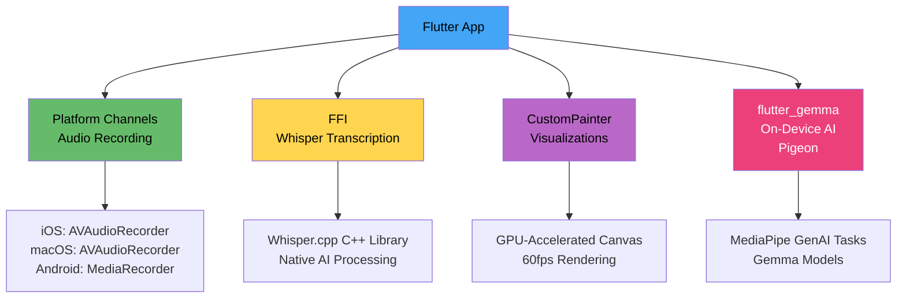
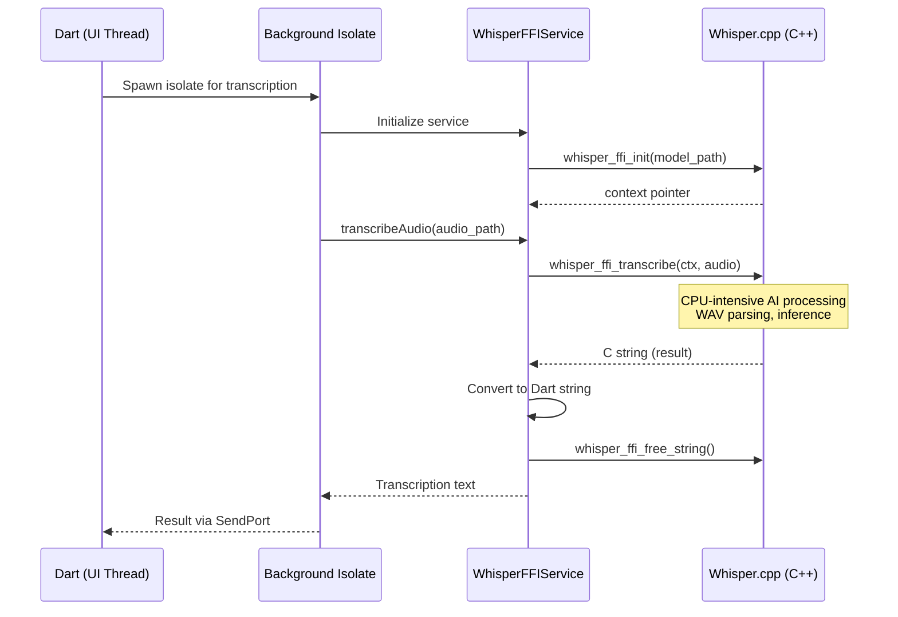
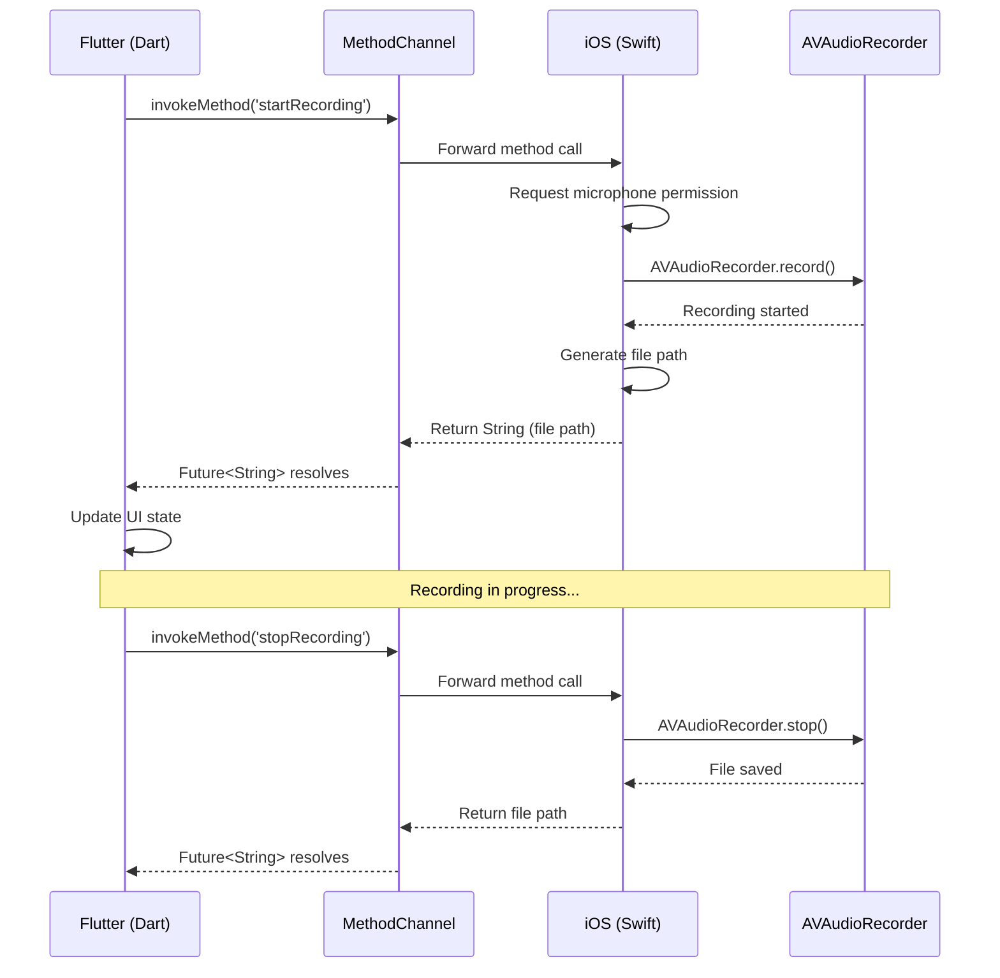
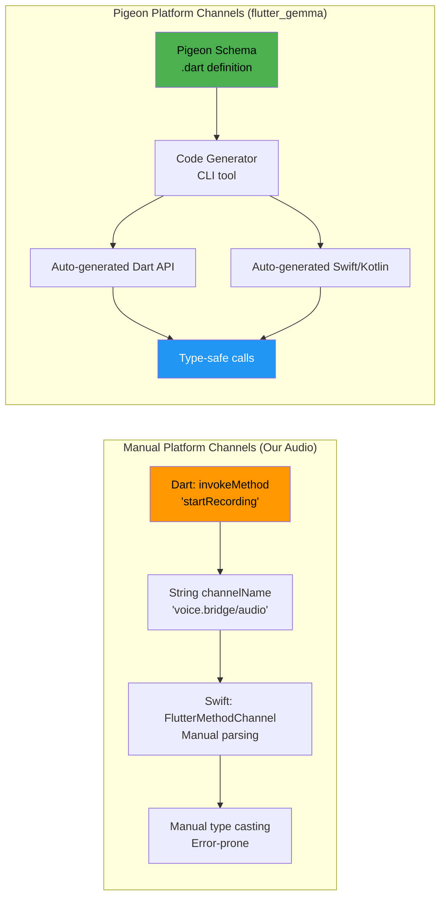
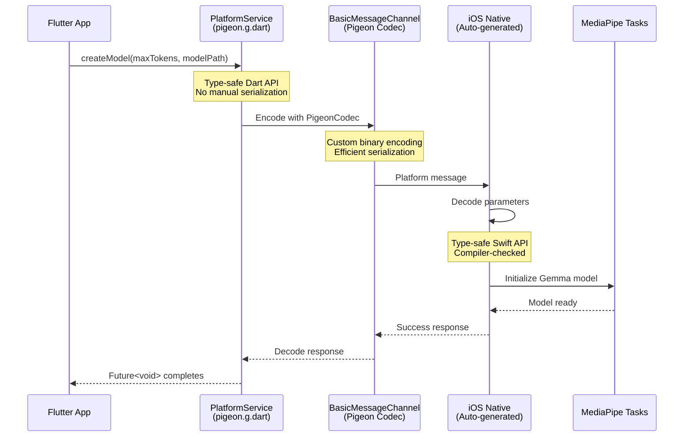
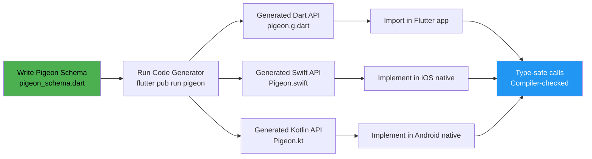
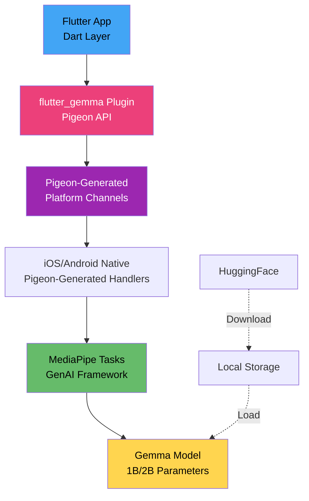
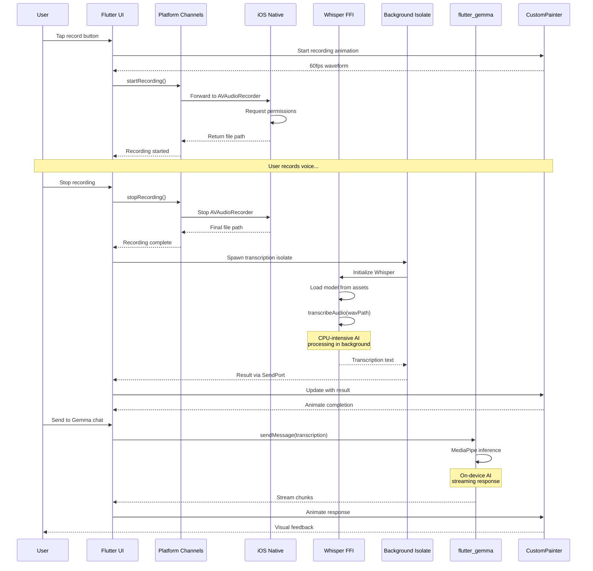

# Flutter Voice Bridge: A Deep Dive into Flutter's Advanced Capabilities

**Presentation Demo Setup:**
- **iPhone 13 Pro Max**: Gemma AI Chat with multimodal capabilities
- **macOS**: Whisper transcription with custom visualizations
- **Cross-platform**: Custom rendering, FFI, and Platform Channels working seamlessly

---

## Table of Contents
1. [Overview](#overview)
2. [FFI (Foreign Function Interface)](#ffi-foreign-function-interface)
3. [Platform Channels](#platform-channels)
4. [Pigeon: Type-Safe Platform Channels](#pigeon-type-safe-platform-channels)
5. [Custom Rendering with CustomPainter](#custom-rendering-with-custompainter)
6. [Flutter Gemma: On-Device AI](#flutter-gemma-on-device-ai)
7. [Architecture & Integration Flow](#architecture--integration-flow)
8. [Platform Views](#platform-views)
9. [Performance Characteristics](#performance-characteristics)

---

## Overview

Flutter Voice Bridge demonstrates production-grade native integrations showcasing Flutter's versatility:

- **FFI Integration**: Direct C++ library calls for Whisper.cpp (speech-to-text)
- **Platform Channels**: Manual bidirectional communication (our audio recording)
- **Pigeon**: Type-safe code-generated Platform Channels (flutter_gemma)
- **Custom Rendering**: Hardware-accelerated 60fps visualizations
- **On-Device AI**: Gemma models running natively via MediaPipe
- **Platform Views**: Embedding native UIKit/Android components
- **Clean Architecture**: Dependency injection, state management, isolates



---

## FFI (Foreign Function Interface)

### What is FFI?

FFI allows **direct calls to native C/C++ libraries** from Dart without serialization overhead. It's the **fastest** way to integrate native code - much faster than Platform Channels.

### Architecture: Whisper Speech Recognition



### Code Example: Function Signature Mapping

Every C function requires two typedef declarations:

**Dart Side** ([whisper_ffi_service.dart](lib/core/transcription/whisper_ffi_service.dart:33-51)):
```dart
// C: whisper_context* whisper_ffi_init(const char* model_path)
typedef WhisperInitNative = Pointer<Void> Function(Pointer<Utf8> modelPath);  // Native C signature
typedef WhisperInit = Pointer<Void> Function(Pointer<Utf8> modelPath);        // Dart function signature

// C: char* whisper_ffi_transcribe(whisper_context* ctx, const char* audio_path)
typedef WhisperTranscribeNative = Pointer<Utf8> Function(Pointer<Void> ctx, Pointer<Utf8> audioPath);
typedef WhisperTranscribe = Pointer<Utf8> Function(Pointer<Void> ctx, Pointer<Utf8> audioPath);
```

### Dynamic Library Loading

Platform-specific search paths ([whisper_ffi_service.dart](lib/core/transcription/whisper_ffi_service.dart:299-339)):

```dart
void _loadAppleLibrary() {
  final List<String> libraryPaths = [
    'libwhisper_ffi.dylib',              // Standard @rpath lookup
    '@rpath/libwhisper_ffi.dylib',       // Explicit @rpath
    'Frameworks/libwhisper_ffi.dylib',   // App bundle Frameworks
    // Development and build paths...
  ];

  for (final libraryPath in libraryPaths) {
    try {
      _whisperLib = DynamicLibrary.open(libraryPath);
      return; // Success!
    } catch (e) {
      continue; // Try next path
    }
  }

  throw Exception('Failed to load Whisper native library');
}
```

### Function Binding

Lookup native functions and bind them to Dart ([whisper_ffi_service.dart](lib/core/transcription/whisper_ffi_service.dart:397-429)):

```dart
void _bindFunctions() {
  // Bind whisper_ffi_init function
  _whisperInit = _whisperLib
      .lookup<NativeFunction<WhisperInitNative>>('whisper_ffi_init')
      .asFunction<WhisperInit>();

  // Bind whisper_ffi_transcribe function
  _whisperTranscribe = _whisperLib
      .lookup<NativeFunction<WhisperTranscribeNative>>('whisper_ffi_transcribe')
      .asFunction<WhisperTranscribe>();

  // Bind cleanup functions
  _whisperFree = _whisperLib
      .lookup<NativeFunction<WhisperFreeNative>>('whisper_ffi_free')
      .asFunction<WhisperFree>();
}
```

### Memory Management Pattern

Critical: Proper allocation and cleanup ([whisper_ffi_service.dart](lib/core/transcription/whisper_ffi_service.dart:127-146)):

```dart
// Convert Dart string to native C string
final modelPathPtr = modelPath.toNativeUtf8();

try {
  // Call native function with pointer
  _whisperContext = _whisperInit(modelPathPtr);

  if (_whisperContext == nullptr) {
    throw Exception('Failed to initialize Whisper context');
  }
} finally {
  // ALWAYS free native memory, even if error occurs
  malloc.free(modelPathPtr);
}
```

### Native C++ Implementation

**WAV File Parsing** ([whisper_wrapper.cpp](native/whisper/whisper.cpp/whisper_wrapper.cpp:46-100)):

```cpp
std::vector<float> read_audio_file(const std::string& filename) {
    std::ifstream file(filename, std::ios::binary);

    // Read and validate RIFF header
    char riff_header[12];
    file.read(riff_header, 12);

    if (std::string(riff_header, 4) != "RIFF") {
        std::cerr << "❌ Invalid RIFF header" << std::endl;
        return {};
    }

    if (std::string(riff_header + 8, 4) != "WAVE") {
        std::cerr << "❌ Invalid WAVE header" << std::endl;
        return {};
    }

    // Parse fmt chunk for audio parameters
    uint16_t audio_format, num_channels, bits_per_sample;
    uint32_t sample_rate;

    // Convert 16-bit PCM to float32 for Whisper
    // Handle mono/stereo conversion
    // Return normalized float array
}
```

### Isolate Integration

Prevent UI blocking during CPU-intensive AI processing:

```dart
class IsolateTranscriptionService {
  Isolate? _isolate;
  SendPort? _sendPort;

  Future<void> _spawnIsolate() async {
    final receivePort = ReceivePort();

    // Spawn background isolate
    _isolate = await Isolate.spawn(_isolateEntry, receivePort.sendPort);

    // Get SendPort from isolate
    _sendPort = await receivePort.first;
  }

  static void _isolateEntry(SendPort sendPort) async {
    final service = WhisperFFIService();
    await service.initialize();
    await service.initializeModel(modelPath);

    // Process messages from main isolate
    receivePort.listen((message) async {
      final result = await service.transcribeAudio(message['audioPath']);
      sendPort.send(result);
    });
  }
}
```

**Key Benefits:**
- **Zero serialization overhead**: Direct memory access
- **Maximum performance**: Native C++ speed
- **Background processing**: Isolates prevent UI freezing
- **Memory safety**: Structured cleanup with try-finally

---

## Platform Channels

### What are Platform Channels?

Platform Channels enable **asynchronous bidirectional communication** between Flutter and native code (Swift/Kotlin). They use JSON-serializable messages over a named channel.

### Communication Flow



### Dart Implementation

**Channel Definition** ([platform_channels.dart](lib/core/platform/platform_channels.dart:24-33)):

```dart
class PlatformChannels {
  // Channel naming: Use reverse domain notation
  static const String _audioChannelName = 'voice.bridge/audio';

  // MethodChannel for request-response communication
  static const MethodChannel _audioChannel = MethodChannel(_audioChannelName);
}
```

**Method Call with Error Handling** ([platform_channels.dart](lib/core/platform/platform_channels.dart:50-80)):

```dart
static Future<String> startRecording() async {
  developer.log('🎤 Starting audio recording...', name: 'VoiceBridge.Audio');

  try {
    // Async platform call - waits for native response
    final String result = await _audioChannel.invokeMethod('startRecording');
    developer.log('✅ Recording started: $result', name: 'VoiceBridge.Audio');
    return result;

  } on PlatformException catch (e) {
    // Platform-specific errors: PERMISSION_DENIED, HARDWARE_ERROR, etc.
    developer.log(
      '❌ Platform exception: ${e.code} - ${e.message}',
      name: 'VoiceBridge.Audio',
      error: e,
    );
    rethrow;

  } catch (e) {
    // Unexpected errors
    developer.log('💥 Unexpected error: $e', name: 'VoiceBridge.Audio', error: e);
    rethrow;
  }
}
```

### iOS Native Implementation

**Method Handler Setup** ([AppDelegate.swift](ios/Runner/AppDelegate.swift:14-44)):

```swift
override func application(
  _ application: UIApplication,
  didFinishLaunchingWithOptions launchOptions: [UIApplication.LaunchOptionsKey: Any]?
) -> Bool {
  let controller = window?.rootViewController as! FlutterViewController

  // Create method channel with matching name
  let audioChannel = FlutterMethodChannel(
    name: "voice.bridge/audio",
    binaryMessenger: controller.binaryMessenger
  )

  // Set up method handler
  audioChannel.setMethodCallHandler { [weak self] (call, result) in
    switch call.method {
    case "startRecording":
      self?.startRecording(result: result)
    case "stopRecording":
      self?.stopRecording(result: result)
    case "playRecording":
      if let args = call.arguments as? [String: Any],
         let path = args["path"] as? String {
        self?.playRecording(atPath: path, result: result)
      }
    default:
      result(FlutterMethodNotImplemented)
    }
  }

  return super.application(application, didFinishLaunchingWithOptions: launchOptions)
}
```

**Permission Handling** ([AppDelegate.swift](ios/Runner/AppDelegate.swift:54-88)):

```swift
private func startRecording(result: @escaping FlutterResult) {
  NSLog("🎤 [iOS] startRecording called")

  switch audioSession.recordPermission {
  case .granted:
    NSLog("✅ [iOS] Microphone permission granted")
    self.beginRecording(result: result)

  case .denied:
    NSLog("❌ [iOS] Microphone permission denied")
    result(FlutterError(
      code: "PERMISSION_DENIED",
      message: "Microphone permission denied",
      details: nil
    ))

  case .undetermined:
    NSLog("❓ [iOS] Requesting microphone permission...")
    audioSession.requestRecordPermission { [weak self] granted in
      DispatchQueue.main.async {
        if granted {
          self?.beginRecording(result: result)
        } else {
          result(FlutterError(
            code: "PERMISSION_DENIED",
            message: "Microphone permission denied by user",
            details: nil
          ))
        }
      }
    }
  }
}
```

**Audio Recording with AVAudioRecorder** ([AppDelegate.swift](ios/Runner/AppDelegate.swift:90-149)):

```swift
private func beginRecording(result: @escaping FlutterResult) {
  do {
    // Configure audio session
    try audioSession.setCategory(.playAndRecord, mode: .default)
    try audioSession.setActive(true)

    // WAV format settings (16kHz, mono, 16-bit PCM for Whisper)
    let settings: [String: Any] = [
      AVFormatIDKey: Int(kAudioFormatLinearPCM),
      AVSampleRateKey: 16000.0,      // Optimal for speech recognition
      AVNumberOfChannelsKey: 1,       // Mono for speech
      AVLinearPCMBitDepthKey: 16,     // 16-bit depth
      AVLinearPCMIsFloatKey: false,
      AVLinearPCMIsBigEndianKey: false
    ]

    // Generate file path
    let documentsPath = FileManager.default.urls(
      for: .documentDirectory,
      in: .userDomainMask
    )[0]
    let audioDir = documentsPath.appendingPathComponent("audio")

    // Create directory if needed
    if !FileManager.default.fileExists(atPath: audioDir.path) {
      try FileManager.default.createDirectory(
        at: audioDir,
        withIntermediateDirectories: true
      )
    }

    let timestamp = Int64(Date().timeIntervalSince1970 * 1000)
    let audioFilename = audioDir.appendingPathComponent("voice_memo_\(timestamp).wav")

    // Create and start recorder
    audioRecorder = try AVAudioRecorder(url: audioFilename, settings: settings)
    audioRecorder?.delegate = self
    audioRecorder?.isMeteringEnabled = true

    let success = audioRecorder?.record() ?? false
    if success {
      NSLog("✅ [iOS] Recording started")
      result(audioFilename.path)
    } else {
      result(FlutterError(code: "RECORDING_FAILED", message: "Failed to start", details: nil))
    }
  } catch {
    result(FlutterError(code: "RECORDING_ERROR", message: error.localizedDescription, details: nil))
  }
}
```

**Key Differences from FFI:**
- **Asynchronous**: Uses Future-based communication
- **Serialization**: Data must be JSON-encodable
- **Platform-specific**: Separate implementations for iOS/Android/macOS
- **Higher-level**: Better for UI operations, permissions, hardware access

---

## Pigeon: Type-Safe Platform Channels

### What is Pigeon?

Pigeon is a **code generator** that creates **type-safe Platform Channel implementations** from a single schema definition. Instead of manually writing platform channel code (like we did for audio recording), Pigeon generates all the boilerplate automatically.

**flutter_gemma uses Pigeon** for all its native communication with MediaPipe!

### Comparison: Manual vs Pigeon Platform Channels



### Pigeon Architecture in flutter_gemma



### Pigeon Generated Code

**Schema Definition** (not in our project, but in flutter_gemma source):

```dart
// pigeon_schema.dart
@HostApi()
abstract class PlatformService {
  void createModel({
    required int maxTokens,
    required String modelPath,
    List<int>? loraRanks,
    PreferredBackend? preferredBackend,
    int? maxNumImages,
  });

  void closeModel();

  void createSession({
    required double temperature,
    required int randomSeed,
    required int topK,
    double? topP,
    String? loraPath,
    bool? enableVisionModality,
  });

  String generateResponse(String prompt, Uint8List? imageBytes);
}

enum PreferredBackend {
  unknown, cpu, gpu, gpuFloat16, gpuMixed, gpuFull, tpu
}
```

**Auto-Generated Dart** ([flutter_gemma/lib/pigeon.g.dart](https://pub.dev/packages/flutter_gemma)):

```dart
// Autogenerated from Pigeon (v24.1.0), do not edit directly.
class _PigeonCodec extends StandardMessageCodec {
  const _PigeonCodec();

  @override
  void writeValue(WriteBuffer buffer, Object? value) {
    if (value is int) {
      buffer.putUint8(4);
      buffer.putInt64(value);
    } else if (value is PreferredBackend) {
      buffer.putUint8(129);
      writeValue(buffer, value.index);
    } else {
      super.writeValue(buffer, value);
    }
  }

  @override
  Object? readValueOfType(int type, ReadBuffer buffer) {
    switch (type) {
      case 129:
        final int? value = readValue(buffer) as int?;
        return value == null ? null : PreferredBackend.values[value];
      default:
        return super.readValueOfType(type, buffer);
    }
  }
}

class PlatformService {
  PlatformService({BinaryMessenger? binaryMessenger, String messageChannelSuffix = ''})
      : pigeonVar_binaryMessenger = binaryMessenger,
        pigeonVar_messageChannelSuffix = messageChannelSuffix.isNotEmpty ? '.$messageChannelSuffix' : '';

  final BinaryMessenger? pigeonVar_binaryMessenger;
  static const MessageCodec<Object?> pigeonChannelCodec = _PigeonCodec();
  final String pigeonVar_messageChannelSuffix;

  Future<void> createModel({
    required int maxTokens,
    required String modelPath,
    required List<int>? loraRanks,
    PreferredBackend? preferredBackend,
    int? maxNumImages,
  }) async {
    final String pigeonVar_channelName =
        'dev.flutter.pigeon.flutter_gemma.PlatformService.createModel$pigeonVar_messageChannelSuffix';

    final BasicMessageChannel<Object?> pigeonVar_channel = BasicMessageChannel<Object?>(
      pigeonVar_channelName,
      pigeonChannelCodec,
      binaryMessenger: pigeonVar_binaryMessenger,
    );

    final List<Object?>? pigeonVar_replyList = await pigeonVar_channel
        .send(<Object?>[maxTokens, modelPath, loraRanks, preferredBackend, maxNumImages]) as List<Object?>?;

    if (pigeonVar_replyList == null) {
      throw _createConnectionError(pigeonVar_channelName);
    } else if (pigeonVar_replyList.length > 1) {
      throw PlatformException(
        code: pigeonVar_replyList[0]! as String,
        message: pigeonVar_replyList[1] as String?,
        details: pigeonVar_replyList[2],
      );
    }
  }
}
```

**Usage in flutter_gemma** ([gemma_service.dart](lib/gemma/data/gemma_service.dart:79-114)):

```dart
import 'package:flutter_gemma/pigeon.g.dart';

Future<void> initializeChat() async {
  final gemma = FlutterGemmaPlugin.instance;

  // Type-safe call with compile-time checking
  _inferenceModel = await gemma.createModel(
    modelType: ModelType.gemmaIt,       // Enum, not string - type-safe!
    supportImage: supportsImages,        // bool, properly typed
    maxTokens: 2048,                     // int, validated at compile-time
  );

  _chat = await _inferenceModel!.createChat(
    supportImage: supportsImages
  );
}
```

### Comparison Table: Manual vs Pigeon

| Feature | Manual Platform Channels | Pigeon Platform Channels |
|---------|-------------------------|--------------------------|
| **Type Safety** | ❌ Runtime only (dynamic casting) | ✅ Compile-time checking |
| **Code Generation** | ⚠️ Manual boilerplate | ✅ Automatic from schema |
| **Error Handling** | ⚠️ Manual PlatformException | ✅ Generated error handling |
| **Serialization** | ⚠️ Manual JSON encoding | ✅ Custom binary codec |
| **Maintenance** | ⚠️ Update Dart + Swift/Kotlin separately | ✅ Update schema, regenerate |
| **Refactoring** | ❌ Easy to break at runtime | ✅ Compiler catches breaks |
| **Documentation** | ⚠️ Manual comments | ✅ Schema is self-documenting |
| **Performance** | ⚡⚡ Standard codec | ⚡⚡⚡ Optimized binary codec |
| **Learning Curve** | ⚡⚡⚡ Simple concept | ⚡ Setup + code generation |
| **Best For** | Simple, one-off integrations | Complex APIs, libraries, plugins |

### When to Use Each Approach

**Manual Platform Channels** (like our audio recording):
- ✅ Simple, straightforward operations (start/stop recording)
- ✅ Few methods (3-5 total)
- ✅ Rapid prototyping
- ✅ Learning/educational purposes
- ✅ No complex data types

**Pigeon Platform Channels** (like flutter_gemma):
- ✅ Complex APIs with many methods (10+)
- ✅ Custom data types and enums
- ✅ Plugin development (published packages)
- ✅ Team collaboration (schema as contract)
- ✅ Long-term maintenance
- ✅ Multiple platforms (iOS + Android + macOS)

### How flutter_gemma Uses Pigeon

**Generated API Surface**:

```dart
// From pigeon.g.dart
abstract class PlatformService {
  Future<void> createModel({...});
  Future<void> closeModel();
  Future<void> createSession({...});
  Future<String> generateResponse(String prompt, Uint8List? imageBytes);
  Future<void> createVectorStore({...});
  Future<void> addDocumentToStore({...});
  Future<List<RetrievalResult>> retrieveDocuments({...});
  // ... 15+ more methods
}

enum PreferredBackend { unknown, cpu, gpu, gpuFloat16, gpuMixed, gpuFull, tpu }
enum ModelFileType { cpu, gpu }

class RetrievalResult {
  String id;
  String content;
  double similarity;
  String? metadata;
}

class VectorStoreStats {
  int documentCount;
  int vectorDimension;
}
```

**Benefits for flutter_gemma**:
1. **15+ methods** with full type safety
2. **Custom enums** (PreferredBackend, ModelFileType)
3. **Complex data structures** (RetrievalResult, VectorStoreStats)
4. **Binary codec** for efficient image transfer (Uint8List)
5. **Automatic error handling** for all methods
6. **Cross-platform** (iOS, Android, macOS, Windows) from single schema

### Code Generation Workflow



**Example Command**:
```bash
flutter pub run pigeon \
  --input pigeons/schema.dart \
  --dart_out lib/pigeon.g.dart \
  --swift_out ios/Runner/Pigeon.swift \
  --kotlin_out android/app/src/main/kotlin/Pigeon.kt
```

### Real-World Impact

**Manual Platform Channels** (Our Implementation):
- **3 methods**: `startRecording()`, `stopRecording()`, `playRecording()`
- **~150 lines** of manual Dart code
- **~200 lines** of manual Swift code
- **~250 lines** of manual Kotlin code
- **Total: ~600 lines** of hand-written code

**Pigeon Equivalent** (flutter_gemma):
- **15+ methods** with complex types
- **~50 lines** of schema definition
- **~2000+ lines** of auto-generated code
- **Maintenance**: Update schema, regenerate everything
- **Errors**: Caught at compile-time, not runtime

### Key Takeaways

1. **Manual Platform Channels**: Perfect for simple, direct communication (our audio recording)
2. **Pigeon**: Essential for complex APIs with many methods (flutter_gemma's MediaPipe integration)
3. **Type Safety**: Pigeon prevents entire classes of runtime errors
4. **Maintenance**: Schema-first approach scales better for large APIs
5. **Performance**: Both are fast, Pigeon has optimized binary encoding
6. **Learning**: Start with manual to understand the concepts, use Pigeon for production plugins

---

## Custom Rendering with CustomPainter

### What is CustomPainter?

CustomPainter provides **direct access to the GPU-accelerated Canvas** for drawing custom graphics. It's perfect for complex visualizations, animations, and effects that can't be achieved with widgets alone.

### Rendering Pipeline


### Architecture

**Widget Structure** ([audio_visualizer.dart](lib/ui/components/audio_visualizer.dart:7-41)):

```dart
class AdvancedAudioVisualizer extends StatefulWidget {
  final bool isRecording;
  final double height;
  final Color primaryColor, secondaryColor, tertiaryColor;
  final AudioVisualizationMode mode;  // waveform, spectrum, particles, radial, hybrid
  final bool showControls;
  final VoidCallback? onTap;

  // External control for fullscreen mode
  final bool? externalAnimationState;
  final double? externalAnimationSpeed;
  final double? externalAnimationScale;
}
```

### Animation System

**Single Master Controller** ([audio_visualizer.dart](lib/ui/components/audio_visualizer.dart:122-138)):

```dart
void _initializeAnimations() {
  // Single master controller for perfect synchronization
  _masterController = AnimationController(
    duration: const Duration(milliseconds: 2400),
    vsync: this,
  );

  _masterAnimation = Tween<double>(
    begin: 0.0,
    end: 2 * math.pi,  // One full cycle
  ).animate(_masterController);
}

void _startAnimations() {
  if (!_isAnimationPlaying) return;
  _masterController.repeat();  // Infinite loop
}
```

**Derived Phases** ([audio_visualizer.dart](lib/ui/components/audio_visualizer.dart:180-188)):

```dart
// All derived from single master animation
double get _primaryPhase => _masterAnimation.value * 1.0;      // Base frequency
double get _secondaryPhase => _masterAnimation.value * 1.5;    // 1.5x frequency
double get _pulsePhase => _masterAnimation.value * 0.5;        // Slower pulse
double get _globalPhase => _masterAnimation.value * 0.8;       // Gentle drift

// Pulse amplitude for breathing effect
double get _pulseAmplitude =>
  0.3 + (0.7 * (0.5 + 0.5 * math.sin(_pulsePhase)));
```

### Visualization Modes

**Mode 1: Waveform with Harmonics** ([audio_visualizer.dart](lib/ui/components/audio_visualizer.dart:460-517)):

```dart
void _paintWaveLayer(Canvas canvas, Size size, double amplitudeMultiplier,
                     Color color, double frequencyMultiplier) {
  final path = Path();
  final paint = Paint()
    ..color = color
    ..style = PaintingStyle.stroke
    ..strokeWidth = 3.0
    ..strokeCap = StrokeCap.round;

  final points = <Offset>[];
  final resolution = width / 2;

  for (int i = 0; i <= resolution; i++) {
    final x = (i / resolution) * width;
    final normalizedX = i / resolution;

    // Complex wave combining multiple harmonics
    final wave1 = math.sin(
      (normalizedX * 4 * math.pi * frequencyMultiplier) +
      (primaryPhase * frequencyMultiplier) + globalPhase
    );
    final wave2 = math.sin(
      (normalizedX * 8 * math.pi * frequencyMultiplier) +
      (secondaryPhase * frequencyMultiplier * 0.7) + globalPhase * 1.3
    ) * 0.5;
    final wave3 = math.sin(
      (normalizedX * 12 * math.pi * frequencyMultiplier) +
      (primaryPhase * frequencyMultiplier * 1.4) + globalPhase * 0.8
    ) * 0.25;

    final combinedWave = wave1 + wave2 + wave3;
    final y = centerY + (combinedWave * amplitude * amplitudeMultiplier * height * 0.25);

    points.add(Offset(x, y));
  }

  // Create smooth Bezier path
  if (points.isNotEmpty) {
    path.moveTo(points.first.dx, points.first.dy);
    for (int i = 1; i < points.length; i++) {
      final current = points[i];
      final previous = points[i - 1];
      final controlPoint = Offset(
        previous.dx + (current.dx - previous.dx) * 0.5,
        previous.dy
      );
      path.quadraticBezierTo(controlPoint.dx, controlPoint.dy, current.dx, current.dy);
    }
  }

  canvas.drawPath(path, paint);
}
```

**Mode 2: Spectrum Analyzer** ([audio_visualizer.dart](lib/ui/components/audio_visualizer.dart:544-606)):

```dart
void _paintSpectrum(Canvas canvas, Size size) {
  final barCount = 64;
  final barWidth = width / barCount;

  for (int i = 0; i < barCount; i++) {
    final normalizedIndex = i / (barCount - 1);

    // Simulate frequency spectrum
    final baseHeight = math.sin(normalizedIndex * math.pi) * 0.8;
    final animatedHeight = baseHeight * amplitude *
      (0.5 + math.sin((primaryPhase * 3) + (normalizedIndex * 6)) * 0.5);

    final barHeight = math.max(animatedHeight * height * 0.85 * scale, 2.0);

    // Frequency-based rainbow coloring
    final hue = normalizedIndex * 280;  // Red to blue across spectrum
    final vibrantColor = HSVColor.fromAHSV(1.0, hue, 0.8, 0.9).toColor();

    // Gradient effect for bars
    final gradient = ui.Gradient.linear(
      Offset(x, height),
      Offset(x, height - barHeight),
      [
        vibrantColor.withValues(alpha: 0.9),
        vibrantColor.withValues(alpha: 0.6),
        vibrantColor.withValues(alpha: 0.3),
      ],
      [0.0, 0.7, 1.0],
    );

    paint.shader = gradient;

    // Rounded rectangle bar
    final rect = RRect.fromRectAndRadius(
      Rect.fromLTWH(x + 1, height - barHeight, barWidth - 2, barHeight),
      Radius.circular(barWidth * 0.3),
    );

    canvas.drawRRect(rect, paint);
  }
}
```

**Mode 3: Particle System** ([audio_visualizer.dart](lib/ui/components/audio_visualizer.dart:608-663)):

```dart
void _paintParticles(Canvas canvas, Size size) {
  final particleCount = 120;
  final centerX = width / 2;
  final centerY = height / 2;
  final maxRadius = math.min(width, height) / 2 * 0.75 * scale;

  for (int i = 0; i < particleCount; i++) {
    final normalizedIndex = i / (particleCount - 1);
    final angle = normalizedIndex * 2 * math.pi;

    // Circular motion with wave distortion
    final baseRadius = (amplitude * maxRadius * 0.6) +
      (math.sin((primaryPhase * 2) + (angle * 3)) * maxRadius * 0.25);

    final x = centerX + (math.cos(angle + globalPhase) * baseRadius);
    final y = centerY + (math.sin(angle + globalPhase) * baseRadius * 0.8);

    final particleSize = 2.5 +
      (math.sin((secondaryPhase * 3) + (angle * 5)) * 1.8) * scale;

    // Rainbow effect
    final hue = (normalizedIndex * 360 + globalPhase * 50) % 360;
    final vibrantColor = HSVColor.fromAHSV(1.0, hue, 0.8, 0.9).toColor();

    // Glow effect using blur
    final glowPaint = Paint()
      ..color = vibrantColor.withValues(alpha: 0.3)
      ..maskFilter = ui.MaskFilter.blur(ui.BlurStyle.normal, particleSize * 0.8);

    canvas.drawCircle(Offset(x, y), particleSize * 1.5, glowPaint);
    canvas.drawCircle(Offset(x, y), particleSize, paint);
  }
}
```

### Advanced Effects

**Gradient Shaders** ([audio_visualizer.dart](lib/ui/components/audio_visualizer.dart:524-542)):

```dart
void _paintStaticWave(Canvas canvas, Size size) {
  final gradient = ui.Gradient.linear(
    Offset(0, centerY),
    Offset(width, centerY),
    [
      primaryColor.withValues(alpha: 0.5),
      secondaryColor.withValues(alpha: 0.4),
      tertiaryColor.withValues(alpha: 0.3),
    ]
  );

  final paint = Paint()
    ..shader = gradient
    ..style = PaintingStyle.stroke
    ..strokeWidth = 3.0;
}
```

**Blur Effects** ([audio_visualizer.dart](lib/ui/components/audio_visualizer.dart:776-789)):

```dart
void _paintGlowEffect(Canvas canvas, Size size) {
  final glowPaint = Paint()
    ..color = primaryColor.withValues(alpha: 0.3 * amplitude)
    ..maskFilter = ui.MaskFilter.blur(ui.BlurStyle.normal, 10.0);

  canvas.drawCircle(
    Offset(width / 2, centerY),
    width * 0.3 * amplitude,
    glowPaint
  );
}
```

**Performance Optimization** ([audio_visualizer.dart](lib/ui/components/audio_visualizer.dart:792-799)):

```dart
@override
bool shouldRepaint(covariant AdvancedAudioPainter oldDelegate) {
  // Only repaint when animation values change
  return oldDelegate.primaryPhase != primaryPhase ||
      oldDelegate.secondaryPhase != secondaryPhase ||
      oldDelegate.amplitude != amplitude ||
      oldDelegate.globalPhase != globalPhase ||
      oldDelegate.isRecording != isRecording ||
      oldDelegate.scale != scale;
}
```

**Key Benefits:**
- **Hardware Acceleration**: GPU-rendered at 60fps
- **Fine Control**: Direct Canvas API access
- **Shader Support**: Gradients, blur, masks
- **Composability**: Can combine with widgets seamlessly

---

## Flutter Gemma: On-Device AI

### The Cherry on Top

While FFI, Platform Channels, and Custom Rendering demonstrate Flutter's **integration capabilities**, flutter_gemma showcases **cutting-edge on-device AI** running entirely locally. It combines **Pigeon-generated type-safe channels** with **MediaPipe's AI framework** for a powerful, maintainable solution.

### Architecture



### How It Works

**1. Model Management** ([gemma_service.dart](lib/gemma/data/gemma_service.dart:37-77)):

```dart
class GemmaService {
  InferenceModel? _inferenceModel;
  InferenceChat? _chat;

  // Check if model is downloaded
  Future<bool> isModelDownloaded(AvailableModel model) async {
    final datasource = GemmaDownloaderDataSource(model: model.toDownloadModel());
    return await datasource.checkModelExistence();
  }

  // Download from HuggingFace with progress tracking
  Future<void> downloadModel(AvailableModel model, Function(double) onProgress) async {
    final datasource = GemmaDownloaderDataSource(model: model.toDownloadModel());
    await datasource.downloadModel(
      token: GemmaConstants.huggingFaceAccessToken,
      onProgress: onProgress,
    );
  }

  // Delete model to free space
  Future<void> deleteModel(AvailableModel model) async {
    final datasource = GemmaDownloaderDataSource(model: model.toDownloadModel());
    final path = await datasource.getFilePath();
    final file = File(path);
    if (file.existsSync()) {
      await file.delete();
    }
  }
}
```

**2. Model Initialization** ([gemma_service.dart](lib/gemma/data/gemma_service.dart:79-114)):

```dart
Future<void> initializeChat() async {
  final gemma = FlutterGemmaPlugin.instance;
  final selectedModel = await getSelectedModel();

  if (!kIsWeb) {
    final datasource = GemmaDownloaderDataSource(model: selectedModel.toDownloadModel());

    // Ensure model is downloaded
    final isInstalled = await datasource.checkModelExistence();
    if (!isInstalled) {
      throw Exception('Model not downloaded: ${selectedModel.displayName}');
    }

    // Set model path for native layer
    final modelPath = await datasource.getFilePath();
    await gemma.modelManager.setModelPath(modelPath);
  }

  // Create inference model with MediaPipe
  _inferenceModel = await gemma.createModel(
    modelType: ModelType.gemmaIt,
    supportImage: selectedModel.supportsImages,  // Multimodal capability
    maxTokens: 2048,
  );

  // Create chat session
  _chat = await _inferenceModel!.createChat(
    supportImage: selectedModel.supportsImages
  );

  _isInitialized = true;
}
```

**3. Streaming Inference** ([gemma_service.dart](lib/gemma/data/gemma_service.dart:116-134)):

```dart
Stream<String> sendMessage(String text, {Uint8List? imageBytes}) async* {
  if (!_isInitialized || _chat == null) {
    await initializeChat();
  }

  // Create message (text-only or multimodal)
  final Message userMessage;
  if (imageBytes != null) {
    final prompt = text.isNotEmpty ? text : "What's in this image?";
    userMessage = Message.withImage(
      text: prompt,
      imageBytes: imageBytes,
      isUser: true
    );
  } else {
    userMessage = Message(text: text, isUser: true);
  }

  // Add to chat history
  await _chat!.addQueryChunk(userMessage);

  // Stream response chunks as they're generated
  yield* _chat!.generateChatResponseAsync();
}
```

### Native Integration: Pigeon + MediaPipe

flutter_gemma uses **Pigeon-generated Platform Channels** to communicate with MediaPipe:

**Communication Stack**:
```
Dart App (Type-safe API)
    ↓
flutter_gemma Plugin (Pigeon wrapper)
    ↓
pigeon.g.dart (Auto-generated Dart)
    ↓
PigeonCodec (Binary serialization)
    ↓
Native iOS/Android (Auto-generated handlers)
    ↓
MediaPipe Tasks GenAI Framework
    ↓
Gemma Model Inference
```

**iOS**: MediaPipe Tasks GenAI (installed via CocoaPods)
```ruby
# ios/Podfile
pod 'MediaPipeTasksGenAI', '~> 0.10.14'
```

**Android**: MediaPipe Tasks GenAI (Gradle dependency)
```gradle
implementation 'com.google.mediapipe:tasks-genai:0.10.14'
```

**Why Pigeon for flutter_gemma?**
- 15+ complex methods (createModel, createSession, generateResponse, etc.)
- Custom data types (PreferredBackend enum, RetrievalResult class)
- Type-safe image transfer (Uint8List for multimodal)
- Cross-platform consistency (iOS, Android, macOS, Windows)
- Maintainable: Update schema, regenerate all platforms

### Multimodal Capabilities

**Text + Image Understanding**:

```dart
// User can send image with text prompt
final imageBytes = await picker.pickImage();
final stream = gemmaService.sendMessage(
  "What objects are in this image?",
  imageBytes: imageBytes
);

// Stream response tokens as they arrive
await for (final chunk in stream) {
  print(chunk);  // "I see a cat, a laptop, and a coffee mug..."
}
```

### Why This Matters

1. **Privacy**: All processing happens on-device, no data leaves the phone
2. **Speed**: No network latency, instant responses
3. **Offline**: Works without internet connection
4. **Cost**: No API fees or server costs
5. **Integration**: Seamlessly combines with other Flutter features

**Demo Scenario (iPhone 13 Pro Max)**:
- User records voice message → Transcribed via Whisper FFI
- Transcription fed to Gemma → On-device AI response
- User can attach photos → Multimodal understanding
- All visualized with CustomPainter animations
- All without leaving the device

---

## Architecture & Integration Flow

### Complete User Flow



### Project Architecture

```
flutter_voice_bridge/
├── lib/
│   ├── core/                      # Business Logic Layer
│   │   ├── audio/                 # Audio service abstractions
│   │   ├── transcription/         # FFI + Isolate integration
│   │   │   ├── whisper_ffi_service.dart      # FFI bindings
│   │   │   └── isolate_transcription_service.dart
│   │   ├── platform/              # Platform channel wrappers
│   │   │   └── platform_channels.dart
│   │   └── theme/                 # Theme management
│   │
│   ├── data/                      # Data Layer
│   │   ├── models/                # Data classes
│   │   └── services/              # File I/O, persistence
│   │
│   ├── ui/                        # Presentation Layer
│   │   ├── views/                 # Screens with Cubit state
│   │   ├── widgets/               # Reusable UI components
│   │   └── components/            # Custom painters, platform views
│   │       ├── audio_visualizer.dart         # CustomPainter
│   │       └── native_text_view.dart         # Platform view
│   │
│   ├── gemma/                     # AI Chat Feature
│   │   ├── data/                  # Gemma service + downloader
│   │   │   ├── gemma_service.dart
│   │   │   └── gemma_downloader_datasource.dart
│   │   ├── domain/                # Model definitions
│   │   └── ui/                    # Chat UI + state management
│   │
│   └── di.dart                    # Dependency injection (GetIt)
│
├── ios/Runner/
│   ├── AppDelegate.swift          # Platform channels + Platform views
│   └── Models/                    # Whisper model storage
│
├── macos/Runner/
│   └── MainFlutterWindow.swift    # macOS platform channels
│
├── android/app/src/main/kotlin/
│   └── MainActivity.kt            # Android platform channels
│
└── native/whisper/whisper.cpp/
    ├── whisper_wrapper.cpp        # C++ FFI implementation
    └── whisper_wrapper.h          # C header
```

### Dependency Injection

**Service Locator Pattern** ([di.dart](lib/di.dart)):

```dart
final getIt = GetIt.instance;

void setupDependencies() {
  // Lazy singletons - Created once when first accessed
  getIt.registerLazySingleton<AudioService>(() => PlatformAudioService());
  getIt.registerLazySingleton<VoiceMemoService>(() => VoiceMemoService());
  getIt.registerLazySingleton<TranscriptionService>(
    () => IsolateTranscriptionService()
  );
  getIt.registerLazySingleton<GemmaService>(() => GemmaService());

  // Factories - New instance each time
  getIt.registerFactory<HomeCubit>(() => HomeCubit(
    audioService: getIt<AudioService>(),
    voiceMemoService: getIt<VoiceMemoService>(),
    transcriptionService: getIt<TranscriptionService>(),
  ));
}
```

### State Management

**BLoC/Cubit Pattern**:

```dart
class HomeCubit extends Cubit<HomeState> {
  final AudioService _audioService;
  final TranscriptionService _transcriptionService;

  Future<void> startRecording() async {
    emit(state.copyWith(isRecording: true));

    try {
      final filePath = await _audioService.startRecording();
      emit(state.copyWith(recordingPath: filePath));
    } catch (e) {
      emit(state.copyWith(error: e.toString(), isRecording: false));
    }
  }

  Future<void> transcribeRecording(String path) async {
    emit(state.copyWith(isTranscribing: true));

    try {
      final text = await _transcriptionService.transcribe(path);
      emit(state.copyWith(transcription: text, isTranscribing: false));
    } catch (e) {
      emit(state.copyWith(error: e.toString(), isTranscribing: false));
    }
  }
}
```

---

## Platform Views

### Embedding Native UI Components

Platform Views allow embedding **native UIKit/Android Views** directly in the Flutter widget tree.

### iOS Implementation

**Factory Registration** ([AppDelegate.swift](ios/Runner/AppDelegate.swift:46-48)):

```swift
// Register Platform View factory
let nativeTextViewFactory = NativeTextViewFactory()
self.registrar(forPlugin: "NativeTextView")?
  .register(nativeTextViewFactory, withId: "native-text-view")
```

**Native View Creation** ([AppDelegate.swift](ios/Runner/AppDelegate.swift:322-379)):

```swift
class NativeTextView: NSObject, FlutterPlatformView {
  private let _view: UIView
  private let _label: UILabel

  init(frame: CGRect, viewId: Int64, args: Any?) {
    // Create container view
    _view = UIView(frame: frame)

    // Create native UILabel
    _label = UILabel()
    _label.translatesAutoresizingMaskIntoConstraints = false
    _label.textAlignment = .center
    _label.numberOfLines = 0
    _label.font = UIFont.systemFont(ofSize: 16, weight: .semibold)
    _label.textColor = .white

    // Parse Flutter arguments
    if let arguments = args as? [String: Any] {
      let text = arguments["text"] as? String ?? "Hello from iOS!"
      let backgroundColorValue = arguments["backgroundColor"] as? Int64 ?? 0xFF2196F3

      _label.text = text

      // Convert Flutter color (ARGB int) to UIColor
      let red = CGFloat((backgroundColorValue >> 16) & 0xFF) / 255.0
      let green = CGFloat((backgroundColorValue >> 8) & 0xFF) / 255.0
      let blue = CGFloat(backgroundColorValue & 0xFF) / 255.0
      let alpha = CGFloat((backgroundColorValue >> 24) & 0xFF) / 255.0

      _view.backgroundColor = UIColor(red: red, green: green, blue: blue, alpha: alpha)
    }

    _view.addSubview(_label)

    // Auto Layout constraints
    NSLayoutConstraint.activate([
      _label.centerXAnchor.constraint(equalTo: _view.centerXAnchor),
      _label.centerYAnchor.constraint(equalTo: _view.centerYAnchor),
      _label.leadingAnchor.constraint(greaterThanOrEqualTo: _view.leadingAnchor, constant: 16),
      _label.trailingAnchor.constraint(lessThanOrEqualTo: _view.trailingAnchor, constant: -16)
    ])

    _view.layer.cornerRadius = 8
    _view.layer.masksToBounds = true

    super.init()
  }

  func view() -> UIView {
    return _view
  }
}
```

**Flutter Usage**:

```dart
class NativeTextView extends StatelessWidget {
  @override
  Widget build(BuildContext context) {
    if (Platform.isIOS) {
      return UiKitView(
        viewType: 'native-text-view',
        creationParams: {
          'text': 'Hello from Flutter!',
          'backgroundColor': Colors.blue.value,
        },
        creationParamsCodec: const StandardMessageCodec(),
      );
    }
    // Android: AndroidView(...)
  }
}
```

**Use Cases:**
- Native map views (before flutter_map)
- WebView integration
- Camera previews
- Video players
- Complex native components

---

## Performance Characteristics

### Comparison Table

| Feature | FFI | Manual Channels | Pigeon Channels | CustomPainter |
|---------|-----|----------------|-----------------|---------------|
| **Speed** | ⚡⚡⚡ | ⚡⚡ | ⚡⚡⚡ | ⚡⚡⚡ |
| **Overhead** | Zero | JSON serialization | Binary codec | Minimal |
| **Type Safety** | ✅ Dart FFI types | ❌ Runtime only | ✅ Compile-time | ✅ Dart types |
| **Use Case** | CPU-intensive | Simple native APIs | Complex native APIs | Visuals |
| **Threading** | Isolates | Main thread | Main thread | UI thread |
| **Complexity** | Very High | Medium | Medium (setup) | Medium |
| **Code Gen** | Manual | Manual | ✅ Automatic | Manual |
| **Best For** | AI, DSP, codecs | 3-5 simple methods | 10+ methods, plugins | Animations |
| **Example** | Whisper.cpp | Our audio recording | flutter_gemma | Visualizer |

### Benchmarks

**Whisper Transcription (5s audio)**:
- FFI Direct Call: ~800ms (background isolate)
- Platform Channel Alternative: ~1200ms + UI blocking

**CustomPainter Rendering**:
- 60fps (16.67ms per frame) consistently maintained
- 5 visualization modes without frame drops
- GPU shader support for complex gradients

**Gemma Inference**:
- First token: ~200-500ms (model dependent)
- Subsequent tokens: ~50-100ms each (streaming)
- All on-device, no network latency

---

## Key Takeaways

### 1. **FFI for Performance-Critical Tasks**
- Direct C/C++ integration with zero overhead
- Perfect for AI models, audio/video processing, game engines
- Requires careful memory management
- Use isolates to prevent UI blocking

### 2. **Platform Channels for Native APIs**
- **Manual**: Perfect for simple operations (3-5 methods), rapid prototyping
- **Pigeon**: Essential for complex APIs (10+ methods), type-safe, maintainable
- Both provide async communication with native code
- Choose based on API complexity and maintenance needs

### 3. **CustomPainter for Complex Visuals**
- GPU-accelerated rendering at 60fps
- Full control over drawing operations
- Shader support for advanced effects
- Composable with Flutter widgets

### 4. **flutter_gemma: On-Device AI Revolution**
- Privacy-preserving local inference
- Multimodal capabilities (text + images)
- No API costs or network dependency
- Powered by MediaPipe and Platform Channels

### 5. **Integration Strategy**
- **FFI** when performance is critical (Whisper transcription)
- **Manual Channels** for simple native operations (audio recording)
- **Pigeon** for complex, maintainable native APIs (flutter_gemma)
- **CustomPainter** for GPU-accelerated visuals
- Combine all techniques for powerful apps

### 6. **Clean Architecture Matters**
- Dependency injection for testability
- State management separates logic from UI
- Isolates for CPU-intensive work
- Modular, maintainable codebase

---

## Demo Flow Summary

### iPhone 13 Pro Max (Gemma AI Chat)
1. **Launch App** → Gemma chat interface
2. **Type Message** → Streaming AI response with CustomPainter animation
3. **Attach Photo** → Multimodal understanding (vision + text)
4. **Show Model Settings** → Download/switch between Gemma 1B/2B models
5. **Demonstrate Privacy** → Turn off WiFi, still works perfectly

### macOS (Whisper Transcription)
1. **Record Voice Memo** → Platform Channel to AVAudioRecorder
2. **CustomPainter Animation** → Real-time waveform visualization
3. **Stop Recording** → FFI transcription in background isolate
4. **Display Result** → Transcribed text appears
5. **Send to Gemma** → Combine transcription with AI chat

### Cross-Platform Features
1. **CustomPainter Modes** → Switch between waveform, spectrum, particles, radial
2. **Animation Controls** → Play/pause, speed adjustment (0.5x-2x)
3. **Fullscreen Mode** → Immersive visualization experience
4. **Theme Switching** → Dark/light mode with custom rendering

---

## Resources

### Code References
- **FFI Service**: [lib/core/transcription/whisper_ffi_service.dart](lib/core/transcription/whisper_ffi_service.dart)
- **Platform Channels**: [lib/core/platform/platform_channels.dart](lib/core/platform/platform_channels.dart)
- **iOS Native**: [ios/Runner/AppDelegate.swift](ios/Runner/AppDelegate.swift)
- **CustomPainter**: [lib/ui/components/audio_visualizer.dart](lib/ui/components/audio_visualizer.dart)
- **Gemma Service**: [lib/gemma/data/gemma_service.dart](lib/gemma/data/gemma_service.dart)
- **C++ Wrapper**: [native/whisper/whisper.cpp/whisper_wrapper.cpp](native/whisper/whisper.cpp/whisper_wrapper.cpp)

### Technologies
- **Whisper.cpp**: https://github.com/ggerganov/whisper.cpp
- **flutter_gemma**: https://pub.dev/packages/flutter_gemma
- **MediaPipe**: https://ai.google.dev/edge/mediapipe/solutions/genai/llm_inference
- **Pigeon**: https://pub.dev/packages/pigeon

### Flutter Documentation
- **FFI**: https://dart.dev/guides/libraries/c-interop
- **Platform Channels**: https://docs.flutter.dev/platform-integration/platform-channels
- **Pigeon**: https://pub.dev/packages/pigeon
- **CustomPainter**: https://api.flutter.dev/flutter/rendering/CustomPainter-class.html

---

## Summary: Three Paths to Native Integration

```mermaid
graph TB
    subgraph FFI["FFI: Maximum Performance"]
        F1[Whisper.cpp<br/>C++ Library]
        F2[Direct Function Calls<br/>Zero Overhead]
        F3[Manual Memory<br/>Management]
        F4[Perfect for:<br/>AI, DSP, Codecs]
        F1 --> F2 --> F3 --> F4
    end

    subgraph Manual["Manual Channels: Simplicity"]
        M1[Audio Recording<br/>3 Methods]
        M2[Hand-written<br/>Dart + Swift/Kotlin]
        M3[Runtime Type<br/>Safety Only]
        M4[Perfect for:<br/>Simple APIs]
        M1 --> M2 --> M3 --> M4
    end

    subgraph Pigeon["Pigeon: Type Safety & Scale"]
        P1[flutter_gemma<br/>15+ Methods]
        P2[Auto-generated<br/>from Schema]
        P3[Compile-time<br/>Type Safety]
        P4[Perfect for:<br/>Complex APIs, Plugins]
        P1 --> P2 --> P3 --> P4
    end

    style FFI fill:#FFD54F,color:#000
    style Manual fill:#66BB6A,color:#000
    style Pigeon fill:#9C27B0,color:#fff
```



### Decision Matrix

**Choose FFI when:**
- ✅ You need maximum performance (CPU-intensive operations)
- ✅ You're integrating existing C/C++/Rust libraries
- ✅ You can handle manual memory management
- ✅ You need direct hardware access or low-level control
- 📋 **Example**: Whisper.cpp speech recognition, image processing, game engines

**Choose Manual Platform Channels when:**
- ✅ You have 3-5 simple methods
- ✅ You're prototyping or learning
- ✅ You need quick platform API access
- ✅ Type safety isn't critical (simple strings/numbers)
- 📋 **Example**: Our audio recording (start, stop, play)

**Choose Pigeon Platform Channels when:**
- ✅ You have 10+ methods with complex parameters
- ✅ You need compile-time type safety
- ✅ You're building a published plugin
- ✅ You have custom data types and enums
- ✅ You want long-term maintainability
- 📋 **Example**: flutter_gemma with 15+ methods, enums, complex types

### Real-World Metrics

| Metric | FFI (Whisper) | Manual (Audio) | Pigeon (Gemma) |
|--------|---------------|----------------|----------------|
| **Methods** | 4 core functions | 3 methods | 15+ methods |
| **Code Written** | ~430 lines Dart<br/>~150 lines C++ | ~150 lines Dart<br/>~450 lines Swift/Kotlin | ~50 lines schema<br/>~2000 auto-generated |
| **Type Safety** | ✅ FFI types | ❌ Runtime casting | ✅ Compile-time |
| **Refactor Risk** | High (pointers) | Medium (runtime errors) | Low (compiler checks) |
| **Performance** | Maximum | Standard | Optimized codec |
| **Maintenance** | Complex | Manual sync | Regenerate from schema |
| **Learning Curve** | Steep | Moderate | Moderate (setup) |

---

**This presentation demonstrates Flutter's power to build sophisticated, high-performance applications with deep native integration while maintaining a clean, maintainable architecture. Whether you need raw performance (FFI), simple integration (Manual Channels), or type-safe scalability (Pigeon), Flutter provides the right tool for the job.**
