# Flutter Voice Bridge: A Journey from $20/month to Free On-Device AI

**A Story of Building What You Need**

---

## The Problem 💸

I was using a Whisper-based speech-to-text app. It worked great... until it asked for **$20/month**.

My reaction: *"I can build this myself with Flutter."*

**Spoiler alert:** I did. And learned Flutter's most powerful integration techniques along the way.

---

## The Journey: Three Integration Patterns


---

## Demo Setup

**Hardware:**
- **iPhone 13 Pro Max** → Gemma AI Chat (multimodal on-device AI)
- **macOS** → Whisper Transcription (FFI-powered speech-to-text)

**What We'll See:**
1. Record voice → Instant transcription (no internet, no cost)
2. Chat with AI → On-device Gemma models
3. Beautiful visualizations → 60fps GPU-rendered animations
4. All running locally, privately, forever free

---

## Act 1: The FFI Solution 🚀
### "Maximum Performance, Zero Compromise"

### The Challenge
Speech recognition needs to be:
- ⚡ **Fast** (real-time processing)
- 🔒 **Private** (no cloud servers)
- 💰 **Free** (no recurring costs)

### The Solution: FFI (Foreign Function Interface)

**FFI = Direct C++ library integration from Dart**


### Why FFI Wins

| What I Needed | FFI Delivered |
|---------------|---------------|
| Fast processing | ⚡ ~800ms for 5s audio |
| No monthly fees | ✅ One-time model download |
| Privacy | ✅ Everything runs on-device |
| Quality | ✅ OpenAI Whisper accuracy |

### The Code (Simplified)

```dart
// Load Whisper model once
await whisperFFI.initialize();
await whisperFFI.initializeModel('ggml-base.en.bin');

// Transcribe any audio file
final text = await whisperFFI.transcribeAudio('recording.wav');
// Result: "Hello, this is a test"
```

**Under the hood:** Direct C++ function calls, zero serialization overhead.

<details>
<summary>📚 Further Details: FFI Deep Dive</summary>

### Memory Management Pattern

```dart
// Convert Dart string to native C string
final modelPathPtr = modelPath.toNativeUtf8();

try {
  // Call native function with pointer
  _whisperContext = _whisperInit(modelPathPtr);

  if (_whisperContext == nullptr) {
    throw Exception('Failed to initialize');
  }
} finally {
  // ALWAYS free native memory
  malloc.free(modelPathPtr);
}
```

### Function Signature Mapping

Every C function needs two typedef declarations:

```dart
// C: whisper_context* whisper_ffi_init(const char* model_path)
typedef WhisperInitNative = Pointer<Void> Function(Pointer<Utf8> modelPath);  // C signature
typedef WhisperInit = Pointer<Void> Function(Pointer<Utf8> modelPath);        // Dart signature
```

### Isolate Integration

```dart
// Spawn background isolate to prevent UI freezing
_isolate = await Isolate.spawn(_isolateEntry, receivePort.sendPort);

static void _isolateEntry(SendPort sendPort) async {
  final service = WhisperFFIService();
  await service.initialize();
  // Process audio in background...
}
```

**File Reference:** [lib/core/transcription/whisper_ffi_service.dart](lib/core/transcription/whisper_ffi_service.dart)
</details>

---

## Act 2: Platform Channels 🎙️
### "Accessing Native Hardware the Flutter Way"

### The Challenge
I need to actually **record audio** using the device's microphone. FFI doesn't help here—I need native iOS/Android APIs.

### The Solution: Platform Channels

**Platform Channels = Flutter ↔️ Native communication bridge**


### The User Experience

1. **User taps record** → Flutter calls native code
2. **iOS requests permission** → User approves
3. **Recording starts** → Native AVAudioRecorder
4. **User taps stop** → File path returned to Flutter
5. **Flutter gets audio file** → Ready for FFI transcription

### The Code

**Flutter side (3 simple methods):**
```dart
// Start recording
final filePath = await PlatformChannels.startRecording();

// Stop recording
final savedPath = await PlatformChannels.stopRecording();

// Play it back
await PlatformChannels.playRecording(savedPath);
```

**iOS side (Swift):**
```swift
let audioRecorder = try AVAudioRecorder(url: audioFilename, settings: [
  AVFormatIDKey: Int(kAudioFormatLinearPCM),
  AVSampleRateKey: 16000.0,      // 16kHz for speech
  AVNumberOfChannelsKey: 1,       // Mono
  AVLinearPCMBitDepthKey: 16      // 16-bit
])
audioRecorder?.record()
```

**Perfect for:** Simple native operations (3-5 methods)

<details>
<summary>📚 Further Details: Platform Channels Deep Dive</summary>

### Error Handling Pattern

```dart
static Future<String> startRecording() async {
  try {
    final String result = await _audioChannel.invokeMethod('startRecording');
    return result;
  } on PlatformException catch (e) {
    // Handle platform-specific errors
    // e.code: 'PERMISSION_DENIED', 'HARDWARE_ERROR', etc.
    developer.log('❌ Error: ${e.code} - ${e.message}');
    rethrow;
  }
}
```

### Permission Handling (iOS)

```swift
switch audioSession.recordPermission {
case .granted:
  self.beginRecording(result: result)

case .denied:
  result(FlutterError(code: "PERMISSION_DENIED", ...))

case .undetermined:
  audioSession.requestRecordPermission { granted in
    if granted {
      self.beginRecording(result: result)
    } else {
      result(FlutterError(code: "PERMISSION_DENIED", ...))
    }
  }
}
```

### WAV Format Configuration

```swift
let settings: [String: Any] = [
  AVFormatIDKey: Int(kAudioFormatLinearPCM),    // WAV format
  AVSampleRateKey: 16000.0,                      // 16kHz (optimal for speech)
  AVNumberOfChannelsKey: 1,                      // Mono
  AVLinearPCMBitDepthKey: 16,                    // 16-bit depth
  AVLinearPCMIsFloatKey: false,
  AVLinearPCMIsBigEndianKey: false
]
```

**File References:**
- Dart: [lib/core/platform/platform_channels.dart](lib/core/platform/platform_channels.dart)
- Swift: [ios/Runner/AppDelegate.swift](ios/Runner/AppDelegate.swift)
</details>

---

## Act 3: The Cherry on Top 🍒
### "Adding AI Chat with Pigeon + Gemma"

### The Realization
*"I just built free speech-to-text. What if I add a free AI chatbot too?"*

Enter **flutter_gemma**: On-device AI powered by Google's Gemma models.

### But There's a Problem...

flutter_gemma has **15+ complex methods** with custom data types, enums, and multimodal support (text + images).

Manual Platform Channels would be:
- ❌ Tedious to write
- ❌ Error-prone (no type safety)
- ❌ Nightmare to maintain

### The Solution: Pigeon 🕊️

**Pigeon = Type-safe Platform Channel code generator**


### The Comparison

| Manual Channels (Our Audio) | Pigeon Channels (flutter_gemma) |
|----------------------------|----------------------------------|
| 3 simple methods | 15+ complex methods |
| ~600 lines hand-written | ~50 lines schema → 2000+ auto-generated |
| ❌ Runtime type safety only | ✅ Compile-time type safety |
| ⚠️ Easy to break during refactor | ✅ Compiler catches all breaks |
| Good for: Simple, quick tasks | Good for: Complex APIs, plugins |

### How flutter_gemma Uses Pigeon

```mermaid
sequenceDiagram
    participant User
    participant Flutter
    participant Pigeon as Pigeon API<br/>(Type-safe)
    participant Native as iOS/Android<br/>(Auto-generated)
    participant MediaPipe
    participant Gemma as Gemma Model<br/>(2B params)

    User->>Flutter: Send message + photo
    Flutter->>Pigeon: createModel(maxTokens: 2048)
    Note over Pigeon: Compile-time checked<br/>No runtime errors

    Pigeon->>Native: Binary-encoded message
    Native->>MediaPipe: Initialize Gemma
    MediaPipe->>Gemma: Load model
    Gemma-->>MediaPipe: Ready

    Flutter->>Pigeon: generateResponse(text, imageBytes)
    Pigeon->>Native: Type-safe call
    Native->>Gemma: Multimodal inference

    Gemma-->>Native: Stream tokens
    Native-->>Pigeon: "I see a cat..."
    Pigeon-->>Flutter: Stream chunks
    Flutter->>User: Display response

    Note over User,Gemma: Privacy: All on-device<br/>Cost: $0.00
```



### The Result

**Complete AI-powered app with:**
- 🎤 Voice recording (Platform Channels)
- 📝 Speech-to-text (FFI + Whisper)
- 💬 AI chat (Pigeon + Gemma)
- 🎨 Beautiful visualizations (CustomPainter - next slide!)
- 🔒 100% private
- 💰 $0/month forever

<details>
<summary>📚 Further Details: Pigeon vs Manual Deep Dive</summary>

### Pigeon Schema Example

```dart
// Define once, generate for all platforms
@HostApi()
abstract class PlatformService {
  void createModel({
    required int maxTokens,
    required String modelPath,
    List<int>? loraRanks,
    PreferredBackend? preferredBackend,
    int? maxNumImages,
  });

  String generateResponse(String prompt, Uint8List? imageBytes);
}

enum PreferredBackend {
  cpu, gpu, gpuFloat16, gpuMixed, tpu
}
```

### Auto-Generated Code Benefits

1. **Type Safety**: Enums, not strings
```dart
// Pigeon: Compile-time error if typo
createModel(preferredBackend: PreferredBackend.gpu)

// Manual: Runtime error, hard to debug
invokeMethod('createModel', {'backend': 'gp'}) // Typo!
```

2. **Custom Codecs**: Efficient binary serialization
```dart
class _PigeonCodec extends StandardMessageCodec {
  @override
  void writeValue(WriteBuffer buffer, Object? value) {
    if (value is PreferredBackend) {
      buffer.putUint8(129);
      writeValue(buffer, value.index);
    }
    // ... optimized for your types
  }
}
```

3. **Automatic Error Handling**
```dart
if (pigeonVar_replyList == null) {
  throw _createConnectionError(pigeonVar_channelName);
} else if (pigeonVar_replyList.length > 1) {
  throw PlatformException(
    code: pigeonVar_replyList[0]! as String,
    message: pigeonVar_replyList[1] as String?,
  );
}
```

### Code Generation Command

```bash
flutter pub run pigeon \
  --input pigeons/schema.dart \
  --dart_out lib/pigeon.g.dart \
  --swift_out ios/Runner/Pigeon.swift \
  --kotlin_out android/app/src/main/kotlin/Pigeon.kt
```

**File Reference:** flutter_gemma uses generated [pigeon.g.dart](https://pub.dev/packages/flutter_gemma)
</details>

---

## Bonus: Custom Rendering 🎨
### "Making It Beautiful"

Because why not make it look amazing while we're at it?

### The Visual Experience


### CustomPainter in Action

**6 Visualization Modes + Interactive Confetti:**
1. **Waveform** → Multi-layered sine waves with harmonics
2. **Spectrum** → 64-bar frequency analyzer (like a real audio app)
3. **Particles** → 120 particles in rainbow circular motion
4. **Radial** → Concentric rings with wave distortions
5. **Hybrid** → All of the above combined
6. **🎉 Confetti Animation** → 300 physics-based particles with gravity, rotation, and Google Developer colors!

**Performance:** Solid 60fps, GPU-accelerated Canvas API

<details>
<summary>📚 Further Details: CustomPainter Implementation</summary>

### Animation System

```dart
// Single master controller for perfect sync
_masterController = AnimationController(
  duration: const Duration(milliseconds: 2400),
  vsync: this,
);

_masterAnimation = Tween<double>(
  begin: 0.0,
  end: 2 * math.pi,  // One full cycle
).animate(_masterController);

_masterController.repeat();  // Infinite loop
```

### Waveform Rendering

```dart
void _paintWaveLayer(Canvas canvas, Size size, ...) {
  final path = Path();

  for (int i = 0; i <= resolution; i++) {
    final x = (i / resolution) * width;

    // Combine multiple harmonics
    final wave1 = math.sin((x * 4 * math.pi) + primaryPhase);
    final wave2 = math.sin((x * 8 * math.pi) + secondaryPhase) * 0.5;
    final wave3 = math.sin((x * 12 * math.pi) + primaryPhase * 1.4) * 0.25;

    final y = centerY + (wave1 + wave2 + wave3) * amplitude * height;
    points.add(Offset(x, y));
  }

  // Smooth Bezier curve through points
  path.moveTo(points.first.dx, points.first.dy);
  for (int i = 1; i < points.length; i++) {
    path.quadraticBezierTo(...);
  }

  canvas.drawPath(path, paint);
}
```

### Spectrum Analyzer

```dart
void _paintSpectrum(Canvas canvas, Size size) {
  final barCount = 64;

  for (int i = 0; i < barCount; i++) {
    final normalizedIndex = i / (barCount - 1);

    // Frequency-based coloring (red to blue)
    final hue = normalizedIndex * 280;
    final color = HSVColor.fromAHSV(1.0, hue, 0.8, 0.9).toColor();

    // Animated bar height
    final barHeight = baseHeight * amplitude *
      math.sin((primaryPhase * 3) + (normalizedIndex * 6));

    // Gradient from bottom to top
    final gradient = ui.Gradient.linear(...);
    paint.shader = gradient;

    canvas.drawRRect(rect, paint);
  }
}
```

### GPU Optimization

```dart
@override
bool shouldRepaint(AdvancedAudioPainter oldDelegate) {
  // Only repaint when animation values actually change
  return oldDelegate.primaryPhase != primaryPhase ||
         oldDelegate.amplitude != amplitude;
}
```

**File Reference:** [lib/ui/components/audio_visualizer.dart](lib/ui/components/audio_visualizer.dart)

### 🎉 Confetti Physics Simulation

**Real-world physics with CustomPainter:**
- **300 particles** with individual physics properties
- **Gravity simulation**: 980 pixels/s² (like real-world gravity)
- **Air resistance**: Velocity decay for natural movement
- **4 particle shapes**: Rectangles, circles, triangles, and 5-pointed stars
- **Rotation**: Each particle spins at different speeds
- **Google Developer colors**: Blue, Green, Yellow, Red + rainbow variants

```dart
class ConfettiParticle {
  void update(double dt) {
    velocityY += 980 * dt;      // Apply gravity
    velocityX *= 0.99;           // Air resistance
    velocityY *= 0.99;

    x += velocityX * dt;         // Update position
    y += velocityY * dt;
    rotation += rotationSpeed * dt;  // Spin

    // Fade out near screen bottom
    if (y > 500) alpha = max(0, alpha - dt * 0.5);
  }
}
```

**Rendering with GPU acceleration:**

```dart
class ConfettiPainter extends CustomPainter {
  @override
  void paint(Canvas canvas, Size size) {
    for (final particle in particles) {
      canvas.save();
      canvas.translate(particle.x, particle.y);
      canvas.rotate(particle.rotation);

      // Draw shape (rectangle, circle, triangle, star)
      _drawShape(canvas, particle);

      canvas.restore();
    }
  }
}
```

**Interactive trigger with haptic feedback:**
- Tap the celebration button 🎉
- Feel haptic vibration
- Watch 300 particles explode across screen
- Particles fall naturally with gravity and rotation

**File Reference:** [lib/ui/components/confetti_overlay.dart](lib/ui/components/confetti_overlay.dart)
</details>

---

## The Complete Architecture 🏗️


---

## Decision Matrix 🎯
### "When Should I Use Each Pattern?"

```mermaid
graph TB
    Start{What do you<br/>need to do?}

    Start -->|CPU-intensive<br/>processing| FFI[Use FFI]
    Start -->|Simple native API<br/>3-5 methods| Manual[Use Manual<br/>Platform Channels]
    Start -->|Complex native API<br/>10+ methods| Pigeon[Use Pigeon<br/>Platform Channels]
    Start -->|Custom graphics<br/>animations| Painter[Use CustomPainter]

    FFI --> FFIEx[✅ AI models<br/>✅ Audio/video codecs<br/>✅ Image processing<br/>✅ Game engines]
    Manual --> ManualEx[✅ Quick prototypes<br/>✅ Learning Flutter<br/>✅ Simple hardware access<br/>✅ 3-5 straightforward methods]
    Pigeon --> PigeonEx[✅ Plugin development<br/>✅ Complex data types<br/>✅ Type safety critical<br/>✅ Long-term maintenance]
    Painter --> PainterEx[✅ Data visualization<br/>✅ Custom animations<br/>✅ Complex graphics<br/>✅ 60fps required]

    style FFI fill:#FFD54F,color:#000
    style Manual fill:#66BB6A,color:#000
    style Pigeon fill:#9C27B0,color:#fff
    style Painter fill:#BA68C8,color:#000
```



### Real-World Metrics

| Metric | FFI<br/>(Whisper) | Manual<br/>(Audio) | Pigeon<br/>(Gemma) | CustomPainter<br/>(Visuals) |
|--------|----------|----------|----------|--------------|
| **Complexity** | Very High | Medium | Medium (setup) | Medium |
| **Type Safety** | ✅ FFI types | ❌ Runtime only | ✅ Compile-time | ✅ Dart types |
| **Performance** | Maximum | Standard | Optimized | GPU-accelerated |
| **Code Written** | ~580 lines | ~600 lines | ~50 schema lines | ~800 lines |
| **Best For** | AI processing | Quick native access | Complex APIs | Visual effects |
| **Learning Curve** | Steep | Moderate | Moderate | Moderate |

---

## Live Demo Flow 🎬

### iPhone 13 Pro Max: Gemma AI Chat
1. **Launch app** → Show Gemma chat interface
2. **Type message** → Watch streaming AI response with animations
3. **Attach photo** → Demonstrate multimodal (vision + text)
4. **Turn off WiFi** → Still works perfectly (on-device!)
5. **Show model settings** → Download/switch between Gemma models

### macOS: Whisper Transcription
1. **Click record** → Platform Channel activates AVAudioRecorder
2. **Speak** → Real-time waveform visualization (CustomPainter)
3. **Stop recording** → FFI transcribes in background isolate
4. **Show result** → Transcribed text appears instantly
5. **Send to Gemma** → Combine transcription with AI chat

### Cross-Platform Features
1. **Switch visualization modes** → Waveform, spectrum, particles, radial, hybrid
2. **Animation controls** → Play/pause, speed (0.5x-2x), scale
3. **Fullscreen mode** → Immersive 60fps experience
4. **Theme switching** → Dark/light with custom rendering

---

## The Bottom Line 💡

### What We Built

**From this:**
- ❌ $20/month subscription
- ❌ Cloud processing (privacy concerns)
- ❌ Requires internet
- ❌ Limited features

**To this:**
- ✅ $0/month forever
- ✅ 100% on-device (private)
- ✅ Works offline
- ✅ Speech-to-text + AI chat + beautiful UI
- ✅ Open source (you own it)

### Three Patterns Learned

1. **FFI** → When you need maximum performance
2. **Manual Platform Channels** → When you need simple native access
3. **Pigeon Platform Channels** → When you need type-safe scalability

**Bonus:** CustomPainter for making it all look amazing

---

## Key Takeaways 🎓

### For Flutter Developers

1. **Start simple** → Manual Platform Channels for learning
2. **Scale up** → Pigeon when complexity grows (10+ methods)
3. **Go fast** → FFI for CPU-intensive operations
4. **Make it beautiful** → CustomPainter for custom visuals

### For This Project

- **Speech-to-text**: FFI + Whisper.cpp → Maximum performance
- **Audio recording**: Manual Platform Channels → Quick & simple
- **AI chat**: Pigeon + Gemma → Type-safe & maintainable
- **Visualizations**: CustomPainter → GPU-accelerated 60fps

### The Big Picture

**Flutter isn't just cross-platform UI.** It's a complete platform for building:
- High-performance native apps (FFI)
- Hardware-integrated experiences (Platform Channels)
- Type-safe plugin ecosystems (Pigeon)
- Beautiful custom graphics (CustomPainter)

All while maintaining **clean architecture** and **developer productivity**.

### 🎨 Bonus: DevFest Berlin 2025 Edition

This app features special DevFest Berlin 2025 branding:
- **Custom DevFest App Bar** with Berlin flag 🇩🇪
- **Google Developer Colors** (Blue, Green, Yellow, Red) throughout the UI
- **Interactive Confetti** celebrating DevFest with 300 physics-based particles
- **Theme Toggle**: Switch between Light → Dark → DevFest → Light modes
- **Pulsing Glow Effect** on the celebration button

Perfect for showcasing Flutter's theming capabilities and CustomPainter mastery!

---

## Resources 📚

### Technologies Used
- **Whisper.cpp**: https://github.com/ggerganov/whisper.cpp
- **flutter_gemma**: https://pub.dev/packages/flutter_gemma
- **MediaPipe**: https://ai.google.dev/edge/mediapipe/solutions/genai/llm_inference
- **Pigeon**: https://pub.dev/packages/pigeon

### Flutter Documentation
- **FFI Guide**: https://dart.dev/guides/libraries/c-interop
- **Platform Channels**: https://docs.flutter.dev/platform-integration/platform-channels
- **CustomPainter**: https://api.flutter.dev/flutter/rendering/CustomPainter-class.html

### This Project
- **GitHub**: [Your repo link]
- **Detailed Technical Documentation**: [FLUTTER_CAPABILITIES_PRESENTATION.md](FLUTTER_CAPABILITIES_PRESENTATION.md)

---

## Thank You! 🙏

**Questions?**

**Want to dive deeper?** Check out [FLUTTER_CAPABILITIES_PRESENTATION.md](FLUTTER_CAPABILITIES_PRESENTATION.md) for:
- Complete code examples
- Architecture deep dives
- Memory management patterns
- Performance benchmarks
- Step-by-step implementation guides

---

**Built with Flutter. Powered by determination to not pay $20/month. 😄**
