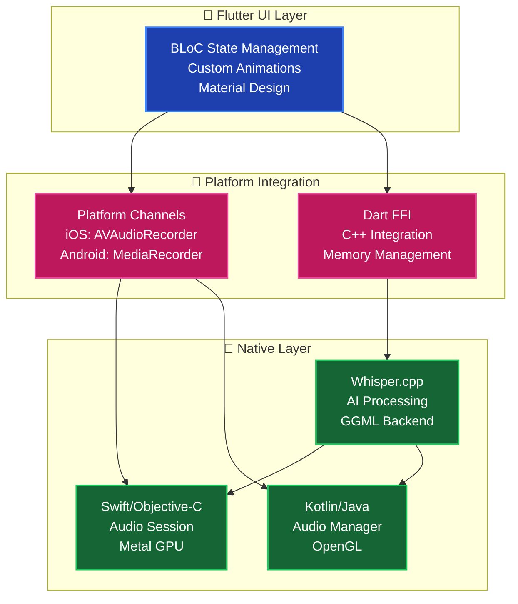

# 🎙️ Flutter Voice Bridge

**Advanced Flutter development with native platform integration and offline AI transcription**

[](https://flutter.dev/)
[](https://flutter.dev/)
[](./LICENSE)
[](https://github.com/ggerganov/whisper.cpp)

> A comprehensive educational project showcasing **advanced Flutter patterns**, **native platform integration**, and **offline AI processing** with **GPU acceleration**.

---

## ⚡ Quick Start (2 minutes)

```bash
# Clone and setup
git clone https://github.com/esrakadah/flutter_voice_bridge.git
cd flutter_voice_bridge
flutter pub get

# Build native libraries and download AI model (~147MB)
chmod +x ./scripts/build_whisper.sh
./scripts/build_whisper.sh

# Install platform dependencies
cd ios && pod install && cd .. && cd macos && pod install && cd ..

# Run on macOS (recommended - full GPU acceleration)
flutter run -d macos
```

**Try it**: Tap record → speak for 10 seconds → watch console for AI transcription results! 🤖

---

## 🎯 What This Project Demonstrates

### 🔧 **Advanced Flutter Techniques**
- **Platform Channels** - Bidirectional native communication
- **Dart FFI** - Direct C++ library integration with memory safety
- **Clean Architecture** - MVVM with dependency injection
- **BLoC State Management** - Complex async flows with immutable states

### 🤖 **Offline AI Integration**
- **Whisper.cpp** - Local speech-to-text processing
- **GPU Acceleration** - Metal GPU on Apple Silicon (2-3x faster)
- **No Internet Required** - Complete offline operation
- **Memory Management** - Production-grade FFI resource handling

### 🎨 **Advanced UI & Animations**
- **Custom Painters** - 60fps hardware-accelerated animations
- **4 Visualization Modes** - Waveform, Spectrum, Particles, Radial
- **Dynamic Controls** - Real-time size (50%-300%) and speed (0.5x-2x) adjustment
- **Immersive Fullscreen** - Professional animation experience

---

## 🏗️ Architecture Overview



---

## 📱 Platform Support

| Feature | iOS | macOS | Android | Description |
|---------|-----|-------|---------|-------------|
| **🎤 Audio Recording** | ✅ | ✅ | ✅ | High-quality native audio capture |
| **🔊 Audio Playback** | ✅ | ✅ | ✅ | In-app playback functionality |
| **🤖 AI Transcription** | ✅ | ✅ | 🔄 | Offline speech-to-text (Android in progress) |
| **🎨 Visualizations** | ✅ | ✅ | ✅ | 4 animation modes with controls |
| **⚡ GPU Acceleration** | ✅ | ✅ | 🔄 | Metal (iOS/macOS), OpenGL (Android) |

**Legend**: ✅ Complete, 🔄 In Progress

---

## 📚 Documentation

### **🚀 Start Here**
- **[📖 Complete Documentation Hub](./docs/README.md)** - Your navigation center for all guides
- **[⚙️ Setup Guide](./docs/guides/setup.md)** - Complete installation with troubleshooting
- **[🎯 Visual Architecture](./docs/guides/visual_architecture.md)** - All diagrams in one place

### **🔧 Implementation Guides**
- **[🏛️ System Architecture](./docs/guides/architecture.md)** - Deep technical architecture
- **[🔗 Implementation Patterns](./docs/guides/implementation_patterns.md)** - Code patterns and examples
- **[🤖 AI Integration](./docs/guides/ai_integration.md)** - Whisper.cpp FFI setup

### **🎨 Features & Polish**
- **[🎭 Animation System](./docs/guides/animations.md)** - Custom painters and visualizations
- **[📊 Feature Status](./docs/guides/feature_status.md)** - Implementation status across platforms

---

## 🎓 Perfect For Learning

### **🆕 Flutter Developers**
- **Platform Channels** - Learn native communication
- **State Management** - Master BLoC patterns
- **Clean Architecture** - Scalable app structure
- **Testing** - Comprehensive test coverage

### **🔥 Advanced Developers**
- **Dart FFI** - C++ library integration
- **Memory Management** - Production-grade resource handling
- **GPU Programming** - Metal/OpenGL acceleration
- **Performance** - 60fps animations and optimization

### **🎨 UI/UX Developers**
- **Custom Animations** - Hardware-accelerated rendering
- **Immersive Experiences** - Fullscreen interactions
- **Cross-Platform Design** - Consistent UI across platforms
- **Accessibility** - Inclusive design patterns

---

## 🛠️ Development

### **File Structure**
```
lib/
├── core/           # Business logic and services
│   ├── audio/      # Recording and playback
│   ├── transcription/ # AI processing
│   └── platform/   # Platform channels
├── data/           # Models and persistence
└── ui/             # Views, widgets, animations
native/whisper/     # C++ Whisper integration
```

### **Key Technologies**
- **Flutter 3.16.0+** with null safety
- **Whisper.cpp** for AI transcription
- **Metal GPU** acceleration on Apple Silicon
- **Clean Architecture** with dependency injection
- **BLoC/Cubit** for state management

---

## 🤝 Contributing

We welcome contributions! This project serves as both a **working application** and **educational resource**.

**Ways to Help:**
- 🐛 **Report bugs** you find
- ✨ **Suggest features** or improvements
- 📝 **Improve documentation** and guides
- 🔧 **Submit code** improvements
- 🎓 **Share learning experiences**

See **[CONTRIBUTING.md](./CONTRIBUTING.md)** for detailed guidelines.

---

## 🌟 Why This Project Matters

### **📚 Educational Impact**
- **Complete learning resource** for advanced Flutter development
- **Real-world patterns** used in production applications
- **Cross-platform expertise** in a single codebase
- **Open source** knowledge sharing

### **🔧 Technical Innovation**
- **Offline-first AI** without cloud dependencies
- **GPU acceleration** for mobile AI processing
- **Memory-safe FFI** with C++ libraries
- **Production-grade architecture** with comprehensive testing

### **🌍 Community Value**
- **Comprehensive documentation** for learning and reference
- **Working examples** of complex integrations
- **Best practices** for Flutter + native development
- **Extensible foundation** for building similar apps

---

## 📄 License

This project is licensed under the MIT License - see the **[LICENSE](./LICENSE)** file for details.

---

<div align="center">

**🚀 Ready to explore advanced Flutter development?**

[📖 **Start with Documentation**](./docs/README.md) • [⚙️ **Setup Guide**](./docs/guides/setup.md) • [🎯 **Visual Tour**](./docs/guides/visual_architecture.md)

**Built with ❤️ for the Flutter community**

</div>

