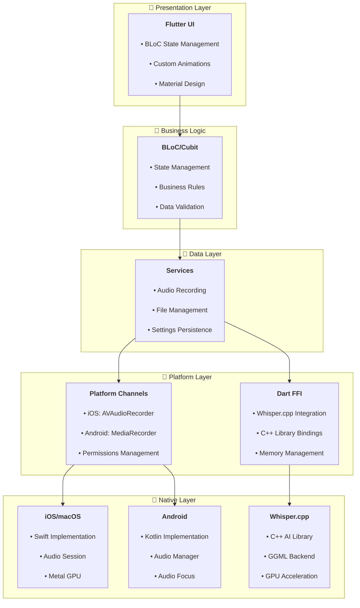

# 🎙️ Flutter Voice Bridge

A cross-platform Flutter application demonstrating advanced integration of native device features and local AI capabilities. This project showcases audio recording, playback, and offline speech-to-text transcription using `Whisper.cpp` with hardware acceleration.

**Last Updated**: 29 July 2025  
**Educational Focus**: Advanced Flutter patterns and native integration

---

## 🚀 Quick Start

### Prerequisites
- **Flutter SDK** 3.16.0+ ([Installation Guide](https://docs.flutter.dev/get-started/install))
- **Xcode** 15.0+ (for iOS/macOS development)
- **Android Studio** 2023.1+ (for Android development)
- **CMake** 3.20+ ([Installation Guide](https://cmake.org/install/))

### Installation

1. **Clone and setup**
   ```bash
   git clone https://github.com/esrakadah/flutter_voice_bridge.git
   cd flutter_voice_bridge
   flutter pub get
   ```

2. **Build native libraries and download AI model**
   ```bash
   chmod +x ./scripts/build_whisper.sh
   ./scripts/build_whisper.sh
   ```

3. **Install platform dependencies**
   ```bash
   # iOS/macOS (required for transcription)
   cd ios && pod install && cd ..
   cd macos && pod install && cd ..
   
   # Android (optional)
   flutter doctor --android-licenses
   ```

4. **Run the application**
   ```bash
   # macOS (recommended - full features with GPU transcription)
   flutter run -d macos
   
   # iOS Simulator
   flutter run -d ios
   
   # Android (audio recording only)
   flutter run -d android
   ```

---

## ✨ What This Project Demonstrates

### **Cross-Platform Audio Integration**
- High-quality audio recording on iOS, macOS, and Android
- Optimized audio formats (WAV 16kHz, 16-bit, mono) for speech processing
- Platform-specific audio session management

### **Offline AI Processing**
- Local speech-to-text using Whisper.cpp via Dart FFI
- Metal GPU acceleration on Apple Silicon (M1/M2/M3)
- No internet required, no API keys needed
- Model size: ~147MB for offline operation

### **Advanced Animation System**
- 4 visualization modes: Waveform, Spectrum, Particles, Radial
- Hardware-accelerated 60fps animations using CustomPainter
- Dynamic controls: size adjustment (50%-300%), speed (0.5x-2x)
- Fullscreen immersive experience with persistent settings

### **Native Platform Integration**
- **Platform Channels**: Bidirectional communication with iOS/Android native code
- **Dart FFI**: Direct C++ library integration for AI processing
- **Platform Views**: Native UI components embedded in Flutter
- **Clean Architecture**: MVVM with dependency injection and BLoC state management

---

## 🏗️ Architecture Overview

> 💡 **For visual learners**: See [VISUAL_ARCHITECTURE_GUIDE.md](./VISUAL_ARCHITECTURE_GUIDE.md) for all architectural diagrams with detailed explanations!



---

## 📚 Documentation

### **Core Documentation**
- **[VISUAL_ARCHITECTURE_GUIDE.md](./VISUAL_ARCHITECTURE_GUIDE.md)** - 🎯 **All diagrams in one place** - Perfect starting point for visual learners
- **[TECHNICAL_GUIDE.md](./TECHNICAL_GUIDE.md)** - Comprehensive implementation patterns
- **[ARCHITECTURE.md](./ARCHITECTURE.md)** - Detailed system architecture 
- **[SETUP.md](./SETUP.md)** - Complete setup and troubleshooting guide

### **Specialized Guides**
- **[WHISPER_SETUP.md](./WHISPER_SETUP.md)** - AI model integration details
- **[ANIMATION_GUIDE.md](./ANIMATION_GUIDE.md)** - Animation system deep dive
- **[FEATURE_STATUS.md](./FEATURE_STATUS.md)** - Implementation status across platforms

### **Project Management**
- **[project_management/](./project_management/)** - Development documentation
  - `requirements/` - UI patterns and technical specifications
  - `design/` - Design system and visual guidelines
  - `development_paths/` - Implementation guides and best practices

---

## 🛠️ Development

### **File Structure**
```
lib/
├── core/                   # Business logic and services
│   ├── audio/             # Audio recording/playback services
│   ├── transcription/     # AI transcription services
│   └── platform/          # Platform channel implementations
├── data/                  # Data models and persistence
├── ui/                    # User interface components
│   ├── views/             # Main application screens
│   ├── widgets/           # Reusable UI components
│   └── components/        # Custom painters and animations
└── di.dart                # Dependency injection setup
```

### **Build Scripts**
- `scripts/build_whisper.sh` - Compiles Whisper.cpp and downloads AI model
- `scripts/copy_native_libraries.sh` - Platform-specific library deployment

---

## 🤝 Contributing

See **[CONTRIBUTING.md](./CONTRIBUTING.md)** for development guidelines, code standards, and contribution workflow.

---

## 📄 License

This project is licensed under the MIT License - see the **[LICENSE](./LICENSE)** file for details.

