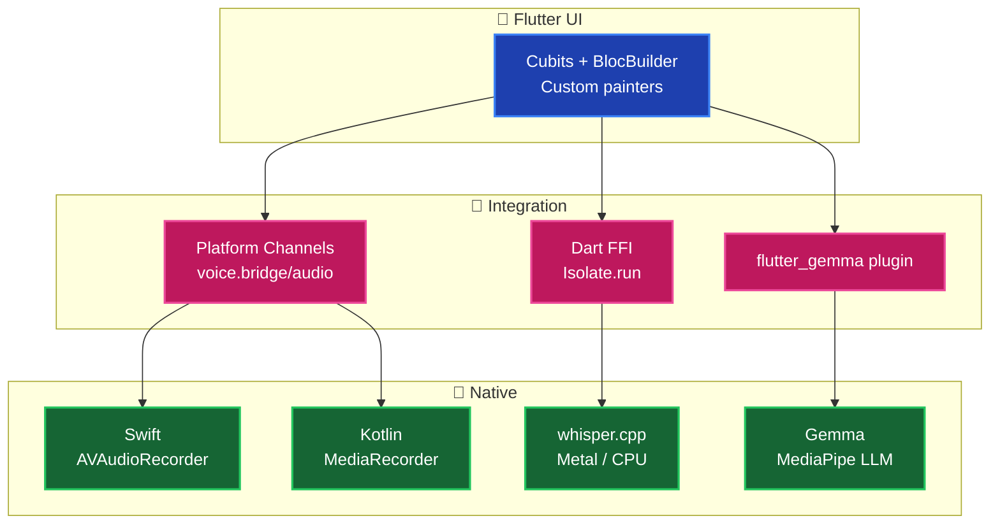

# 🎙️ Flutter Voice Bridge

**Flutter beyond the widget layer: platform channels, Dart FFI to whisper.cpp, and offline AI transcription**

[](https://github.com/esrakadah/flutter_voice_bridge/actions/workflows/ci.yml)
[](https://flutter.dev/)
[](#-platform-support)
[](./LICENSE)
[](https://github.com/ggml-org/whisper.cpp)

> An educational voice memo app. You record on any platform through native audio APIs; on macOS the recording is
> transcribed fully offline by whisper.cpp, called from Dart through FFI on a background isolate.

---

## ⚡ Quick Start (macOS)

Requirements: macOS 13.3+, Xcode, Flutter 3.38+, CocoaPods and `cmake` (`brew install cocoapods cmake`).

```bash
git clone https://github.com/esrakadah/flutter_voice_bridge.git
cd flutter_voice_bridge
flutter pub get

# Builds libwhisper_ffi.dylib (whisper.cpp v1.7.6) and downloads the base.en model (~147 MB).
# Run this before the first `flutter run`: the app bundles the model from assets/models/.
./scripts/build_whisper.sh

flutter run -d macos
```

**Try it**: tap record, speak for a few seconds, tap stop. The transcript appears in the app and is saved with
the recording, so it is still there after a restart.

Optional: `brew install ffmpeg` for the `Process.run` demo card (debug builds only, see below).

---

## 🎯 What This Project Demonstrates

### 🔧 Flutter and native integration
- **Platform Channels**: recording and playback through AVAudioRecorder (iOS, macOS) and MediaRecorder (Android)
- **Dart FFI**: a small C wrapper around whisper.cpp, with explicit memory ownership on both sides
- **Isolates**: each native transcription runs in `Isolate.run`, so the UI keeps animating while Whisper works
- **Platform Views** (iOS, Android): a native text view embedded in the Flutter tree
- **Process.run**: calling an external tool (ffmpeg) with an allowlist and graceful failure

### 🤖 Offline AI
- **whisper.cpp** speech-to-text on macOS, no network after setup
- **Metal** backend enabled by whisper.cpp's defaults on Apple Silicon
- **Gemma chat (experimental, iOS)**: on-device Gemma through [`flutter_gemma`](https://pub.dev/packages/flutter_gemma)

### 🎨 UI
- **Custom painters**: 5 visualization modes (waveform, spectrum, particles, radial, hybrid)
- **Live controls** for size and speed, plus an immersive fullscreen mode
- **Event Mode** for talks and booths: Settings switches on the DevFest theme and an app bar with your event's
  name, city, year and flag; the choice is saved across restarts

### 🧱 Architecture
- **Cubits** (`flutter_bloc`) with immutable, `Equatable` states
- **get_it** for dependency injection; services are injected through abstract interfaces so cubits are unit-tested
  with `mocktail` and `bloc_test`

---

## 🏗️ Architecture Overview


```mermaid
graph TB
    subgraph "🎨 Flutter UI"
        UI[Cubits + BlocBuilder<br/>Custom painters]
    end

    subgraph "🔧 Integration"
        PC[Platform Channels<br/>voice.bridge/audio]
        FFI[Dart FFI<br/>Isolate.run]
        GemmaPlugin[flutter_gemma plugin]
    end

    subgraph "📱 Native"
        Apple[Swift<br/>AVAudioRecorder]
        Android[Kotlin<br/>MediaRecorder]
        Whisper[whisper.cpp<br/>Metal / CPU]
        GemmaLLM[Gemma<br/>MediaPipe LLM]
    end

    UI --> PC
    UI --> FFI
    UI --> GemmaPlugin
    PC --> Apple
    PC --> Android
    FFI --> Whisper
    GemmaPlugin --> GemmaLLM

    classDef ui fill:#1e40af,stroke:#3b82f6,stroke-width:2px,color:#ffffff
    classDef platform fill:#be185d,stroke:#ec4899,stroke-width:2px,color:#ffffff
    classDef native fill:#166534,stroke:#22c55e,stroke-width:2px,color:#ffffff

    class UI ui
    class PC,FFI,GemmaPlugin platform
    class Apple,Android,Whisper,GemmaLLM native
```

---

## 📱 Platform Support

| Feature | macOS | iOS | Android |
|---|---|---|---|
| 🎤 Recording | ✅ WAV 16 kHz | ✅ WAV 16 kHz | ✅ AAC (m4a) |
| 🔊 Playback | ✅ | ✅ | ✅ |
| 🤖 Transcription | ✅ whisper.cpp | ⚠️ placeholder text | ⚠️ placeholder text |
| 💬 Gemma chat | ❌ | 🧪 experimental | ❌ |
| 🎨 Visualizations | ✅ | ✅ | ✅ |

Minimum versions: macOS 13.3 (needed by whisper.cpp's BLAS backend), iOS 16.0 (needed by `flutter_gemma`).

iOS and Android use a placeholder transcription service: shipping the native library there needs a signed
framework (iOS) and an NDK build (Android), which this project does not do yet.

### Gemma chat (experimental)

The Gemma screen downloads a model on first use (300 MB to 3.1 GB, picked in its settings screen). Some
Gemma models on Hugging Face are gated; for those, pass your token at build time instead of editing code:

```bash
flutter run -d <ios-device> --dart-define=HF_TOKEN=hf_your_token
```

`flutter_gemma` is deliberately held at 0.9.x; moving to 1.x changes the model API and needs a device retest.

### ffmpeg demo

The `Process.run` card runs `ffmpeg -version` when you tap it. It only works in macOS debug builds: the
release build is sandboxed without the Homebrew exception, and the card then reports ffmpeg as not available.

---

## 🧪 Testing

```bash
flutter analyze
flutter test                              # unit and widget tests, also run in CI
flutter test integration_test -d macos    # on-device smoke test, needs ./scripts/build_whisper.sh first
```

Covered today: every public method of the home and Gemma cubits (including double taps and stale results), the
Gemma download's resume rules, event branding and its persistence, the home screen (empty state, record button,
event app bar, status card) and dependency registration. On a Mac with the native build,
`test/core/transcription/whisper_ffi_service_test.dart` also transcribes whisper.cpp's sample clip through the
real library and checks that the calling isolate stayed responsive; CI skips it.

---

## 📚 Documentation

- **[Documentation hub](./docs/README.md)** and **[setup guide](./docs/guides/setup.md)**
- **[Architecture](./docs/guides/architecture.md)**, **[implementation patterns](./docs/guides/implementation_patterns.md)**,
  **[AI integration](./docs/guides/ai_integration.md)**
- **[Animations](./docs/guides/animations.md)** and **[feature status](./docs/guides/feature_status.md)**
- **[Gemma module](./lib/gemma/README.md)**
- **[DevFest Berlin 2025 talk material](./docs/talks/devfest-berlin-2025/PRESENTATION.md)**; the code as presented is tagged
  [`devfest-berlin-2025`](https://github.com/esrakadah/flutter_voice_bridge/tree/devfest-berlin-2025)
- **[Engineering review, 2 Oct 2026](./docs/reviews/2026-10-02-gbu.md)**: what was found, fixed and deliberately left

The guides describe the July 2025 workshop version; where they disagree with this README, this README and the
code win.

---

## 🛠️ Project Structure

```
lib/
├── core/           # audio, transcription (FFI), platform channels, theme, errors
├── data/           # voice memo model and file-based service
├── gemma/          # experimental Gemma chat: data, domain, ui
└── ui/             # views, cubits, components, painters
native/whisper/     # C wrapper + CMakeLists.txt around a pinned whisper.cpp
scripts/            # build_whisper.sh
```

---

## 🤝 Contributing

Bug reports, fixes and workshop feedback are welcome. See **[CONTRIBUTING.md](./CONTRIBUTING.md)**.

## 📄 License

MIT, see **[LICENSE](./LICENSE)**.

<div align="center">

**Built with ❤️ for the Flutter community by [@esrakadah](https://github.com/esrakadah)**

</div>
