# 🎙️ Flutter Voice Bridge

**Flutter Voice Bridge** is a **production-ready** cross-platform application showcasing advanced integration of native device features and local AI capabilities within a Flutter app. It provides a robust foundation for building voice-powered applications, featuring audio recording, playback, and **fully working offline speech-to-text transcription** using `Whisper.cpp` with GPU acceleration.

This project follows **Clean Architecture** principles and demonstrates **real-world implementation** of complex Flutter concepts including FFI, Platform Channels, AI integration, and **advanced custom animations**.

> **🎯 Status**: **PRODUCTION READY** - Full iOS/macOS transcription with GPU acceleration working perfectly. Android audio recording fully functional. **NEW**: Immersive fullscreen animations with dynamic controls!

## ✨ Features

- **✅ Cross-Platform Audio Recording**: High-quality audio capture on iOS, macOS, and Android with optimized formats (WAV 16kHz).
- **✅ Local Audio Playback**: Play recorded memos directly within the app across all platforms.
- **✅ Offline Speech-to-Text**: **FULLY WORKING** on-device transcription using `Whisper.cpp` via Dart FFI with Metal GPU acceleration on Apple Silicon.
- **✅ Immersive Audio Visualization**: **NEW!** Fullscreen animation experience with 4 stunning modes (Waveform, Spectrum, Particles, Radial).
- **✅ Dynamic Animation Controls**: **NEW!** Real-time size adjustment with + and - controls, speed settings (0.5x-2x), and play/pause.
- **✅ Smart Animation Persistence**: **NEW!** All animation preferences automatically saved across app sessions.
- **✅ Tap-to-Fullscreen Navigation**: **NEW!** Seamless transition from compact to immersive fullscreen animation view.
- **✅ Keyword Extraction**: Automatic keyword detection from transcribed text with intelligent filtering.
- **✅ Clean Architecture (MVVM)**: A clear separation of concerns between UI, business logic, and data layers.
- **✅ Dependency Injection**: Loose coupling and enhanced testability using `get_it`.
- **✅ State Management with BLoC/Cubit**: Predictable and scalable state management with real-time UI updates.
- **✅ Native Integration**: Deep integration with native APIs via Platform Channels and Dart FFI.
- **✅ GPU Acceleration**: Metal GPU support on Apple Silicon (M1/M2/M3) for fast AI inference.
- **✅ Native Platform Views**: Custom native UI components integrated seamlessly with Flutter.
- **📚 Comprehensive Documentation**: Complete guides for architecture, setup, and feature implementation.

## 🎨 Animation System Architecture

### 🖼️ Fullscreen Animation Experience

```mermaid
graph TB
    subgraph "Animation UI Layer"
        HV["`**Home View**<br/>
        • Compact Animation Preview<br/>
        • Tap-to-Fullscreen Navigation<br/>
        • Mode Selection Chips`"]
        
        FS["`**Fullscreen View**<br/>
        • Immersive Black Background<br/>
        • Large-scale Animations<br/>
        • Professional Control Panel<br/>
        • Back Navigation`"]
    end
    
    subgraph "Animation Control System"
        AC["`**Animation Controller**<br/>
        • Master Timeline (2400ms base)<br/>
        • Synchronized Phases<br/>
        • Speed Adjustment (0.5x-2x)<br/>
        • Play/Pause State`"]
        
        SC["`**Scale Controller**<br/>
        • Size Range (50%-300%)<br/>
        • Step Increments (25%)<br/>
        • Real-time Adjustment<br/>
        • Bounds Checking`"]
    end
    
    subgraph "Animation Modes"
        WF["`**Waveform Mode**<br/>
        • Multi-layer Wave Synthesis<br/>
        • Complex Harmonics<br/>
        • Smooth Bezier Curves<br/>
        • Dynamic Amplitude`"]
        
        SP["`**Spectrum Mode**<br/>
        • 64-bar Frequency Display<br/>
        • Gradient Color Mapping<br/>
        • Real-time Height Animation<br/>
        • Spectrum Analyzer Style`"]
        
        PT["`**Particles Mode**<br/>
        • 120 Animated Particles<br/>
        • Rainbow HSV Colors<br/>
        • Orbital Motion Patterns<br/>
        • Glow Effects`"]
        
        RD["`**Radial Mode**<br/>
        • 7 Concentric Rings<br/>
        • Pulsing Central Dot<br/>
        • Wave Interference<br/>
        • Multi-color Gradients`"]
    end
    
    subgraph "Persistence Layer"
        AP["`**Animation Preferences**<br/>
        • SharedPreferences Backend<br/>
        • Scale, Speed, Mode Storage<br/>
        • Auto-load on Startup<br/>
        • Cross-session Continuity`"]
    end
    
    subgraph "Rendering Engine"
        CP["`**Custom Painter**<br/>
        • Hardware-accelerated Canvas<br/>
        • Blur Effects & Masks<br/>
        • Gradient Shaders<br/>
        • 60fps Performance`"]
    end
    
    %% Connections
    HV --> FS
    FS --> AC
    FS --> SC
    AC --> WF
    AC --> SP
    AC --> PT
    AC --> RD
    SC --> WF
    SC --> SP
    SC --> PT
    SC --> RD
    WF --> CP
    SP --> CP
    PT --> CP
    RD --> CP
    AP --> AC
    AP --> SC
    
    %% Styling
    classDef ui fill:#1e3a8a,stroke:#3b82f6,stroke-width:2px,color:#ffffff
    classDef control fill:#581c87,stroke:#a855f7,stroke-width:2px,color:#ffffff
    classDef animation fill:#14532d,stroke:#22c55e,stroke-width:2px,color:#ffffff
    classDef system fill:#9a3412,stroke:#f97316,stroke-width:2px,color:#ffffff
    
    class HV,FS ui
    class AC,SC control
    class WF,SP,PT,RD animation
    class AP,CP system
```



### 🎮 Animation Control Flow

```mermaid
sequenceDiagram
    participant User
    participant CompactView as Compact Animation
    participant FullscreenView as Fullscreen View
    participant AnimationController as Animation Controller
    participant ScaleController as Scale Controller
    participant Preferences as Animation Preferences
    participant CustomPainter as Custom Painter
    
    Note over User,CustomPainter: 🎨 Enhanced Animation Experience Flow
    
    User->>CompactView: Tap Animation Preview
    CompactView->>FullscreenView: Navigate to Fullscreen
    FullscreenView->>Preferences: Load Saved Settings
    Preferences-->>FullscreenView: Scale: 1.25x, Speed: 1.5x, Mode: Particles
    
    FullscreenView->>AnimationController: Initialize with External State
    FullscreenView->>ScaleController: Set Scale to 1.25x
    
    AnimationController->>CustomPainter: Render with Scale & Speed
    CustomPainter-->>FullscreenView: 60fps Smooth Animation
    
    Note over User,CustomPainter: 🎛️ Dynamic Control Interaction
    
    User->>FullscreenView: Tap "+" Size Button
    FullscreenView->>ScaleController: Increase Scale (1.25x → 1.5x)
    ScaleController->>Preferences: Save New Scale
    ScaleController->>CustomPainter: Update Scale in Real-time
    CustomPainter-->>User: Larger Animation Instantly
    
    User->>FullscreenView: Tap Speed Control
    FullscreenView->>AnimationController: Change Speed (1.5x → 2x)
    AnimationController->>Preferences: Save New Speed
    AnimationController->>CustomPainter: Update Animation Speed
    CustomPainter-->>User: Faster Animation
    
    User->>FullscreenView: Tap Mode Button
    FullscreenView->>FullscreenView: Cycle Mode (Particles → Radial)
    FullscreenView->>CustomPainter: Switch Rendering Mode
    CustomPainter-->>User: Different Animation Style
    
    Note over User,CustomPainter: 💾 Persistent Experience
    
    User->>FullscreenView: Navigate Back
    FullscreenView->>Preferences: Save All Current Settings
    Preferences-->>FullscreenView: Settings Persisted
    
    Note over User,CustomPainter: 🔄 Next Session Continuity
    
    User->>CompactView: App Restart + Tap Animation
    CompactView->>FullscreenView: Navigate to Fullscreen
    FullscreenView->>Preferences: Load Previous Settings
    Preferences-->>FullscreenView: Scale: 1.5x, Speed: 2x, Mode: Radial
    FullscreenView-->>User: Exact Same Experience Restored
```



## 🏛️ Project Architecture

The application is structured using a clean, layered architecture that separates concerns and promotes modularity.

### 📊 System Architecture Overview

```mermaid
graph TB
    %% Flutter App Architecture & Native Connections
    subgraph "Flutter Layer"
        UI["`**UI Layer**<br/>
        • HomeView (BlocConsumer)<br/>
        • VoiceRecorderButton<br/>
        • AudioVisualizer + Fullscreen<br/>
        • NativeTextView (Platform View)`"]
        
        BL["`**Business Logic**<br/>
        • HomeCubit (State Management)<br/>
        • Recording/Transcription Logic<br/>
        • Animation Preferences<br/>
        • Error Handling`"]
        
        Data["`**Data Layer**<br/>
        • VoiceMemoService<br/>
        • VoiceMemo Model<br/>
        • Animation Settings<br/>
        • File I/O Operations`"]
    end
    
    subgraph "Platform Interface"
        PC["`**Platform Channels**<br/>
        • Audio Recording Control<br/>
        • Permission Management<br/>
        • Platform View Integration`"]
        
        FFI["`**Dart FFI**<br/>
        • Direct C++ Integration<br/>
        • Whisper.cpp Binding<br/>
        • Memory Management`"]
    end
    
    subgraph "iOS/macOS Native"
        iOS_Swift["`**Swift Implementation**<br/>
        • AVAudioRecorder<br/>
        • Audio Session Config<br/>
        • WAV Format (16kHz)`"]
        
        iOS_Metal["`**Metal GPU**<br/>
        • Hardware Acceleration<br/>
        • Neural Network Ops<br/>
        • Apple M1/M2/M3 Support`"]
    end
    
    subgraph "Android Native"
        Android_Kotlin["`**Kotlin Implementation**<br/>
        • MediaRecorder<br/>
        • Audio Permissions<br/>
        • WAV Format`"]
        
        Android_GPU["`**GPU Support**<br/>
        • OpenGL/Vulkan<br/>
        • Compute Shaders`"]
    end
    
    subgraph "AI Processing Layer"
        Whisper["`**Whisper.cpp**<br/>
        • OpenAI Whisper Model<br/>
        • GGML Backend<br/>
        • 147MB Base Model<br/>
        • Real-time Processing`"]
        
        Models["`**AI Models**<br/>
        • ggml-base.en.bin<br/>
        • English Language Support<br/>
        • Offline Inference`"]
    end
    
    %% Flutter Internal Flow
    UI --> BL
    BL --> Data
    BL --> PC
    BL --> FFI
    
    %% Platform Channel Connections
    PC --> iOS_Swift
    PC --> Android_Kotlin
    
    %% FFI Direct Connections
    FFI --> Whisper
    Whisper --> Models
    
    %% GPU Acceleration Paths
    iOS_Swift --> iOS_Metal
    Android_Kotlin --> Android_GPU
    Whisper --> iOS_Metal
    Whisper --> Android_GPU
    
    %% Styling
    classDef flutter fill:#1e3a8a,stroke:#3b82f6,stroke-width:2px,color:#ffffff
    classDef platform fill:#581c87,stroke:#a855f7,stroke-width:2px,color:#ffffff
    classDef native fill:#14532d,stroke:#22c55e,stroke-width:2px,color:#ffffff
    classDef ai fill:#9a3412,stroke:#f97316,stroke-width:2px,color:#ffffff
    
    class UI,BL,Data flutter
    class PC,FFI platform
    class iOS_Swift,Android_Kotlin,iOS_Metal,Android_GPU native
    class Whisper,Models ai
```



### 🔄 Recording & Transcription Flow

```mermaid
sequenceDiagram
    participant User
    participant UI as Flutter UI
    participant Cubit as HomeCubit
    participant AudioSvc as AudioService
    participant PC as Platform Channel
    participant Native as Native Layer
    participant FFI as Dart FFI
    participant Whisper as Whisper.cpp
    participant GPU as Metal GPU
    participant FS as File System
    
    Note over User,FS: 🎤 Complete Voice Recording & AI Transcription Pipeline
    
    User->>UI: Tap Record Button
    UI->>Cubit: startRecording()
    
    activate Cubit
    Cubit->>AudioSvc: startRecording()
    AudioSvc->>PC: invokeMethod('startRecording')
    
    PC->>Native: Platform-specific audio setup
    alt iOS/macOS
        Native->>Native: AVAudioRecorder.record()
        Note right of Native: 16kHz WAV format for Whisper
    else Android
        Native->>Native: MediaRecorder.start()
        Note right of Native: 16kHz WAV format
    end
    
    Native-->>PC: Recording started
    PC-->>AudioSvc: Success response
    AudioSvc-->>Cubit: Recording active
    Cubit-->>UI: RecordingInProgress state
    UI-->>User: Show enhanced animations
    
    Note over User,FS: 🎵 Recording in progress with fullscreen animations...
    
    User->>UI: Tap Stop Button
    UI->>Cubit: stopRecording()
    Cubit->>AudioSvc: stopRecording()
    AudioSvc->>PC: invokeMethod('stopRecording')
    
    PC->>Native: Stop recording
    Native->>Native: Finalize audio file
    Native->>FS: Save WAV file (16kHz, 16-bit, mono)
    Native-->>PC: File path returned
    PC-->>AudioSvc: Audio file saved
    AudioSvc-->>Cubit: Recording completed
    
    Note over User,FS: 🤖 AI Transcription via FFI (WORKING)
    
    Cubit->>FFI: transcribeAudio(filePath)
    activate FFI
    FFI->>Whisper: Initialize model (if needed)
    FFI->>Whisper: Load & validate audio file
    Whisper->>Whisper: Read WAV samples
    
    alt Apple Silicon (M1/M2/M3)
        Whisper->>GPU: Metal GPU acceleration
        GPU->>GPU: Neural network inference
        GPU-->>Whisper: Accelerated results
        Note right of GPU: ~2-3x faster than CPU
    else Other platforms
        Whisper->>Whisper: CPU-based processing
        Note right of Whisper: Still very fast
    end
    
    Whisper->>Whisper: Generate text transcription
    Whisper-->>FFI: Return transcribed text
    deactivate FFI
    FFI-->>Cubit: Transcription completed
    
    Cubit->>FS: Save VoiceMemo with transcription
    deactivate Cubit
    Cubit-->>UI: TranscriptionCompleted state
    UI-->>User: Show transcribed text
```



## 🚀 Quick Start

### Prerequisites
- Flutter SDK 3.16.0+
- Xcode (for iOS/macOS)
- Android Studio (for Android)
- CMake (for native libraries)

### Setup
```bash
# Clone the repository
git clone <repository-url>
cd flutter_voice_bridge

# Install dependencies
flutter pub get

# Build native Whisper library
./scripts/build_whisper.sh

# Run on your platform
flutter run -d macos    # Recommended for full transcription + animations
flutter run -d ios      # iOS Simulator
flutter run -d android  # Android
```

## 🎯 Key Features Demonstrated

### **✅ Working Features**
- **Audio Recording**: Full platform integration with native APIs
- **Speech-to-Text**: Offline transcription with 147MB Whisper model
- **Immersive Animations**: Fullscreen experience with 4 stunning visualization modes
- **Dynamic Controls**: Real-time size (50%-300%) and speed (0.5x-2x) adjustment
- **Smart Persistence**: All animation preferences automatically saved
- **GPU Acceleration**: Metal GPU support on Apple Silicon
- **Clean Architecture**: Production-ready code organization
- **State Management**: BLoC pattern with immutable states
- **Error Handling**: Comprehensive error recovery
- **Memory Management**: Proper FFI resource cleanup
- **Platform Views**: Native UI components in Flutter

### **🔧 Technical Achievements**
- **Platform Channels**: Bidirectional Flutter ↔ Native communication
- **Dart FFI**: Direct C++ library integration with memory safety
- **AI Integration**: Local Whisper.cpp with GPU acceleration
- **Advanced Animations**: Custom painters with hardware acceleration
- **Settings Persistence**: SharedPreferences with type-safe models
- **Audio Processing**: 16kHz WAV format optimized for speech recognition
- **Multi-threading**: Background transcription using isolates
- **Native Libraries**: Cross-platform C++ compilation and deployment

## 🎨 Animation Features Showcase

### **🖼️ Visualization Modes**
- **🌊 Waveform**: Multi-layered sine waves with complex harmonics
- **📊 Spectrum**: 64-bar frequency analyzer with gradient colors
- **✨ Particles**: 120 animated particles in rainbow orbital motion
- **🔄 Radial**: 7 concentric rings with wave interference patterns

### **🎛️ Interactive Controls**
- **▶️⏸️ Play/Pause**: Large primary control for animation state
- **➖➕ Size Control**: Real-time scaling from 50% to 300%
- **⚡ Speed Control**: Cycle through 0.5x, 1x, 1.5x, 2x speeds
- **🎨 Mode Switcher**: Seamless transitions between visualization modes
- **🔙 Navigation**: Smooth back transition to main view

### **💾 Smart Persistence**
- **Auto-save**: All preferences saved immediately on change
- **Cross-session**: Perfect restoration of user preferences
- **Type-safe**: Robust data models with fallback defaults
- **Performance**: Efficient SharedPreferences implementation

## 📱 Platform Status

| Platform | Audio Recording | Transcription | GPU Acceleration | Animations | Status |
|----------|----------------|---------------|------------------|------------|---------|
| **iOS** | ✅ Working | ✅ Working | ✅ Metal | ✅ 60fps | **Ready** |
| **macOS** | ✅ Working | ✅ Working | ✅ Metal | ✅ 60fps | **Ready** |
| **Android** | ✅ Working | ⚠️ Partial | ⚠️ OpenGL | ✅ 60fps | In Progress |

## 📚 Documentation

- **[SETUP.md](./SETUP.md)** - Complete setup instructions
- **[ARCHITECTURE.md](./ARCHITECTURE.md)** - Technical architecture deep dive  
- **[FEATURE_STATUS.md](./FEATURE_STATUS.md)** - Current implementation status
- **[ANIMATION_GUIDE.md](./ANIMATION_GUIDE.md)** - **NEW!** Comprehensive animation system guide
- **[WHISPER_SETUP.md](./WHISPER_SETUP.md)** - AI transcription setup guide
- **[WORKSHOP_GUIDE.md](./WORKSHOP_GUIDE.md)** - Learning modules and tutorials

## 🏆 Learning Outcomes

This project demonstrates **production-grade Flutter development** including:

### **🔧 Technical Skills**
- Advanced Platform Channel implementation
- Dart FFI with C++ library integration
- AI model integration and optimization
- Custom animation systems with hardware acceleration
- Advanced state management with persistence
- Clean Architecture patterns
- Memory management and resource cleanup
- Performance optimization techniques

### **🏗️ Architecture Patterns**
- Clean Architecture (MVVM)
- Dependency Injection
- Repository Pattern
- Observer Pattern (BLoC)
- Factory Pattern
- Service Locator Pattern
- Settings Persistence Pattern

### **🎨 Animation & UI Patterns**
- Custom Painter implementations
- Hardware-accelerated Canvas rendering
- Real-time parameter adjustment
- Fullscreen navigation patterns
- Settings persistence with SharedPreferences
- Dynamic control panel design
- Immersive user experiences

### **📱 Platform Integration**
- Native iOS/macOS Swift development
- Native Android Kotlin development
- Cross-platform native library compilation
- GPU acceleration integration
- Audio processing and optimization

## 🎯 Real-World Applications

The patterns and techniques demonstrated here are directly applicable to:

- **AI-powered mobile apps** (chatbots, voice assistants, image recognition)
- **Multimedia applications** (audio/video processing, streaming, visualizations)
- **Performance-critical apps** (games, real-time processing, animations)
- **Enterprise applications** (offline-first, native integration, settings persistence)
- **IoT and hardware integration** (sensor data, device communication)
- **Creative and artistic apps** (music visualizers, drawing tools, effects)

## 🏅 Achievement Unlocked

✅ **Offline AI Integration**: Successfully implemented local speech recognition  
✅ **Platform Mastery**: Native audio integration across iOS, macOS, Android  
✅ **Architecture Excellence**: Clean, maintainable, and testable codebase  
✅ **Performance Optimization**: GPU-accelerated AI inference + 60fps animations  
✅ **Immersive UX**: Fullscreen animations with dynamic real-time controls  
✅ **Smart Persistence**: Seamless settings continuity across app sessions  
✅ **Production Ready**: Error handling, logging, and resource management  

---

**Built with ❤️ using Flutter, Dart FFI, Whisper.cpp, and Custom Animations**

