# 🎙️ Flutter Voice Bridge

**Flutter Voice Bridge** is a **production-ready** cross-platform application showcasing advanced integration of native device features and local AI capabilities within a Flutter app. It provides a robust foundation for building voice-powered applications, featuring audio recording, playback, and **fully working offline speech-to-text transcription** using `Whisper.cpp` with GPU acceleration.

This project follows **Clean Architecture** principles and demonstrates **real-world implementation** of complex Flutter concepts including FFI, Platform Channels, AI integration, and **advanced custom animations**.

> **🎯 Status**: **PRODUCTION READY** - Full iOS/macOS transcription with GPU acceleration working perfectly. Android audio recording fully functional. **NEW**: Immersive fullscreen animations with dynamic controls!

## 🚀 Quick Start

### Prerequisites
- **Flutter SDK** 3.16.0+ ([Installation Guide](https://docs.flutter.dev/get-started/install))
- **Xcode** 15.0+ (for iOS/macOS development)
- **Android Studio** 2023.1+ (for Android development)
- **CMake** 3.20+ ([Installation Guide](https://cmake.org/install/))

### Setup & Installation

1. **Clone the repository**
   ```bash
   git clone https://github.com/esrakadah/flutter_voice_bridge.git
   cd flutter_voice_bridge
   ```

2. **Install Flutter dependencies**
   ```bash
   flutter pub get
   ```

3. **Build native Whisper library & download AI model**
   ```bash
   # This script automatically downloads Whisper.cpp, compiles it, and downloads the AI model (~147MB)
   chmod +x ./scripts/build_whisper.sh
   ./scripts/build_whisper.sh
   ```

4. **Install platform dependencies**
   ```bash
   # For iOS/macOS (required for transcription)
   cd ios && pod install && cd ..
   cd macos && pod install && cd ..
   
   # For Android (optional)
   flutter doctor --android-licenses
   ```

5. **Run the application**
   ```bash
   # macOS (recommended - full features including GPU-accelerated transcription)
   flutter run -d macos
   
   # iOS Simulator
   flutter run -d ios
   
   # Android (audio recording only, transcription coming soon)
   flutter run -d android
   ```

### ✅ Verification

After setup, you should be able to:
- ✅ Record audio by tapping the record button
- ✅ See animated audio visualizations
- ✅ View transcribed text in console logs (iOS/macOS only)
- ✅ Access fullscreen animation mode

Expected console output:
```bash
🤖 Initializing Whisper with model: [path]/ggml-base.en.bin
✅ Whisper context initialized successfully
🎵 Starting transcription for: voice_memo_[timestamp].wav
✅ Transcription completed successfully
📄 Result: "Your spoken text appears here"
```

## ✨ Features

- **✅ Cross-Platform Audio Recording**: High-quality audio capture on iOS, macOS, and Android with optimized formats (WAV 16kHz).
- **✅ Local Audio Playback**: Play recorded memos directly within the app across all platforms.
- **✅ Offline Speech-to-Text**: **FULLY WORKING** on-device transcription using `Whisper.cpp` via Dart FFI with Metal GPU acceleration on Apple Silicon.
- **✅ Immersive Audio Visualization**: **NEW!** Fullscreen animation experience with 4 stunning modes (Waveform, Spectrum, Particles, Radial).
- **✅ Dynamic Animation Controls**: **NEW!** Real-time size adjustment with + and - controls, speed settings (0.5x-2x), and play/pause.
- **✅ Smart Animation Persistence**: **NEW!** All animation preferences automatically saved across app sessions.
- **✅ Tap-to-Fullscreen Navigation**: **NEW!** Seamless transition from compact to immersive fullscreen animation view.
- **✅ Keyword Extraction**: Automatic keyword detection from transcribed text with intelligent filtering.
- **✅ Clean Architecture (MVVM)**: A clear separation of concerns between UI, business logic, and data layers.
- **✅ Dependency Injection**: Loose coupling and enhanced testability using `get_it`.
- **✅ State Management with BLoC/Cubit**: Predictable and scalable state management with real-time UI updates.
- **✅ Native Integration**: Deep integration with native APIs via Platform Channels and Dart FFI.
- **✅ GPU Acceleration**: Metal GPU support on Apple Silicon (M1/M2/M3) for fast AI inference.
- **✅ Native Platform Views**: Custom native UI components integrated seamlessly with Flutter.
- **📚 Comprehensive Documentation**: Complete guides for architecture, setup, and feature implementation.

## 🎨 Animation System Architecture

### 🖼️ Fullscreen Animation Experience

```mermaid
graph TB
    subgraph "Animation UI Layer"
        HV["`**Home View**<br/>
        • Compact Animation Preview<br/>
        • Tap-to-Fullscreen Navigation<br/>
        • Mode Selection Chips`"]
        
        FS["`**Fullscreen View**<br/>
        • Immersive Black Background<br/>
        • Large-scale Animations<br/>
        • Professional Control Panel<br/>
        • Back Navigation`"]
    end
    
    subgraph "Animation Control System"
        AC["`**Animation Controller**<br/>
        • Master Timeline (2400ms base)<br/>
        • Synchronized Phases<br/>
        • Speed Adjustment (0.5x-2x)<br/>
        • Play/Pause State`"]
        
        SC["`**Scale Controller**<br/>
        • Size Range (50%-300%)<br/>
        • Step Increments (25%)<br/>
        • Real-time Adjustment<br/>
        • Bounds Checking`"]
    end
    
    subgraph "Animation Modes"
        WF["`**Waveform Mode**<br/>
        • Multi-layer Wave Synthesis<br/>
        • Complex Harmonics<br/>
        • Smooth Bezier Curves<br/>
        • Dynamic Amplitude`"]
        
        SP["`**Spectrum Mode**<br/>
        • 64-bar Frequency Display<br/>
        • Gradient Color Mapping<br/>
        • Real-time Height Animation<br/>
        • Spectrum Analyzer Style`"]
        
        PT["`**Particles Mode**<br/>
        • 120 Animated Particles<br/>
        • Rainbow HSV Colors<br/>
        • Orbital Motion Patterns<br/>
        • Glow Effects`"]
        
        RD["`**Radial Mode**<br/>
        • 7 Concentric Rings<br/>
        • Pulsing Central Dot<br/>
        • Wave Interference<br/>
        • Multi-color Gradients`"]
    end
    
    subgraph "Persistence Layer"
        AP["`**Animation Preferences**<br/>
        • SharedPreferences Backend<br/>
        • Scale, Speed, Mode Storage<br/>
        • Auto-load on Startup<br/>
        • Cross-session Continuity`"]
    end
    
    subgraph "Rendering Engine"
        CP["`**Custom Painter**<br/>
        • Hardware-accelerated Canvas<br/>
        • Blur Effects & Masks<br/>
        • Gradient Shaders<br/>
        • 60fps Performance`"]
    end
    
    %% Connections
    HV --> FS
    FS --> AC
    FS --> SC
    AC --> WF
    AC --> SP
    AC --> PT
    AC --> RD
    SC --> WF
    SC --> SP
    SC --> PT
    SC --> RD
    WF --> CP
    SP --> CP
    PT --> CP
    RD --> CP
    AP --> AC
    AP --> SC
    
    %% Styling
    classDef ui fill:#1e3a8a,stroke:#3b82f6,stroke-width:2px,color:#ffffff
    classDef control fill:#581c87,stroke:#a855f7,stroke-width:2px,color:#ffffff
    classDef animation fill:#14532d,stroke:#22c55e,stroke-width:2px,color:#ffffff
    classDef system fill:#9a3412,stroke:#f97316,stroke-width:2px,color:#ffffff
    
    class HV,FS ui
    class AC,SC control
    class WF,SP,PT,RD animation
    class AP,CP system
```



### 🎮 Animation Control Flow

```mermaid
sequenceDiagram
    participant User
    participant CompactView as Compact Animation
    participant FullscreenView as Fullscreen View
    participant AnimationController as Animation Controller
    participant ScaleController as Scale Controller
    participant Preferences as Animation Preferences
    participant CustomPainter as Custom Painter
    
    Note over User,CustomPainter: 🎨 Enhanced Animation Experience Flow
    
    User->>CompactView: Tap Animation Preview
    CompactView->>FullscreenView: Navigate to Fullscreen
    FullscreenView->>Preferences: Load Saved Settings
    Preferences-->>FullscreenView: Scale: 1.25x, Speed: 1.5x, Mode: Particles
    
    FullscreenView->>AnimationController: Initialize with External State
    FullscreenView->>ScaleController: Set Scale to 1.25x
    
    AnimationController->>CustomPainter: Render with Scale & Speed
    CustomPainter-->>FullscreenView: 60fps Smooth Animation
    
    Note over User,CustomPainter: 🎛️ Dynamic Control Interaction
    
    User->>FullscreenView: Tap "+" Size Button
    FullscreenView->>ScaleController: Increase Scale (1.25x → 1.5x)
    ScaleController->>Preferences: Save New Scale
    ScaleController->>CustomPainter: Update Scale in Real-time
    CustomPainter-->>User: Larger Animation Instantly
    
    User->>FullscreenView: Tap Speed Control
    FullscreenView->>AnimationController: Change Speed (1.5x → 2x)
    AnimationController->>Preferences: Save New Speed
    AnimationController->>CustomPainter: Update Animation Speed
    CustomPainter-->>User: Faster Animation
    
    User->>FullscreenView: Tap Mode Button
    FullscreenView->>FullscreenView: Cycle Mode (Particles → Radial)
    FullscreenView->>CustomPainter: Switch Rendering Mode
    CustomPainter-->>User: Different Animation Style
    
    Note over User,CustomPainter: 💾 Persistent Experience
    
    User->>FullscreenView: Navigate Back
    FullscreenView->>Preferences: Save All Current Settings
    Preferences-->>FullscreenView: Settings Persisted
    
    Note over User,CustomPainter: 🔄 Next Session Continuity
    
    User->>CompactView: App Restart + Tap Animation
    CompactView->>FullscreenView: Navigate to Fullscreen
    FullscreenView->>Preferences: Load Previous Settings
    Preferences-->>FullscreenView: Scale: 1.5x, Speed: 2x, Mode: Radial
    FullscreenView-->>User: Exact Same Experience Restored
```



## 🏛️ Project Architecture

The application is structured using a clean, layered architecture that separates concerns and promotes modularity.

### 📊 System Architecture Overview


### 🔄 Recording & Transcription Flow


## 🎯 Key Features Demonstrated

### **✅ Working Features**
- **Audio Recording**: Full platform integration with native APIs
- **Speech-to-Text**: Offline transcription with 147MB Whisper model
- **Immersive Animations**: Fullscreen experience with 4 stunning visualization modes
- **Dynamic Controls**: Real-time size (50%-300%) and speed (0.5x-2x) adjustment
- **Smart Persistence**: All animation preferences automatically saved
- **GPU Acceleration**: Metal GPU support on Apple Silicon
- **Clean Architecture**: Production-ready code organization
- **State Management**: BLoC pattern with immutable states
- **Error Handling**: Comprehensive error recovery
- **Memory Management**: Proper FFI resource cleanup
- **Platform Views**: Native UI components in Flutter

### **🔧 Technical Achievements**
- **Platform Channels**: Bidirectional Flutter ↔ Native communication
- **Dart FFI**: Direct C++ library integration with memory safety
- **AI Integration**: Local Whisper.cpp with GPU acceleration
- **Advanced Animations**: Custom painters with hardware acceleration
- **Settings Persistence**: SharedPreferences with type-safe models
- **Audio Processing**: 16kHz WAV format optimized for speech recognition
- **Multi-threading**: Background transcription using isolates
- **Native Libraries**: Cross-platform C++ compilation and deployment

## 🎨 Animation Features Showcase

### **🖼️ Visualization Modes**
- **🌊 Waveform**: Multi-layered sine waves with complex harmonics
- **📊 Spectrum**: 64-bar frequency analyzer with gradient colors
- **✨ Particles**: 120 animated particles in rainbow orbital motion
- **🔄 Radial**: 7 concentric rings with wave interference patterns

### **🎛️ Interactive Controls**
- **▶️⏸️ Play/Pause**: Large primary control for animation state
- **➖➕ Size Control**: Real-time scaling from 50% to 300%
- **⚡ Speed Control**: Cycle through 0.5x, 1x, 1.5x, 2x speeds
- **🎨 Mode Switcher**: Seamless transitions between visualization modes
- **🔙 Navigation**: Smooth back transition to main view

### **💾 Smart Persistence**
- **Auto-save**: All preferences saved immediately on change
- **Cross-session**: Perfect restoration of user preferences
- **Type-safe**: Robust data models with fallback defaults
- **Performance**: Efficient SharedPreferences implementation

## 📱 Platform Status

| Platform | Audio Recording | Transcription | GPU Acceleration | Animations | Status |
|----------|----------------|---------------|------------------|------------|---------|
| **iOS** | ✅ Working | ✅ Working | ✅ Metal | ✅ 60fps | **Ready** |
| **macOS** | ✅ Working | ✅ Working | ✅ Metal | ✅ 60fps | **Ready** |
| **Android** | ✅ Working | ⚠️ Partial | ⚠️ OpenGL | ✅ 60fps | In Progress |

## 📚 Documentation

- **[SETUP.md](./SETUP.md)** - Complete setup instructions & troubleshooting
- **[ARCHITECTURE.md](./ARCHITECTURE.md)** - Technical architecture deep dive  
- **[FEATURE_STATUS.md](./FEATURE_STATUS.md)** - Current implementation status
- **[ANIMATION_GUIDE.md](./ANIMATION_GUIDE.md)** - **NEW!** Comprehensive animation system guide
- **[WHISPER_SETUP.md](./WHISPER_SETUP.md)** - AI transcription setup guide
- **[WORKSHOP_GUIDE.md](./WORKSHOP_GUIDE.md)** - Learning modules and tutorials

## 🎓 Educational Value

This project is designed as a **comprehensive learning resource** for advanced Flutter development. It demonstrates:

### **🔧 Technical Skills**
- **Platform Channels**: Bidirectional communication with native iOS/Android code
- **Dart FFI**: Direct C++ library integration for AI processing
- **Process.run**: System command execution and build automation
- **Custom Painters**: Hardware-accelerated 60fps animations
- **Clean Architecture**: Scalable MVVM patterns with dependency injection
- **State Management**: Complex BLoC/Cubit patterns with persistence
- **Memory Management**: Proper resource cleanup in native integrations
- **Performance Optimization**: GPU acceleration and efficient rendering

### **🏗️ Architecture Patterns**
- Clean Architecture (Domain/Data/Presentation layers)
- Dependency Injection with GetIt
- Repository Pattern for data abstraction
- Observer Pattern with BLoC/Cubit
- Factory Pattern for service creation
- Settings Persistence with SharedPreferences

### **📱 Platform Integration**
- Native Swift development (iOS/macOS)
- Native Kotlin development (Android)
- Cross-platform library compilation
- Metal GPU acceleration on Apple Silicon
- Audio processing and format optimization

## 🤝 Contributing

We welcome contributions! This project serves as both a production app and educational resource.

### **Ways to Contribute**
- 🐛 **Bug Reports**: Found an issue? [Open an issue](https://github.com/esrakadah/flutter_voice_bridge/issues)
- ✨ **Feature Requests**: Have ideas? [Suggest a feature](https://github.com/esrakadah/flutter_voice_bridge/issues)
- 📝 **Documentation**: Help improve our guides and examples
- 🔧 **Code**: Submit pull requests for bug fixes or new features
- 🎓 **Educational Content**: Add workshops, tutorials, or examples

### **Development Setup**
1. Fork the repository
2. Create a feature branch: `git checkout -b feature/amazing-feature`
3. Follow the setup instructions in [SETUP.md](./SETUP.md)
4. Make your changes and test thoroughly
5. Submit a pull request with a clear description

### **Code Standards**
- Follow the [Dart/Flutter style guide](https://dart.dev/guides/language/effective-dart/style)
- Add comprehensive tests for new features
- Update documentation for any API changes
- Ensure all platforms build and run successfully

## 📄 License

This project is licensed under the MIT License - see the [LICENSE](LICENSE) file for details.

## 🙏 Acknowledgments

- **OpenAI** for the Whisper speech recognition model
- **ggerganov** for the excellent [whisper.cpp](https://github.com/ggerganov/whisper.cpp) implementation
- **Flutter Team** for the powerful cross-platform framework
- **Apple** for Metal GPU acceleration support
- **Community Contributors** for feedback and improvements

## 📞 Support & Community

- 🐛 **Issues**: [GitHub Issues](https://github.com/esrakadah/flutter_voice_bridge/issues)
- 💬 **Discussions**: [GitHub Discussions](https://github.com/esrakadah/flutter_voice_bridge/discussions)
- 📧 **Email**: Create an issue for direct support
- 🎓 **Workshops**: Check [WORKSHOP_GUIDE.md](./WORKSHOP_GUIDE.md) for learning materials

## 🌟 Star History

⭐ If this project helped you learn something new or build something amazing, please give it a star!

[](https://star-history.com/#esrakadah/flutter_voice_bridge&Date)

## 🚀 What's Next?

Planned improvements and new features:
- 🤖 **Additional AI Models**: Object detection, text recognition
- ☁️ **Cloud Sync**: Optional cloud backup with encryption
- 🌐 **Web Support**: WebAssembly compilation of Whisper
- 🎨 **More Animations**: Additional visualization modes
- 📱 **Platform Views**: More native UI component examples
- 🔧 **Build Tools**: Improved development and CI/CD workflows

---

<div align="center">
  <h3>🎉 Ready to build something amazing?</h3>
  <p>Clone this repository and start exploring advanced Flutter development!</p>
  
  ```bash
  git clone https://github.com/esrakadah/flutter_voice_bridge.git
  cd flutter_voice_bridge
  ./scripts/build_whisper.sh
  flutter run -d macos
  ```
</div>

