# 🎙️ Flutter Voice Bridge

A cross-platform Flutter application demonstrating advanced integration of native device features and local AI capabilities. This project showcases audio recording, playback, and offline speech-to-text transcription using `Whisper.cpp` with hardware acceleration.

**Last Updated**: 29 July 2025  
**Educational Focus**: Advanced Flutter patterns and native integration

---

## 🚀 Quick Start

### Prerequisites
- **Flutter SDK** 3.16.0+ ([Installation Guide](https://docs.flutter.dev/get-started/install))
- **Xcode** 15.0+ (for iOS/macOS development)
- **Android Studio** 2023.1+ (for Android development)
- **CMake** 3.20+ ([Installation Guide](https://cmake.org/install/))

### Installation

1. **Clone and setup**
   ```bash
   git clone https://github.com/esrakadah/flutter_voice_bridge.git
   cd flutter_voice_bridge
   flutter pub get
   ```

2. **Build native libraries and download AI model**
   ```bash
   chmod +x ./scripts/build_whisper.sh
   ./scripts/build_whisper.sh
   ```

3. **Install platform dependencies**
   ```bash
   # iOS/macOS (required for transcription)
   cd ios && pod install && cd ..
   cd macos && pod install && cd ..
   
   # Android (optional)
   flutter doctor --android-licenses
   ```

4. **Run the application**
   ```bash
   # macOS (recommended - full features with GPU transcription)
   flutter run -d macos
   
   # iOS Simulator
   flutter run -d ios
   
   # Android (audio recording only)
   flutter run -d android
   ```

---

## ✨ What This Project Demonstrates

### **Cross-Platform Audio Integration**
- High-quality audio recording on iOS, macOS, and Android
- Optimized audio formats (WAV 16kHz, 16-bit, mono) for speech processing
- Platform-specific audio session management

### **Offline AI Processing**
- Local speech-to-text using Whisper.cpp via Dart FFI
- Metal GPU acceleration on Apple Silicon (M1/M2/M3)
- No internet required, no API keys needed
- Model size: ~147MB for offline operation

### **Advanced Animation System**
- 4 visualization modes: Waveform, Spectrum, Particles, Radial
- Hardware-accelerated 60fps animations using CustomPainter
- Dynamic controls: size adjustment (50%-300%), speed (0.5x-2x)
- Fullscreen immersive experience with persistent settings

### **Native Platform Integration**
- **Platform Channels**: Bidirectional communication with iOS/Android native code
- **Dart FFI**: Direct C++ library integration for AI processing
- **Platform Views**: Native UI components embedded in Flutter
- **Clean Architecture**: MVVM with dependency injection and BLoC state management

---

## 🏗️ Architecture Overview

> 💡 **For visual learners**: See [VISUAL_ARCHITECTURE_GUIDE.md](VISUAL_ARCHITECTURE_GUIDE.md) for all architectural diagrams with detailed explanations!

```mermaid
graph TB
    subgraph "🎨 Presentation Layer"
        UI["`**Flutter UI**<br/>
        • BLoC State Management<br/>
        • Custom Animations<br/>
        • Material Design`"]
    end
    
    subgraph "🧠 Business Logic"
        BLoC["`**BLoC/Cubit**<br/>
        • State Management<br/>
        • Business Rules<br/>
        • Data Validation`"]
    end
    
    subgraph "💾 Data Layer"
        Services["`**Services**<br/>
        • Audio Recording<br/>
        • File Management<br/>
        • Settings Persistence`"]
    end
    
    subgraph "🔧 Platform Layer"
        Channels["`**Platform Channels**<br/>
        • iOS: AVAudioRecorder<br/>
        • Android: MediaRecorder<br/>
        • Permissions Management`"]
        
        FFI["`**Dart FFI**<br/>
        • Whisper.cpp Integration<br/>
        • C++ Library Bindings<br/>
        • Memory Management`"]
    end
    
    subgraph "📱 Native Layer"
        iOS["`**iOS/macOS**<br/>
        • Swift Implementation<br/>
        • Audio Session<br/>
        • Metal GPU`"]
        
        Android["`**Android**<br/>
        • Kotlin Implementation<br/>
        • Audio Manager<br/>
        • Audio Focus`"]
        
        Whisper["`**Whisper.cpp**<br/>
        • C++ AI Library<br/>
        • GGML Backend<br/>
        • GPU Acceleration`"]
    end
    
    UI --> BLoC
    BLoC --> Services
    Services --> Channels
    Services --> FFI
    Channels --> iOS
    Channels --> Android
    FFI --> Whisper
```



---

## 🎯 Learning Objectives

This project teaches advanced Flutter development concepts:

### **1. Native Integration Patterns**
- Implementing Platform Channels for bidirectional communication
- Integrating C++ libraries using Dart FFI
- Managing native resources and memory
- Platform-specific conditional implementations

### **2. AI Integration Techniques**
- Local AI model integration without cloud dependencies
- FFI memory management for C++ libraries
- GPU acceleration setup and optimization
- Offline-first AI processing workflows

### **3. Advanced UI Patterns**
- Custom animations with hardware acceleration
- State management with complex flows
- Responsive design across platforms
- Performance optimization for 60fps animations

### **4. Clean Architecture Implementation**
- MVVM pattern with dependency injection
- Service abstraction and interface segregation
- Error handling across architectural layers
- Testable code organization

---

## 📱 Features Overview

| Feature | iOS/macOS | Android | Description |
|---------|-----------|---------|-------------|
| **Audio Recording** | ✅ | ✅ | Native high-quality audio capture |
| **Audio Playback** | ✅ | ✅ | In-app audio playback functionality |
| **Speech Transcription** | ✅ | 🔄 | Offline AI transcription (Android in progress) |
| **Animation Visualizations** | ✅ | ✅ | 4 modes with dynamic controls |
| **Settings Persistence** | ✅ | ✅ | Animation preferences saved across sessions |
| **Fullscreen Mode** | ✅ | ✅ | Immersive animation experience |

**Legend**: ✅ Complete, 🔄 In Progress

---

## 🔍 Key Code Examples

### Platform Channel Implementation
```dart
// lib/core/platform/platform_channels.dart
class PlatformChannels {
  static const MethodChannel _audioChannel = MethodChannel('audio_recorder');

  static Future<String> startRecording() async {
    final String? result = await _audioChannel.invokeMethod('startRecording');
    return result ?? '';
  }
}
```

### FFI Integration
```dart
// lib/core/transcription/whisper_ffi_service.dart
class WhisperFFIService {
  late final DynamicLibrary _whisperLib;
  
  Future<String> transcribeAudio(String audioPath) async {
    final audioPathPtr = audioPath.toNativeUtf8();
    try {
      final resultPtr = _whisperLib.lookup('whisper_transcribe');
      return resultPtr.toDartString();
    } finally {
      malloc.free(audioPathPtr); // Critical: Memory cleanup
    }
  }
}
```

### State Management
```dart
// lib/ui/views/home/home_cubit.dart
class HomeCubit extends Cubit<HomeState> {
  final AudioService _audioService;
  final TranscriptionService _transcriptionService;

  Future<void> startRecording() async {
    emit(const HomeState.recording());
    final audioPath = await _audioService.startRecording();
    emit(HomeState.recordingInProgress(audioPath: audioPath));
  }
}
```

---

## 📚 Documentation

### **Core Documentation**
- **[VISUAL_ARCHITECTURE_GUIDE.md](VISUAL_ARCHITECTURE_GUIDE.md)** - 🎯 **All diagrams in one place** - Perfect starting point for visual learners
- **[TECHNICAL_GUIDE.md](TECHNICAL_GUIDE.md)** - Comprehensive implementation patterns
- **[ARCHITECTURE.md](ARCHITECTURE.md)** - Detailed system architecture 
- **[SETUP.md](SETUP.md)** - Complete setup and troubleshooting guide

### **Specialized Guides**
- **[WHISPER_SETUP.md](WHISPER_SETUP.md)** - AI model integration details
- **[ANIMATION_GUIDE.md](ANIMATION_GUIDE.md)** - Animation system deep dive
- **[FEATURE_STATUS.md](FEATURE_STATUS.md)** - Implementation status across platforms

### **Project Management**
- **[project_management/](project_management/)** - Development documentation
  - `requirements/` - UI patterns and technical specifications
  - `design/` - Design system and visual guidelines
  - `development_paths/` - Implementation guides and best practices

---

## 🛠️ Development

### **File Structure**
```
lib/
├── core/                   # Business logic and services
│   ├── audio/             # Audio recording/playback services
│   ├── transcription/     # AI transcription services
│   └── platform/          # Platform channel implementations
├── data/                  # Data models and persistence
├── ui/                    # User interface components
│   ├── views/             # Main application screens
│   ├── widgets/           # Reusable UI components
│   └── components/        # Custom painters and animations
└── di.dart                # Dependency injection setup
```

### **Build Scripts**
- `scripts/build_whisper.sh` - Compiles Whisper.cpp and downloads AI model
- `scripts/copy_native_libraries.sh` - Platform-specific library deployment

---

## 🤝 Contributing

See **[CONTRIBUTING.md](CONTRIBUTING.md)** for development guidelines, code standards, and contribution workflow.

---

## 📄 License

This project is licensed under the MIT License - see the **[LICENSE](LICENSE)** file for details.

