# 🎓 **Flutter Voice Bridge - Advanced Workshop Guide**

**Workshop Title**: "Bridging the Gap: Extending Flutter Beyond Its Limits"  
**Level**: Advanced (3+ years Flutter experience)  
**Duration**: 6-8 hours  
**Prerequisites**: Experience with Flutter, State Management, and basic native development

---

## 🎯 **Learning Objectives**

By the end of this workshop, you will master:

1. **Platform Channel Integration** - Bidirectional communication between Flutter and native code
2. **Platform Views** - Embedding native UI components within Flutter apps
3. **Dart FFI Implementation** - Direct C/C++ library integration for performance-critical operations
4. **Process Run** - System process execution and command-line integration
5. **Custom Renderer** - Low-level Flutter engine customization and rendering control
6. **Isolate Programming** - Background processing without blocking the UI thread
7. **Clean Architecture in Flutter** - Scalable, testable, and maintainable code organization
8. **Advanced State Management** - Complex state flows with BLoC/Cubit patterns
9. **Native Audio Processing** - Platform-specific audio recording and playback
10. **AI Integration** - Offline speech-to-text with Whisper.cpp
11. **Performance Optimization** - Memory management, GPU acceleration, and efficient resource usage

---

## 📚 **Module 1: Architecture Foundation (90 minutes)**

### **1.1 Clean Architecture Overview**

**Learning Goal**: Understand how to structure a Flutter app for maximum maintainability and testability.

#### **Key Concepts Demonstrated**:

```dart
// 🏗️ Dependency Inversion Principle
abstract class AudioService {  // Interface in Domain Layer
  Future<String> startRecording();
}

class PlatformAudioService implements AudioService {  // Implementation in Data Layer
  @override
  Future<String> startRecording() => PlatformChannels.startRecording();
}
```

#### **Architecture Layers**:

```mermaid
graph TD
    subgraph "üé® Presentation Layer"
        Views["`**Views**<br/>
        home_view.dart<br/>
        • BlocConsumer<br/>
        • UI Components<br/>
        • User Interactions`"]
        
        Widgets["`**Widgets**<br/>
        voice_recorder_button.dart<br/>
        audio_visualizer.dart<br/>
        • Reusable Components<br/>
        • Material Design`"]
        
        Cubit["`**State Management**<br/>
        home_cubit.dart<br/>
        home_state.dart<br/>
        • BLoC Pattern<br/>
        • Reactive Updates`"]
    end
    
    subgraph "🧠 Business Logic Layer"
        Services["`**Core Services**<br/>
        • AudioService (Abstract)<br/>
        • TranscriptionService<br/>
        • Platform-agnostic Logic`"]
        
        UseCases["`**Use Cases**<br/>
        • Record Audio<br/>
        • Transcribe Audio<br/>
        • Save Voice Memo<br/>
        • Load Recordings`"]
    end
    
    subgraph "üíæ Data Layer"
        Models["`**Data Models**<br/>
        voice_memo.dart<br/>
        • Immutable Data<br/>
        • JSON Serialization<br/>
        • Type Safety`"]
        
        DataServices["`**Data Services**<br/>
        voice_memo_service.dart<br/>
        • File I/O<br/>
        • Data Persistence<br/>
        • CRUD Operations`"]
    end
    
    subgraph "üîß Platform Layer"
        PlatformServices["`**Platform Services**<br/>
        platform_audio_service.dart<br/>
        • Platform Channels<br/>
        • Native Integration<br/>
        • Conditional Implementation`"]
        
        FFIServices["`**FFI Services**<br/>
        whisper_ffi_service.dart<br/>
        • Direct C++ Calls<br/>
        • Memory Management<br/>
        • AI Model Integration`"]
        
        Channels["`**Platform Channels**<br/>
        platform_channels.dart<br/>
        • Method Channels<br/>
        • Error Handling<br/>
        • Type Conversion`"]
    end
    
    subgraph "üì± Native Implementations"
        iOS["`**iOS (Swift)**<br/>
        • AVAudioRecorder<br/>
        • Audio Session<br/>
        • Metal GPU`"]
        
        Android["`**Android (Kotlin)**<br/>
        • MediaRecorder<br/>
        • Audio Manager<br/>
        • GPU Acceleration`"]
        
        CPP["`**C++ (FFI)**<br/>
        • Whisper.cpp<br/>
        • GGML Backend<br/>
        • AI Models`"]
    end
    
    %% Dependencies Flow (Clean Architecture)
    Views --> Cubit
    Widgets --> Views
    Cubit --> Services
    Services --> UseCases
    UseCases --> Models
    UseCases --> DataServices
    Services --> PlatformServices
    Services --> FFIServices
    PlatformServices --> Channels
    FFIServices --> CPP
    Channels --> iOS
    Channels --> Android
    
    %% Dependency Injection
    DI["`**Dependency Injection**<br/>
    di.dart (GetIt)<br/>
    • Service Locator<br/>
    • Platform Conditional<br/>
    • Singleton Management`"]
    
    DI -.-> Services
    DI -.-> PlatformServices
    DI -.-> FFIServices
    DI -.-> DataServices
    
    %% Styling - Dark mode friendly
    classDef presentation fill:#1e40af,stroke:#3b82f6,stroke-width:2px,color:#ffffff
    classDef business fill:#166534,stroke:#22c55e,stroke-width:2px,color:#ffffff
    classDef data fill:#c2410c,stroke:#f97316,stroke-width:2px,color:#ffffff
    classDef platform fill:#be185d,stroke:#ec4899,stroke-width:2px,color:#ffffff
    classDef native fill:#581c87,stroke:#a855f7,stroke-width:2px,color:#ffffff
    classDef di fill:#374151,stroke:#9ca3af,stroke-width:2px,stroke-dasharray: 5 5,color:#ffffff
    
    class Views,Widgets,Cubit presentation
    class Services,UseCases business
    class Models,DataServices data
    class PlatformServices,FFIServices,Channels platform
    class iOS,Android,CPP native
    class DI di
```



1. **Presentation Layer** (`lib/ui/`)
   - UI components (Views, Widgets)
   - State management (Cubits)
   - User interaction handling

2. **Domain Layer** (`lib/core/`)
   - Business logic interfaces
   - Domain models
   - Use cases (implicit in Cubits)

3. **Data Layer** (`lib/data/`)
   - Repository implementations
   - Data sources (API, File System)
   - Data models with serialization

4. **Infrastructure Layer** (`platform channels`, `FFI`)
   - External service integrations
   - Platform-specific implementations

#### **Exercise 1.1**: Dependency Injection Analysis
```dart
// Analyze this DI setup - what principles does it follow?
getIt.registerLazySingleton<AudioService>(() => PlatformAudioService());
getIt.registerFactory<HomeCubit>(() => HomeCubit(
  audioService: getIt<AudioService>(),
));
```

**Discussion Points**:
- Why use `LazySingleton` vs `Factory`?
- How does this support testing?
- What are the performance implications?

### **1.2 State Management with BLoC Pattern**

#### **State Design Principles**:

```dart
// ✅ Immutable state classes
abstract class HomeState extends Equatable {
  const HomeState();
  @override
  List<Object?> get props => [];
}

// ✅ Specific state types for clarity
class RecordingInProgress extends HomeState {
  final Duration recordingDuration;
  final String? recordingPath;
  
  const RecordingInProgress({
    this.recordingDuration = Duration.zero,
    this.recordingPath,
  });
  
  @override
  List<Object?> get props => [recordingDuration, recordingPath];
}
```

#### **Exercise 1.2**: State Transition Mapping
Create a state diagram showing all possible transitions in `HomeState`.

---

## 📱 **Module 2: Platform Channel Mastery (90 minutes)**

### **2.1 Method Channel Implementation**

**Learning Goal**: Implement robust bidirectional communication between Flutter and native platforms.

#### **Platform Channel Communication Flow**


#### **Flutter Side (Dart)**:

```dart
class PlatformChannels {
  static const String _audioChannelName = 'voice.bridge/audio';
  static const MethodChannel _audioChannel = MethodChannel(_audioChannelName);
  
  static Future<String> startRecording() async {
    try {
      final String result = await _audioChannel.invokeMethod('startRecording');
      developer.log('✅ Recording started: $result');
      return result;
    } on PlatformException catch (e) {
      developer.log('❌ Platform error: ${e.code} - ${e.message}');
      rethrow;
    }
  }
}
```

#### **iOS Side (Swift)**:

```swift
override func application(_ application: UIApplication, didFinishLaunchingWithOptions ...) -> Bool {
  let controller: FlutterViewController = window?.rootViewController as! FlutterViewController
  let audioChannel = FlutterMethodChannel(name: "voice.bridge/audio",
                                         binaryMessenger: controller.binaryMessenger)
  
  audioChannel.setMethodCallHandler { [weak self] (call, result) in
    switch call.method {
    case "startRecording":
      self?.startRecording(result: result)
    default:
      result(FlutterMethodNotImplemented)
    }
  }
}
```

#### **Android Side (Kotlin)**:

```kotlin
override fun configureFlutterEngine(flutterEngine: FlutterEngine) {
    super.configureFlutterEngine(flutterEngine)
    
    MethodChannel(flutterEngine.dartExecutor.binaryMessenger, CHANNEL)
        .setMethodCallHandler { call, result ->
            when (call.method) {
                "startRecording" -> startRecording(result)
                else -> result.notImplemented()
            }
        }
}
```

### **2.2 Error Handling Best Practices**

#### **Robust Error Handling Pattern**:

```dart
// ✅ Typed error handling with recovery suggestions
class PlatformChannelHelper {
  static Future<T> safeInvoke<T>(
    MethodChannel channel,
    String method, [
    dynamic arguments,
  ]) async {
    try {
      return await channel.invokeMethod<T>(method, arguments);
    } on PlatformException catch (e) {
      throw _mapPlatformException(e);
    } on MissingPluginException catch (e) {
      throw PlatformError(
        details: 'Platform method not implemented: $method',
        type: PlatformErrorType.methodNotImplemented,
      );
    }
  }
}
```

#### **Exercise 2.1**: Platform Channel Design
Design a platform channel for camera integration with these requirements:
- Permission handling
- Photo capture with quality settings
- Video recording with duration limits
- Error handling and user feedback

---

## 📺 **Module 3: Platform Views Integration (60 minutes)**

### **3.1 Understanding Platform Views**

**Learning Goal**: Embed native UI components directly within Flutter widget trees.

#### **Platform Views Architecture**

```mermaid
graph TB
    subgraph "Flutter Widget Tree"
        Widget["`**Flutter Widgets**<br/>
        • Column<br/>
        • Text<br/>
        • Buttons`"]
        
        PlatformView["`**PlatformView Widget**<br/>
        • AndroidView<br/>
        • UiKitView<br/>
        • Bridge to Native UI`"]
    end
    
    subgraph "Native UI Layer"
        NativeView["`**Native Components**<br/>
        • MapView (iOS/Android)<br/>
        • WebView<br/>
        • Camera Preview<br/>
        • Custom Native UI`"]
    end
    
    subgraph "Rendering Pipeline"
        FlutterRender["`**Flutter Renderer**<br/>
        • Skia Canvas<br/>
        • Widget Composition<br/>
        • Layout Engine`"]
        
        NativeRender["`**Native Renderer**<br/>
        • Platform UI Kit<br/>
        • Hardware Acceleration<br/>
        • Native Performance`"]
        
        Composition["`**Hybrid Composition**<br/>
        • Texture Layer<br/>
        • Z-Index Management<br/>
        • Event Handling`"]
    end
    
    Widget --> FlutterRender
    PlatformView --> NativeView
    NativeView --> NativeRender
    FlutterRender --> Composition
    NativeRender --> Composition
    
    %% Styling
    classDef flutter fill:#1e40af,stroke:#3b82f6,stroke-width:2px,color:#ffffff
    classDef native fill:#166534,stroke:#22c55e,stroke-width:2px,color:#ffffff
    classDef render fill:#be185d,stroke:#ec4899,stroke-width:2px,color:#ffffff
    
    class Widget,PlatformView flutter
    class NativeView native
    class FlutterRender,NativeRender,Composition render
```



### **3.2 Implementation Patterns**

#### **iOS Implementation**:
```dart
// Flutter side
Widget build(BuildContext context) {
  return UiKitView(
    viewType: 'map-view',
    layoutDirection: TextDirection.ltr,
    creationParams: {'latitude': 37.7749, 'longitude': -122.4194},
    creationParamsCodec: const StandardMessageCodec(),
  );
}
```

```swift
// iOS side - UIViewFactory
import Flutter
import UIKit
import MapKit

class MapViewFactory: NSObject, FlutterPlatformViewFactory {
    func create(withFrame frame: CGRect, viewIdentifier viewId: Int64, arguments args: Any?) -> FlutterPlatformView {
        return MapView(frame: frame, viewId: viewId, args: args)
    }
}

class MapView: NSObject, FlutterPlatformView {
    private var mapView: MKMapView
    
    func view() -> UIView {
        return mapView
    }
}
```

#### **Android Implementation**:
```kotlin
// Android side - PlatformViewFactory
class MapViewFactory : PlatformViewFactory(StandardMessageCodec.INSTANCE) {
    override fun create(context: Context, viewId: Int, args: Any?): PlatformView {
        return MapView(context, viewId, args as Map<String, Any>)
    }
}

class MapView(context: Context, id: Int, creationParams: Map<String, Any>) : PlatformView {
    private val mapView = MapView(context)
    
    override fun getView(): View = mapView
}
```

### **3.3 Use Cases & Trade-offs**

#### **When to Use Platform Views**:

```mermaid
flowchart TD
    Start([Need Native Component?])
    HasFlutter{Flutter Alternative Exists?}
    Performance{Performance Critical?}
    CustomUI{Complex Native UI?}
    
    Start --> HasFlutter
    HasFlutter -->|Yes| UseFlutter[Use Flutter Widget]
    HasFlutter -->|No| Performance
    Performance -->|Yes| CustomUI
    Performance -->|No| PlatformChannel[Platform Channel + Data]
    CustomUI -->|Yes| PlatformView[✅ Use Platform View]
    CustomUI -->|No| PlatformChannel
    
    %% Examples
    Examples["`**Examples:**<br/>
    • Google Maps<br/>
    • Camera Preview<br/>
    • Native Video Players<br/>
    • Complex Charts<br/>
    • WebView (complex interactions)`"]
    
    PlatformView --> Examples
    
    %% Styling
    classDef decision fill:#374151,stroke:#9ca3af,stroke-width:2px,color:#ffffff
    classDef solution fill:#166534,stroke:#22c55e,stroke-width:2px,color:#ffffff
    classDef alternative fill:#c2410c,stroke:#f97316,stroke-width:2px,color:#ffffff
    
    class Start,HasFlutter,Performance,CustomUI decision
    class PlatformView solution
    class UseFlutter,PlatformChannel alternative
```


#### **Exercise 3.1**: Platform View vs Alternatives
Compare implementation approaches for video player integration:
- Pure Flutter plugins
- Platform Views
- Platform Channels with data exchange

---

## ⚡ **Module 4: Dart FFI Deep Dive (90 minutes)**

### **4.1 FFI Architecture & Memory Management**

**Learning Goal**: Master direct C/C++ integration with proper memory safety.

#### **FFI Integration Flow**

```mermaid
sequenceDiagram
    participant Dart as Dart Code
    participant FFI as dart:ffi
    participant Native as C/C++ Library
    participant Memory as Native Memory
    
    Note over Dart,Memory: 🔗 Direct C++ Integration Pipeline
    
    Dart->>FFI: Load dynamic library
    FFI->>Native: DynamicLibrary.open()
    Native-->>FFI: Library handle
    
    Dart->>FFI: Lookup function
    FFI->>Native: lookupFunction<>()
    Native-->>FFI: Function pointer
    
    Note over Dart,Memory: 📝 Function Call with Memory Management
    
    Dart->>FFI: Prepare arguments
    FFI->>Memory: Allocate native memory
    Memory-->>FFI: Pointer addresses
    FFI->>Native: Call C++ function
    
    activate Native
    Native->>Native: Process data
    Native->>Memory: Write results
    Native-->>FFI: Return value/pointer
    deactivate Native
    
    FFI->>Dart: Convert to Dart types
    Dart->>FFI: Read from pointers
    FFI->>Memory: Free allocated memory
    
    Note over Dart,Memory: ⚠️ Critical: Always cleanup memory!
```



### **4.2 Real-World FFI Implementation**

#### **Our Whisper.cpp Integration**:
```dart
// lib/core/transcription/whisper_ffi_service.dart
class WhisperFFIService implements TranscriptionService {
  late final DynamicLibrary _whisperLib;
  late final WhisperTranscribeFunction _transcribeAudio;
  
  // Function signature definition
  typedef WhisperTranscribeNative = Pointer<Utf8> Function(Pointer<Utf8>);
  typedef WhisperTranscribeFunction = Pointer<Utf8> Function(Pointer<Utf8>);
  
  void _loadLibrary() {
    if (Platform.isAndroid) {
      _whisperLib = DynamicLibrary.open('libwhisper.so');
    } else if (Platform.isIOS || Platform.isMacOS) {
      _whisperLib = DynamicLibrary.process();
    }
    
    // Lookup the function
    _transcribeAudio = _whisperLib
        .lookupFunction<WhisperTranscribeNative, WhisperTranscribeFunction>(
            'transcribe_audio');
  }
  
  @override
  Future<String> transcribeAudio(String audioPath) async {
    // Memory management pattern
    final audioPathPtr = audioPath.toNativeUtf8();
    try {
      // Input validation
      if (!await File(audioPath).exists()) {
        throw ArgumentError('Audio file not found: $audioPath');
      }
      
      // Call native function
      final resultPtr = _transcribeAudio(audioPathPtr);
      
      // Error checking
      if (resultPtr.address == 0) {
        throw Exception('Transcription failed - invalid audio format?');
      }
      
      // Convert result back to Dart
      final result = resultPtr.toDartString();
      
      // Cleanup native memory (C++ side handles resultPtr)
      return result;
    } finally {
      // Always cleanup - prevents memory leaks
      malloc.free(audioPathPtr);
    }
  }
}
```

#### **C++ Side Implementation**:
```cpp
// native/whisper/whisper_wrapper.cpp
extern "C" {
    char* transcribe_audio(const char* audio_path) {
        // Load Whisper model (cached)
        static whisper_context* ctx = nullptr;
        if (!ctx) {
            whisper_context_params cparams = whisper_context_default_params();
            cparams.use_gpu = true; // Metal on Apple Silicon
            ctx = whisper_init_from_file_with_params("ggml-base.en.bin", cparams);
        }
        
        // Load and process audio
        std::vector<float> pcmf32;
        if (!load_audio_file(audio_path, pcmf32)) {
            return nullptr;
        }
        
        // Run transcription
        whisper_full_params wparams = whisper_full_default_params(WHISPER_SAMPLING_GREEDY);
        int ret = whisper_full(ctx, wparams, pcmf32.data(), pcmf32.size());
        
        if (ret != 0) return nullptr;
        
        // Extract text
        std::string result;
        const int n_segments = whisper_full_n_segments(ctx);
        for (int i = 0; i < n_segments; ++i) {
            const char* text = whisper_full_get_segment_text(ctx, i);
            result += text;
        }
        
        // Return heap-allocated string (Dart will handle cleanup)
        char* result_ptr = (char*)malloc(result.length() + 1);
        strcpy(result_ptr, result.c_str());
        return result_ptr;
    }
}
```

### **4.3 FFI Performance Patterns**

#### **Performance Comparison**:

```mermaid
graph LR
    subgraph "📊 Performance Metrics"
        PlatformChannel["`**Platform Channels**<br/>
        • Serialization overhead<br/>
        • ~1-5ms per call<br/>
        • Good for simple data<br/>
        • Built-in error handling`"]
        
        FFI["`**Dart FFI**<br/>
        • Direct memory access<br/>
        • ~0.1-0.5ms per call<br/>
        • Best for heavy computation<br/>
        • Manual memory management`"]
        
        WebAssembly["`**WebAssembly**<br/>
        • Cross-platform<br/>
        • ~2-3x FFI overhead<br/>
        • Limited GPU access<br/>
        • Easier distribution`"]
    end
    
    subgraph "🎯 Use Case Decision"
        Simple[Simple Operations<br/>String/Number exchange]
        Heavy[Heavy Computation<br/>AI/Graphics/Math]
        CrossPlatform[Maximum Portability<br/>Web compatibility]
    end
    
    Simple --> PlatformChannel
    Heavy --> FFI
    CrossPlatform --> WebAssembly
    
    %% Styling
    classDef performance fill:#1e40af,stroke:#3b82f6,stroke-width:2px,color:#ffffff
    classDef usecase fill:#166534,stroke:#22c55e,stroke-width:2px,color:#ffffff
    
    class PlatformChannel,FFI,WebAssembly performance
    class Simple,Heavy,CrossPlatform usecase
```


#### **Exercise 4.1**: Memory Safety Analysis
Identify and fix memory leaks in this FFI code:
```dart
// Buggy code - find the issues!
Future<String> processImage(String imagePath) async {
  final pathPtr = imagePath.toNativeUtf8();
  final resultPtr = processImageFunction(pathPtr);
  return resultPtr.toDartString();
  // What's wrong? How to fix?
}
```

---

## 🚀 **Module 5: Process Run & System Integration (45 minutes)**

### **5.1 Process Execution Patterns**

**Learning Goal**: Execute system commands and integrate with external tools.

#### **Process Run Architecture**

```mermaid
graph TB
    subgraph "Flutter Application"
        DartCode["`**Dart Code**<br/>
        • Process.run()<br/>
        • Process.start()<br/>
        • ProcessResult handling`"]
        
        ProcessManager["`**Process Manager**<br/>
        • Command execution<br/>
        • Environment setup<br/>
        • Error handling`"]
    end
    
    subgraph "System Layer"
        Shell["`**System Shell**<br/>
        • bash/zsh (Unix)<br/>
        • cmd/PowerShell (Windows)<br/>
        • Command interpretation`"]
        
        ExternalTools["`**External Tools**<br/>
        • ffmpeg (video processing)<br/>
        • ImageMagick (images)<br/>
        • git (version control)<br/>
        • Custom scripts`"]
    end
    
    subgraph "Security Sandbox"
        Permissions["`**Security Context**<br/>
        • File system access<br/>
        • Network permissions<br/>
        • Executable permissions<br/>
        • Process isolation`"]
    end
    
    DartCode --> ProcessManager
    ProcessManager --> Shell
    Shell --> ExternalTools
    ProcessManager --> Permissions
    
    %% Data Flow
    DartCode -->|Command + Args| ProcessManager
    ProcessManager -->|stdout/stderr| DartCode
    
    %% Styling
    classDef flutter fill:#1e40af,stroke:#3b82f6,stroke-width:2px,color:#ffffff
    classDef system fill:#166534,stroke:#22c55e,stroke-width:2px,color:#ffffff
    classDef security fill:#be185d,stroke:#ec4899,stroke-width:2px,color:#ffffff
    
    class DartCode,ProcessManager flutter
    class Shell,ExternalTools system
    class Permissions security
```



### **5.2 Real-World Process Examples**

#### **Audio Format Conversion** (Solving our Android .wav issue):
```dart
// lib/core/audio/audio_converter.dart
class AudioConverter {
  static Future<String> convertToWav(String inputPath) async {
    final outputPath = inputPath.replaceAll('.m4a', '.wav');
    
    // Use ffmpeg for audio conversion
    final result = await Process.run('ffmpeg', [
      '-i', inputPath,           // Input file
      '-acodec', 'pcm_s16le',    // Audio codec
      '-ar', '16000',            // Sample rate
      '-ac', '1',                // Mono channel
      outputPath,                // Output file
    ]);
    
    if (result.exitCode != 0) {
      throw Exception('Audio conversion failed: ${result.stderr}');
    }
    
    return outputPath;
  }
  
  // Batch processing for multiple files
  static Future<List<String>> convertBatch(List<String> inputPaths) async {
    final List<String> convertedPaths = [];
    
    for (String inputPath in inputPaths) {
      try {
        final converted = await convertToWav(inputPath);
        convertedPaths.add(converted);
        print('✅ Converted: $inputPath → $converted');
      } catch (e) {
        print('❌ Failed to convert $inputPath: $e');
      }
    }
    
    return convertedPaths;
  }
}
```

#### **Git Integration for Version Control**:
```dart
// lib/core/development/git_integration.dart
class GitIntegration {
  static Future<String> getCurrentBranch() async {
    final result = await Process.run('git', ['branch', '--show-current']);
    if (result.exitCode == 0) {
      return result.stdout.toString().trim();
    }
    throw Exception('Failed to get git branch: ${result.stderr}');
  }
  
  static Future<List<String>> getChangedFiles() async {
    final result = await Process.run('git', ['diff', '--name-only']);
    if (result.exitCode == 0) {
      return result.stdout.toString().trim().split('\n');
    }
    return [];
  }
  
  static Future<void> commitChanges(String message) async {
    // Add all changes
    await Process.run('git', ['add', '.']);
    
    // Commit with message
    final result = await Process.run('git', ['commit', '-m', message]);
    if (result.exitCode != 0) {
      throw Exception('Git commit failed: ${result.stderr}');
    }
  }
}
```

### **5.3 Process Security & Best Practices**

#### **Security Considerations**:

```mermaid
flowchart TD
    UserInput[User Input]
    Validate{Input Validation}
    Sanitize[Sanitize Arguments]
    Whitelist{Command Whitelist}
    Execute[Execute Process]
    Monitor[Monitor Execution]
    
    UserInput --> Validate
    Validate -->|Invalid| Reject[❌ Reject Request]
    Validate -->|Valid| Sanitize
    Sanitize --> Whitelist
    Whitelist -->|Not Allowed| Reject
    Whitelist -->|Allowed| Execute
    Execute --> Monitor
    Monitor -->|Timeout| Kill[🚫 Kill Process]
    Monitor -->|Success| Return[✅ Return Result]
    
    %% Security Notes
    SecurityNotes["`**Security Best Practices:**<br/>
    • Never execute user input directly<br/>
    • Use argument arrays, not string commands<br/>
    • Set execution timeouts<br/>
    • Validate all file paths<br/>
    • Run with minimal permissions`"]
    
    Whitelist --> SecurityNotes
    
    %% Styling
    classDef security fill:#be185d,stroke:#ec4899,stroke-width:2px,color:#ffffff
    classDef process fill:#166534,stroke:#22c55e,stroke-width:2px,color:#ffffff
    classDef danger fill:#dc2626,stroke:#ef4444,stroke-width:2px,color:#ffffff
    
    class Validate,Sanitize,Whitelist,Monitor security
    class Execute,Return process
    class Reject,Kill danger
```


#### **Exercise 5.1**: Secure Command Execution
Implement a secure wrapper for external tool execution:
```dart
class SecureProcessRunner {
  static const allowedCommands = ['ffmpeg', 'git', 'convert'];
  static const maxExecutionTime = Duration(seconds: 30);
  
  // TODO: Implement secure execution with:
  // - Command whitelist validation
  // - Argument sanitization  
  // - Timeout handling
  // - Error recovery
}
```

---

## 🎨 **Module 6: Custom Renderer & Engine Modification (60 minutes)**

### **6.1 Flutter Rendering Pipeline**

**Learning Goal**: Understand and customize Flutter's rendering engine for specialized use cases.

#### **Flutter Rendering Architecture**

```mermaid
graph TB
    subgraph "🎨 Flutter Rendering Pipeline"
        Widgets["`**Widget Layer**<br/>
        • StatelessWidget<br/>
        • StatefulWidget<br/>
        • Declarative UI`"]
        
        Elements["`**Element Tree**<br/>
        • Widget instantiation<br/>
        • State management<br/>
        • Build context`"]
        
        RenderObjects["`**Render Object Tree**<br/>
        • Layout computation<br/>
        • Paint operations<br/>
        • Hit testing`"]
        
        Engine["`**Flutter Engine**<br/>
        • Skia graphics library<br/>
        • Dart VM<br/>
        • Platform embedding`"]
    end
    
    subgraph "🔧 Custom Rendering Points"
        CustomWidget["`**Custom Widget**<br/>
        • Custom RenderObject<br/>
        • Specialized layout<br/>
        • Custom painting`"]
        
        CustomPainter["`**Custom Painter**<br/>
        • Canvas operations<br/>
        • Path manipulation<br/>
        • Shader effects`"]
        
        EngineModification["`**Engine Modification**<br/>
        • Native embedding<br/>
        • Custom surface<br/>
        • Hardware integration`"]
    end
    
    subgraph "🖥️ Platform Layer"
        Skia["`**Skia Graphics**<br/>
        • GPU acceleration<br/>
        • Vector graphics<br/>
        • Text rendering`"]
        
        Hardware["`**Hardware Layer**<br/>
        • GPU drivers<br/>
        • Display composition<br/>
        • Memory management`"]
    end
    
    Widgets --> Elements
    Elements --> RenderObjects
    RenderObjects --> Engine
    Engine --> Skia
    Skia --> Hardware
    
    %% Custom Integration Points
    CustomWidget --> RenderObjects
    CustomPainter --> Engine
    EngineModification --> Skia
    
    %% Styling
    classDef flutter fill:#1e40af,stroke:#3b82f6,stroke-width:2px,color:#ffffff
    classDef custom fill:#be185d,stroke:#ec4899,stroke-width:2px,color:#ffffff
    classDef platform fill:#166534,stroke:#22c55e,stroke-width:2px,color:#ffffff
    
    class Widgets,Elements,RenderObjects,Engine flutter
    class CustomWidget,CustomPainter,EngineModification custom
    class Skia,Hardware platform
```



### **6.2 Custom Renderer Implementation**

#### **Audio Visualizer Custom Renderer** (From our project):
```dart
// lib/ui/components/audio_visualizer.dart
class AudioVisualizerPainter extends CustomPainter {
  final List<double> waveformData;
  final double animationValue;
  final Color primaryColor;
  
  AudioVisualizerPainter({
    required this.waveformData,
    required this.animationValue,
    required this.primaryColor,
  });
  
  @override
  void paint(Canvas canvas, Size size) {
    final paint = Paint()
      ..color = primaryColor.withOpacity(0.8)
      ..strokeWidth = 2.0
      ..style = PaintingStyle.stroke;
    
    // Create dynamic waveform path
    final path = Path();
    final centerY = size.height / 2;
    
    for (int i = 0; i < waveformData.length; i++) {
      final x = (i / waveformData.length) * size.width;
      final amplitude = waveformData[i] * animationValue;
      final y = centerY + (amplitude * size.height * 0.3);
      
      if (i == 0) {
        path.moveTo(x, y);
      } else {
        path.lineTo(x, y);
      }
    }
    
    canvas.drawPath(path, paint);
    
    // Add particle effects
    _drawParticles(canvas, size);
  }
  
  void _drawParticles(Canvas canvas, Size size) {
    final particlePaint = Paint()
      ..color = primaryColor.withOpacity(0.6)
      ..style = PaintingStyle.fill;
    
    for (int i = 0; i < 20; i++) {
      final x = (i / 20) * size.width;
      final radius = (waveformData[i % waveformData.length] * 3 + 1) * animationValue;
      canvas.drawCircle(Offset(x, size.height / 2), radius, particlePaint);
    }
  }
  
  @override
  bool shouldRepaint(covariant CustomPainter oldDelegate) => true;
}
```

### **6.3 Engine-Level Customization**

#### **Custom Embedder for Specialized Hardware**:


#### **Real-World Custom Renderer Use Cases**:

```mermaid
graph LR
    subgraph "🎯 Use Cases for Custom Rendering"
        Gaming["`**Game Development**<br/>
        • Custom shaders<br/>
        • Particle systems<br/>
        • 3D integration<br/>
        • Performance optimization`"]
        
        DataViz["`**Data Visualization**<br/>
        • Real-time charts<br/>
        • Scientific plots<br/>
        • Geographic maps<br/>
        • Custom animations`"]
        
        Industrial["`**Industrial Applications**<br/>
        • Control interfaces<br/>
        • Monitoring dashboards<br/>
        • CAD viewers<br/>
        • Hardware integration`"]
        
        Creative["`**Creative Tools**<br/>
        • Drawing applications<br/>
        • Image editors<br/>
        • Audio visualizers<br/>
        • Design tools`"]
    end
    
    subgraph "🛠️ Implementation Approaches"
        CustomPainter["`**CustomPainter**<br/>
        • Canvas-based rendering<br/>
        • 2D graphics<br/>
        • Animation support<br/>
        • Easy integration`"]
        
        RenderObject["`**Custom RenderObject**<br/>
        • Layout control<br/>
        • Hit testing<br/>
        • Performance optimization<br/>
        • Complex interactions`"]
        
        EngineEmbed["`**Engine Embedding**<br/>
        • Hardware integration<br/>
        • Platform-specific<br/>
        • Maximum control<br/>
        • Development complexity`"]
    end
    
    Gaming --> RenderObject
    DataViz --> CustomPainter
    Industrial --> EngineEmbed
    Creative --> CustomPainter
    
    %% Styling
    classDef usecase fill:#1e40af,stroke:#3b82f6,stroke-width:2px,color:#ffffff
    classDef implementation fill:#166534,stroke:#22c55e,stroke-width:2px,color:#ffffff
    
    class Gaming,DataViz,Industrial,Creative usecase
    class CustomPainter,RenderObject,EngineEmbed implementation
```


#### **Exercise 6.1**: Performance-Critical Renderer
Design a custom renderer for real-time audio spectrum analysis:
```dart
class SpectrumAnalyzerRenderer extends RenderBox {
  List<double> _frequencyData = [];
  
  // TODO: Implement:
  // - Efficient frequency domain rendering
  // - GPU-accelerated drawing
  // - 60fps performance optimization
  // - Memory-efficient data handling
}
```

---

## 🎯 **Advanced Integration Workshop Summary**

### **Complete Native Integration Spectrum**

```mermaid
graph TB
    subgraph "🏗️ Flutter Native Integration Landscape"
        PlatformChannels["`**Platform Channels**<br/>
        ✅ Bi-directional communication<br/>
        ✅ Type-safe messaging<br/>
        ✅ Error handling<br/>
        📱 Audio recording example`"]
        
        PlatformViews["`**Platform Views**<br/>
        ✅ Native UI embedding<br/>
        ✅ Complex interactions<br/>
        ⚠️ Performance overhead<br/>
        📺 MapView, WebView examples`"]
        
        DartFFI["`**Dart FFI**<br/>
        ✅ Direct C++ integration<br/>
        ✅ Maximum performance<br/>
        ⚠️ Memory management<br/>
        🤖 Whisper.cpp AI example`"]
        
        ProcessRun["`**Process Run**<br/>
        ✅ System command execution<br/>
        ✅ External tool integration<br/>
        ⚠️ Security considerations<br/>
        🔧 ffmpeg, git examples`"]
        
        CustomRenderer["`**Custom Renderer**<br/>
        ✅ Hardware optimization<br/>
        ✅ Specialized graphics<br/>
        ⚠️ Development complexity<br/>
        🎨 Audio visualizer example`"]
    end
    
    subgraph "📊 Decision Matrix"
        Simple[Simple Data Exchange]
        UI[Native UI Needed]
        Performance[High Performance Computing]
        SystemTools[External Tools]
        Graphics[Custom Graphics]
    end
    
    Simple --> PlatformChannels
    UI --> PlatformViews
    Performance --> DartFFI
    SystemTools --> ProcessRun
    Graphics --> CustomRenderer
    
    %% Styling
    classDef integration fill:#1e40af,stroke:#3b82f6,stroke-width:2px,color:#ffffff
    classDef decision fill:#166534,stroke:#22c55e,stroke-width:2px,color:#ffffff
    
    class PlatformChannels,PlatformViews,DartFFI,ProcessRun,CustomRenderer integration
    class Simple,UI,Performance,SystemTools,Graphics decision
```



This comprehensive workshop now covers **all advanced Flutter native integration patterns** with real-world examples, detailed implementations, and practical exercises. Students will master the complete spectrum of extending Flutter beyond its standard capabilities!
- Take photo with flash control
- Handle permissions gracefully
- Support both front and back cameras
- Return photo metadata (size, timestamp, location)

### **2.3 Permission Handling**

#### **iOS Permission Flow**:

```swift
private func startRecording(result: @escaping FlutterResult) {
    switch audioSession.recordPermission {
    case .granted:
        beginRecording(result: result)
    case .denied:
        result(FlutterError(code: "PERMISSION_DENIED", message: "Microphone access denied", details: nil))
    case .undetermined:
        audioSession.requestRecordPermission { granted in
            DispatchQueue.main.async {
                if granted {
                    self.beginRecording(result: result)
                } else {
                    result(FlutterError(code: "PERMISSION_DENIED", message: "User denied microphone access", details: nil))
                }
            }
        }
    }
}
```

#### **Exercise 2.2**: Permission Strategy
Design a comprehensive permission handling strategy for a photo editing app requiring:
- Camera access
- Photo library access  
- Microphone for video recording
- Location for geotagging

---

## ⚡ **Module 3: Dart FFI Deep Dive (150 minutes)**

### **3.1 FFI Fundamentals**

**Learning Goal**: Integrate C/C++ libraries directly into Flutter for maximum performance.

#### **C++ Library Interface**:

```cpp
// whisper_wrapper.h
extern "C" {
    typedef struct whisper_context whisper_context;
    
    // Initialize Whisper with model file
    whisper_context* whisper_ffi_init(const char* model_path);
    
    // Transcribe audio file
    char* whisper_ffi_transcribe(whisper_context* ctx, const char* audio_path);
    
    // Clean up resources
    void whisper_ffi_free(whisper_context* ctx);
    void whisper_ffi_free_string(char* str);
}
```

#### **Dart FFI Bindings**:

```dart
// Function signatures for FFI
typedef WhisperInitNative = Pointer<Void> Function(Pointer<Utf8> modelPath);
typedef WhisperInit = Pointer<Void> Function(Pointer<Utf8> modelPath);

typedef WhisperTranscribeNative = Pointer<Utf8> Function(Pointer<Void> ctx, Pointer<Utf8> audioPath);
typedef WhisperTranscribe = Pointer<Utf8> Function(Pointer<Void> ctx, Pointer<Utf8> audioPath);

class WhisperFFIService {
  late final DynamicLibrary _whisperLib;
  late final WhisperInit _whisperInit;
  late final WhisperTranscribe _whisperTranscribe;
  
  Future<void> initialize() async {
    _loadLibrary();
    _bindFunctions();
  }
  
  void _loadLibrary() {
    if (Platform.isIOS || Platform.isMacOS) {
      _whisperLib = DynamicLibrary.open('libwhisper_ffi.dylib');
    } else if (Platform.isAndroid || Platform.isLinux) {
      _whisperLib = DynamicLibrary.open('libwhisper_ffi.so');
    }
  }
}
```

### **3.2 Memory Management**

#### **Critical Memory Safety Patterns**:

```dart
Future<String> transcribeAudio(String audioFilePath) async {
  final audioPathPtr = audioFilePath.toNativeUtf8();
  Pointer<Utf8> resultPtr = nullptr;
  
  try {
    resultPtr = _whisperTranscribe(_whisperContext!, audioPathPtr);
    
    if (resultPtr == nullptr) {
      throw Exception('Transcription failed - null result');
    }
    
    final transcription = resultPtr.toDartString();
    return transcription.trim();
  } finally {
    // ✅ Always free native memory
    malloc.free(audioPathPtr);
    if (resultPtr != nullptr) {
      _whisperFreeString(resultPtr);
    }
  }
}
```

#### **Exercise 3.1**: Memory Leak Detection
Analyze this code and identify potential memory leaks:

```dart
String processAudio(String path) {
  final pathPtr = path.toNativeUtf8();
  final result = nativeProcess(pathPtr);
  return result.toDartString();
}
```

### **3.3 Complex Data Marshalling**

#### **Handling Complex Data Structures**:

```cpp
// C struct for audio metadata
struct AudioMetadata {
    int sample_rate;
    int channels;
    int duration_ms;
    float* audio_data;
    size_t data_size;
};

// Return audio metadata
AudioMetadata* get_audio_metadata(const char* path);
void free_audio_metadata(AudioMetadata* metadata);
```

```dart
// Dart representation
class AudioMetadata {
  final int sampleRate;
  final int channels;
  final int durationMs;
  final Float32List audioData;
  
  AudioMetadata({
    required this.sampleRate,
    required this.channels,
    required this.durationMs,
    required this.audioData,
  });
  
  static AudioMetadata fromNative(Pointer<NativeAudioMetadata> ptr) {
    final metadata = ptr.ref;
    final audioData = Float32List.fromList(
      metadata.audio_data.asTypedList(metadata.data_size),
    );
    
    return AudioMetadata(
      sampleRate: metadata.sample_rate,
      channels: metadata.channels,
      durationMs: metadata.duration_ms,
      audioData: audioData,
    );
  }
}
```

#### **Exercise 3.2**: FFI Design Challenge
Design FFI bindings for an image processing library that:
- Accepts raw image bytes
- Applies filters (blur, sharpen, contrast)
- Returns processed image with metadata
- Handles multiple image formats

---

## 🔄 **Module 4: Isolate Programming (90 minutes)**

### **4.1 Background Processing**

**Learning Goal**: Prevent UI blocking during heavy computations using Dart isolates.

#### **Isolate Communication Pattern**:

```dart
class IsolateTranscriptionService implements TranscriptionService {
  Isolate? _transcriptionIsolate;
  SendPort? _sendPort;
  ReceivePort? _receivePort;
  
  Future<void> initialize() async {
    _receivePort = ReceivePort();
    
    // Spawn isolate with entry point
    _transcriptionIsolate = await Isolate.spawn(
      _transcriptionIsolateEntryPoint,
      _receivePort!.sendPort,
    );
    
    // Establish bidirectional communication
    _sendPort = await _receivePort!.first as SendPort;
  }
  
  Future<String> transcribeAudio(String audioFilePath) async {
    final Completer<String> completer = Completer<String>();
    
    // Listen for results
    StreamSubscription? subscription;
    subscription = _receivePort!.listen((data) {
      if (data is Map && data['type'] == 'transcription_result') {
        subscription?.cancel();
        completer.complete(data['result'] as String);
      }
    });
    
    // Send work to isolate
    _sendPort!.send({
      'type': 'transcribe',
      'audioFilePath': audioFilePath,
    });
    
    return completer.future;
  }
}
```

#### **Isolate Entry Point**:

```dart
static void _transcriptionIsolateEntryPoint(SendPort mainSendPort) async {
  final isolateReceivePort = ReceivePort();
  mainSendPort.send(isolateReceivePort.sendPort);
  
  WhisperFFIService? whisperService;
  
  await for (final data in isolateReceivePort) {
    if (data is Map<String, dynamic>) {
      switch (data['type']) {
        case 'initialize':
          whisperService = WhisperFFIService();
          await whisperService!.initialize();
          break;
          
        case 'transcribe':
          final result = await whisperService!.transcribeAudio(data['audioFilePath']);
          mainSendPort.send({
            'type': 'transcription_result',
            'result': result,
          });
          break;
      }
    }
  }
}
```

### **4.2 Isolate Performance Optimization**

#### **Best Practices**:

1. **Minimize Data Transfer**: Only send necessary data between isolates
2. **Pool Management**: Reuse isolates for multiple operations
3. **Error Handling**: Implement robust error propagation
4. **Resource Cleanup**: Properly dispose of isolate resources

#### **Exercise 4.1**: Isolate Pool Implementation
Implement an isolate pool for parallel image processing:
- Maintain 2-4 worker isolates
- Load balance requests across workers
- Handle worker failures gracefully
- Scale pool based on device capabilities

---

## 🎵 **Module 5: Advanced Audio Processing (120 minutes)**

### **5.1 Platform-Specific Audio Implementation**

#### **iOS Audio Setup (Swift)**:

```swift
private func beginRecording(result: @escaping FlutterResult) {
    do {
        // Configure audio session for recording
        try audioSession.setCategory(.playAndRecord, mode: .default)
        try audioSession.setActive(true)
        
        // Setup recording settings for Whisper compatibility
        let settings = [
            AVFormatIDKey: Int(kAudioFormatLinearPCM),
            AVSampleRateKey: 16000.0,  // 16kHz for speech recognition
            AVNumberOfChannelsKey: 1,   // Mono
            AVLinearPCMBitDepthKey: 16, // 16-bit depth
            AVLinearPCMIsFloatKey: false,
            AVLinearPCMIsBigEndianKey: false
        ]
        
        // Create recorder with WAV format
        let audioURL = getAudioFileURL()
        audioRecorder = try AVAudioRecorder(url: audioURL, settings: settings)
        audioRecorder?.delegate = self
        audioRecorder?.isMeteringEnabled = true
        
        let success = audioRecorder?.record() ?? false
        if success {
            result(audioURL.path)
        } else {
            result(FlutterError(code: "RECORDING_FAILED", message: "Failed to start recording", details: nil))
        }
    } catch {
        result(FlutterError(code: "RECORDING_ERROR", message: error.localizedDescription, details: nil))
    }
}
```

#### **Android Audio Setup (Kotlin)**:

```kotlin
private fun startRecording(): String {
    val audioDir = File(filesDir, "audio")
    if (!audioDir.exists()) {
        audioDir.mkdirs()
    }
    
    val fileName = "voice_memo_${System.currentTimeMillis()}.wav"
    audioFilePath = File(audioDir, fileName).absolutePath
    
    mediaRecorder = if (Build.VERSION.SDK_INT >= Build.VERSION_CODES.S) {
        MediaRecorder(this)
    } else {
        @Suppress("DEPRECATION")
        MediaRecorder()
    }.apply {
        setAudioSource(MediaRecorder.AudioSource.MIC)
        setOutputFormat(MediaRecorder.OutputFormat.WAV)
        setAudioEncoder(MediaRecorder.AudioEncoder.PCM_16BIT)
        setAudioSamplingRate(16000)  // 16kHz for Whisper
        setAudioChannels(1)          // Mono
        setOutputFile(audioFilePath)
        
        prepare()
        start()
    }
    
    return audioFilePath ?: throw Exception("Failed to create audio file")
}
```

### **5.2 Audio Format Considerations**

#### **Whisper.cpp Requirements**:

- **Sample Rate**: 16kHz (optimal for speech)
- **Channels**: Mono (single channel)
- **Bit Depth**: 16-bit PCM
- **Format**: WAV (uncompressed)

#### **Exercise 5.1**: Audio Converter Implementation
Implement an audio converter that:
- Converts M4A/AAC to WAV format
- Resamples to 16kHz
- Converts stereo to mono
- Maintains audio quality for speech recognition

### **5.3 Audio Visualization**

#### **Custom Painter for Waveforms**:

```dart
class WaveformPainter extends CustomPainter {
  final List<double> waveformData;
  final Color primaryColor;
  final Color secondaryColor;
  final double animationValue;
  
  WaveformPainter({
    required this.waveformData,
    required this.primaryColor,
    required this.secondaryColor,
    required this.animationValue,
  });
  
  @override
  void paint(Canvas canvas, Size size) {
    final paint = Paint()
      ..color = primaryColor
      ..strokeWidth = 2.0
      ..style = PaintingStyle.stroke;
    
    final path = Path();
    final width = size.width;
    final height = size.height;
    final centerY = height / 2;
    
    for (int i = 0; i < waveformData.length; i++) {
      final x = (i / waveformData.length) * width;
      final amplitude = waveformData[i] * (height / 2) * animationValue;
      
      if (i == 0) {
        path.moveTo(x, centerY + amplitude);
      } else {
        path.lineTo(x, centerY + amplitude);
      }
    }
    
    canvas.drawPath(path, paint);
  }
  
  @override
  bool shouldRepaint(WaveformPainter oldDelegate) {
    return oldDelegate.animationValue != animationValue ||
           oldDelegate.waveformData != waveformData;
  }
}
```

---

## 🤖 **Module 6: AI Integration (120 minutes)**

### **6.1 Whisper.cpp Integration**

#### **Model Management**:

```dart
class WhisperModelManager {
  static const String baseModelUrl = 'https://huggingface.co/ggerganov/whisper.cpp/resolve/main/';
  static const Map<String, ModelInfo> availableModels = {
    'base.en': ModelInfo(
      filename: 'ggml-base.en.bin',
      sizeBytes: 147964211,
      languages: ['English'],
      quality: ModelQuality.good,
    ),
    'small.en': ModelInfo(
      filename: 'ggml-small.en.bin', 
      sizeBytes: 487804407,
      languages: ['English'],
      quality: ModelQuality.better,
    ),
  };
  
  static Future<String> downloadModel(String modelKey) async {
    final modelInfo = availableModels[modelKey]!;
    final url = '$baseModelUrl${modelInfo.filename}';
    
    // Download with progress tracking
    final response = await http.get(Uri.parse(url));
    final tempDir = await getTemporaryDirectory();
    final modelFile = File('${tempDir.path}/${modelInfo.filename}');
    
    await modelFile.writeAsBytes(response.bodyBytes);
    return modelFile.path;
  }
}
```

### **6.2 GPU Acceleration**

#### **Metal Backend (iOS/macOS)**:

```cpp
// Enable Metal GPU acceleration on Apple Silicon
struct whisper_context_params cparams = whisper_context_default_params();
cparams.use_gpu = true;  // Enable GPU acceleration

struct whisper_context* ctx = whisper_init_from_file_with_params(model_path, cparams);
```

#### **Performance Monitoring**:

```dart
class PerformanceProfiler {
  static Future<TranscriptionMetrics> profileTranscription(
    String audioPath,
    TranscriptionService service,
  ) async {
    final stopwatch = Stopwatch()..start();
    final memoryBefore = ProcessInfo.currentRss;
    
    final result = await service.transcribeAudio(audioPath);
    
    stopwatch.stop();
    final memoryAfter = ProcessInfo.currentRss;
    
    return TranscriptionMetrics(
      durationMs: stopwatch.elapsedMilliseconds,
      memoryUsedBytes: memoryAfter - memoryBefore,
      audioLengthMs: await getAudioDuration(audioPath),
      transcriptionLength: result.length,
      wordsPerSecond: result.split(' ').length / (stopwatch.elapsedMilliseconds / 1000),
    );
  }
}
```

### **6.3 Error Recovery and Fallbacks**

#### **Robust AI Service Pattern**:

```dart
class RobustTranscriptionService implements TranscriptionService {
  final List<TranscriptionService> _services;
  
  RobustTranscriptionService({
    required List<TranscriptionService> services,
  }) : _services = services;
  
  @override
  Future<String> transcribeAudio(String audioFilePath) async {
    for (int i = 0; i < _services.length; i++) {
      try {
        final result = await _services[i].transcribeAudio(audioFilePath);
        if (result.isNotEmpty) {
          return result;
        }
      } catch (e) {
        developer.log('Service $i failed: $e');
        if (i == _services.length - 1) rethrow;
      }
    }
    
    throw Exception('All transcription services failed');
  }
}
```

---

## 🎨 **Module 7: Advanced UI Patterns (60 minutes)**

### **7.1 Custom Animation Controllers**

#### **Recording Animation**:

```dart
class RecordingAnimationController extends StatefulWidget {
  final bool isRecording;
  final VoidCallback onTap;
  
  @override
  _RecordingAnimationControllerState createState() => _RecordingAnimationControllerState();
}

class _RecordingAnimationControllerState extends State<RecordingAnimationController>
    with TickerProviderStateMixin {
  late AnimationController _pulseController;
  late AnimationController _scaleController;
  late Animation<double> _pulseAnimation;
  late Animation<double> _scaleAnimation;
  
  @override
  void initState() {
    super.initState();
    
    _pulseController = AnimationController(
      duration: Duration(milliseconds: 1000),
      vsync: this,
    );
    
    _scaleController = AnimationController(
      duration: Duration(milliseconds: 200),
      vsync: this,
    );
    
    _pulseAnimation = Tween<double>(begin: 0.8, end: 1.2).animate(
      CurvedAnimation(parent: _pulseController, curve: Curves.easeInOut),
    );
    
    _scaleAnimation = Tween<double>(begin: 1.0, end: 0.95).animate(
      CurvedAnimation(parent: _scaleController, curve: Curves.easeInOut),
    );
  }
  
  @override
  void didUpdateWidget(RecordingAnimationController oldWidget) {
    super.didUpdateWidget(oldWidget);
    
    if (widget.isRecording != oldWidget.isRecording) {
      if (widget.isRecording) {
        _pulseController.repeat(reverse: true);
      } else {
        _pulseController.stop();
        _pulseController.reset();
      }
    }
  }
}
```

---

## 🔧 **Module 8: Testing & Quality Assurance (90 minutes)**

### **8.1 Unit Testing with Mocks**

#### **Testing Platform Channels**:

```dart
class MockMethodChannel {
  final Map<String, dynamic> _responses = {};
  final List<MethodCall> _calls = [];
  
  void setResponse(String method, dynamic response) {
    _responses[method] = response;
  }
  
  Future<T?> invokeMethod<T>(String method, [dynamic arguments]) async {
    _calls.add(MethodCall(method, arguments));
    
    if (_responses.containsKey(method)) {
      final response = _responses[method];
      if (response is Exception) throw response;
      return response as T?;
    }
    
    throw MissingPluginException('No implementation found for method $method');
  }
  
  List<MethodCall> get calls => _calls;
}

// Test example
void main() {
  group('PlatformAudioService', () {
    late MockMethodChannel mockChannel;
    late PlatformAudioService audioService;
    
    setUp(() {
      mockChannel = MockMethodChannel();
      audioService = PlatformAudioService(channel: mockChannel);
    });
    
    test('startRecording returns file path on success', () async {
      const expectedPath = '/path/to/recording.wav';
      mockChannel.setResponse('startRecording', expectedPath);
      
      final result = await audioService.startRecording();
      
      expect(result, equals(expectedPath));
      expect(mockChannel.calls, hasLength(1));
      expect(mockChannel.calls.first.method, equals('startRecording'));
    });
  });
}
```

### **8.2 Integration Testing**

#### **FFI Integration Tests**:

```dart
void main() {
  group('WhisperFFI Integration', () {
    late WhisperFFIService whisperService;
    
    setUp(() async {
      whisperService = WhisperFFIService();
      await whisperService.initialize();
    });
    
    tearDown(() async {
      await whisperService.dispose();
    });
    
    test('transcribes sample audio correctly', () async {
      final sampleAudioPath = await createSampleAudioFile();
      
      final result = await whisperService.transcribeAudio(sampleAudioPath);
      
      expect(result, isNotEmpty);
      expect(result.toLowerCase(), contains('hello'));
    });
    
    test('handles invalid audio files gracefully', () async {
      const invalidPath = '/nonexistent/file.wav';
      
      expect(
        () => whisperService.transcribeAudio(invalidPath),
        throwsA(isA<FileSystemException>()),
      );
    });
  });
}
```

---

## 🚀 **Module 9: Performance & Optimization (60 minutes)**

### **9.1 Memory Profiling**

#### **Memory Usage Monitoring**:

```dart
class MemoryProfiler {
  static Future<MemorySnapshot> captureSnapshot(String label) async {
    final memoryInfo = await ProcessInfo.memoryInfo;
    
    return MemorySnapshot(
      label: label,
      timestamp: DateTime.now(),
      residentMemoryBytes: memoryInfo.residentSize,
      virtualMemoryBytes: memoryInfo.virtualSize,
      peakResidentMemoryBytes: memoryInfo.peakResidentSize,
    );
  }
  
  static Future<void> profileOperation(
    String operationName,
    Future<void> Function() operation,
  ) async {
    final beforeSnapshot = await captureSnapshot('$operationName - Before');
    
    await operation();
    
    final afterSnapshot = await captureSnapshot('$operationName - After');
    
    final memoryDelta = afterSnapshot.residentMemoryBytes - beforeSnapshot.residentMemoryBytes;
    
    developer.log(
      '📊 Memory Profile - $operationName: ${formatBytes(memoryDelta)}',
      name: 'MemoryProfiler',
    );
  }
}
```

### **9.2 Performance Benchmarking**

#### **Transcription Benchmarks**:

```dart
class TranscriptionBenchmark {
  static Future<BenchmarkResults> runBenchmark(
    TranscriptionService service,
    List<String> testAudioFiles,
  ) async {
    final results = <BenchmarkResult>[];
    
    for (final audioFile in testAudioFiles) {
      final stopwatch = Stopwatch()..start();
      final memoryBefore = await ProcessInfo.memoryInfo;
      
      try {
        final transcription = await service.transcribeAudio(audioFile);
        stopwatch.stop();
        
        final memoryAfter = await ProcessInfo.memoryInfo;
        final audioInfo = await getAudioFileInfo(audioFile);
        
        results.add(BenchmarkResult(
          audioFile: audioFile,
          transcriptionLength: transcription.length,
          processingTimeMs: stopwatch.elapsedMilliseconds,
          memoryUsedBytes: memoryAfter.residentSize - memoryBefore.residentSize,
          audioDurationMs: audioInfo.durationMs,
          realTimeRatio: stopwatch.elapsedMilliseconds / audioInfo.durationMs,
        ));
      } catch (e) {
        results.add(BenchmarkResult.error(audioFile, e.toString()));
      }
    }
    
    return BenchmarkResults(results);
  }
}
```

---

## 📋 **Workshop Exercises & Challenges**

### **🏆 Challenge 1: Extended Platform Channel (Advanced)**
**Duration**: 90 minutes

Implement a camera platform channel with these features:
- Take photos with front/back camera selection
- Apply real-time filters during preview
- Handle flash, zoom, and focus controls
- Return photo with EXIF metadata
- Support burst mode photography

**Success Criteria**:
- ✅ Clean architecture with proper error handling
- ✅ Permission management for camera access
- ✅ Memory-efficient image handling
- ✅ Cross-platform compatibility (iOS/Android)

### **🏆 Challenge 2: Custom FFI Integration (Expert)**
**Duration**: 120 minutes

Integrate OpenCV via FFI for image processing:
- Load and process images from camera/gallery
- Apply computer vision algorithms (edge detection, face recognition)
- Return processed images with analysis metadata
- Implement memory pooling for performance

**Success Criteria**:
- ✅ Proper memory management (no leaks)
- ✅ Error handling for invalid images
- ✅ Performance optimization with isolates
- ✅ Comprehensive unit tests

### **🏆 Challenge 3: Production Deployment (Master)**
**Duration**: 60 minutes

Prepare the Voice Bridge app for production:
- Implement comprehensive error tracking
- Add performance monitoring and analytics
- Create automated testing pipeline
- Set up continuous integration with native library builds

**Success Criteria**:
- ✅ Crash-free error handling
- ✅ Performance metrics collection
- ✅ Automated build and test pipeline
- ✅ Production-ready documentation

---

## 📖 **Additional Resources**

### **📚 Recommended Reading**:
- [Flutter Platform Channels Deep Dive](https://docs.flutter.dev/platform-integration/platform-channels)
- [Dart FFI Fundamentals](https://dart.dev/guides/libraries/c-interop)
- [Clean Architecture in Flutter](https://blog.cleancoder.com/uncle-bob/2012/08/13/the-clean-architecture.html)
- [Advanced State Management Patterns](https://bloclibrary.dev/)

### **🔧 Development Tools**:
- **Memory Profiling**: Dart DevTools, Xcode Instruments, Android Studio Profiler
- **Performance Monitoring**: Flutter Inspector, Timeline View
- **Native Debugging**: LLDB (iOS), GDB (Android), Visual Studio (Windows)

### **🌟 Next Steps**:
1. Implement additional AI models (object detection, text recognition)
2. Add cloud synchronization with conflict resolution
3. Create custom platform views for native UI embedding
4. Explore WebAssembly for web platform support

---

**🎓 Workshop Completion**: You now have the knowledge to build production-grade Flutter applications that seamlessly integrate with native platforms and AI capabilities. Use this foundation to push the boundaries of what's possible with Flutter!

---

*This workshop guide is designed to be self-paced. Each module builds upon previous concepts, so ensure you fully understand each section before proceeding.* 