# 🎯 **Workshop Slide Mapping Guide**

**Conference**: WeAreDevelopers Flutter Workshop  
**Project**: Voice Bridge AI - Advanced Flutter Integration  
**Status**: January 2025 - Ready for Live Demo

---

## 📊 **Complete Slide-to-Example Mapping**

### **🎥 Slide 1: Platform Views** 
**Topic**: Native UI components embedded in Flutter

#### ✅ **WORKING EXAMPLES READY:**

**1. Live Demo Code:**
```dart
// 📍 lib/ui/components/native_text_view.dart (Lines 1-78)
class NativeTextView extends StatelessWidget {
  @override
  Widget build(BuildContext context) {
    return UiKitView(  // iOS
      viewType: 'native-text-view',
      creationParams: {'text': text, 'backgroundColor': backgroundColor.value},
    );
    // AndroidView for Android platform
  }
}
```

**2. Native iOS Implementation:**
```swift
// 📍 ios/Runner/AppDelegate.swift (Lines 302-396)
class NativeTextView: NSObject, FlutterPlatformView {
  private let _label: UILabel
  // Full UIKit integration with Flutter bridge
}
```

**3. Native Android Implementation:**
```kotlin
// 📍 android/app/src/main/kotlin/.../MainActivity.kt (Lines 342-396)
class NativeTextView: PlatformView {
  private val textView: TextView
  // Full Android View integration
}
```

**4. Live Demo Location:**
```dart
// 📍 lib/ui/views/home_view.dart (Lines 1080-1140)
Widget _buildPlatformViewDemo(BuildContext context) {
  return NativeTextView(
    text: '🔗 Hello from Native Platform UI!',
    backgroundColor: Colors.deepPurple,
  );
}
```

#### 🎯 **PRESENTATION SCRIPT:**
```
"Let me show you Platform Views in action. Here we have a native UILabel on iOS 
and TextView on Android, rendered directly by the platform's UI toolkit, not Flutter.

[DEMO]: 
1. Show app running - point to purple native text component
2. Show code in native_text_view.dart - explain UiKitView/AndroidView
3. Show iOS AppDelegate.swift - native UILabel implementation
4. Show Android MainActivity.kt - native TextView implementation
5. Explain: 'This text is rendered by UIKit/Android View system, not Skia'"
```

#### 📖 **Reference Documentation:**
- **Code**: `lib/ui/components/native_text_view.dart`
- **Workshop Guide**: [WORKSHOP_GUIDE.md](./WORKSHOP_GUIDE.md) Module 3 (Lines 371-470)
- **Architecture**: [ARCHITECTURE.md](./ARCHITECTURE.md) Platform Integration section

---

### **🎥 Slide 2: Platform Channels/Methods**
**Topic**: Bidirectional communication between Flutter and native code

#### ✅ **WORKING EXAMPLES READY:**

**1. Flutter Side - Audio Recording:**
```dart
// 📍 lib/core/platform/platform_channels.dart (Lines 8-45)
class PlatformChannels {
  static const MethodChannel _audioChannel = MethodChannel('voice.bridge/audio');
  
  static Future<String> startRecording() async {
    final String result = await _audioChannel.invokeMethod('startRecording');
    return result; // Returns file path
  }
}
```

**2. iOS Native Handler:**
```swift
// 📍 ios/Runner/AppDelegate.swift (Lines 17-50)
audioChannel.setMethodCallHandler { [weak self] (call, result) in
  switch call.method {
  case "startRecording":
    self?.startRecording(result: result)
  case "playRecording":
    let path = arguments["path"] as? String
    self?.playRecording(atPath: path, result: result)
  }
}
```

**3. Android Native Handler:**
```kotlin
// 📍 android/app/src/main/kotlin/.../MainActivity.kt (Lines 65-90)
methodChannel.setMethodCallHandler { call, result ->
  when (call.method) {
    "startRecording" -> startRecording(result)
    "playRecording" -> {
      val path = call.arguments["path"] as? String
      playRecording(path, result)
    }
  }
}
```

**4. Service Layer Integration:**
```dart
// 📍 lib/core/audio/platform_audio_service.dart (Lines 25-45)
class PlatformAudioService implements AudioService {
  @override
  Future<String> startRecording() async {
    return await PlatformChannels.startRecording();
  }
}
```

#### 🎯 **PRESENTATION SCRIPT:**
```
"Platform Channels enable bidirectional communication. Watch this:

[DEMO]:
1. Tap record button in app - show real recording starting
2. Show platform_channels.dart - invokeMethod call
3. Show iOS startRecording() - AVAudioRecorder integration
4. Show Android MediaRecorder - native audio recording
5. Show logs: 'Recording started' with file path returned
6. Explain: 'This is production-grade audio recording using native APIs'"
```

#### 📖 **Reference Documentation:**
- **Code**: `lib/core/platform/platform_channels.dart`
- **Workshop Guide**: [WORKSHOP_GUIDE.md](./WORKSHOP_GUIDE.md) Module 2 (Lines 178-290)
- **Conference Q&A**: [CONFERENCE_QA.md](./CONFERENCE_QA.md) Platform Channels section

---

### **🎥 Slide 3: Dart FFI**
**Topic**: Direct C/C++ library integration for maximum performance

#### ✅ **WORKING EXAMPLES READY:**

**1. FFI Service Implementation:**
```dart
// 📍 lib/core/transcription/whisper_ffi_service.dart (Lines 1-280)
class WhisperFFIService {
  late final DynamicLibrary _whisperLib;
  late final WhisperTranscribe _whisperTranscribe;
  
  void _loadLibrary() {
    _whisperLib = DynamicLibrary.open('libwhisper_ffi.dylib');
    _whisperTranscribe = _whisperLib.lookupFunction<
      WhisperTranscribeNative, WhisperTranscribe>('whisper_ffi_transcribe');
  }
  
  Future<String> transcribeAudio(String audioPath) async {
    final audioPathPtr = audioPath.toNativeUtf8();
    try {
      final resultPtr = _whisperTranscribe(_whisperContext!, audioPathPtr);
      return resultPtr.toDartString();
    } finally {
      malloc.free(audioPathPtr); // Critical: Memory management
    }
  }
}
```

**2. C++ Native Implementation:**
```cpp
// 📍 native/whisper/whisper_wrapper.cpp (Lines 230-285)
extern "C" {
    char* whisper_ffi_transcribe(whisper_context* ctx, const char* audio_path) {
        // Load audio file, process with Whisper AI
        std::vector<float> pcmf32 = read_audio_file(audio_path);
        whisper_full(ctx, wparams, pcmf32.data(), pcmf32.size());
        
        // Extract transcribed text
        std::string result_text = "";
        for (int i = 0; i < n_segments; ++i) {
            result_text += whisper_full_get_segment_text(ctx, i);
        }
        
        return strdup(result_text.c_str()); // Dart will free this
    }
}
```

**3. Business Logic Integration:**
```dart
// 📍 lib/ui/views/home/home_cubit.dart (Lines 90-120)
Future<void> stopRecording() async {
  final String filePath = await _audioService.stopRecording();
  emit(RecordingCompleted(filePath: filePath));
  
  // Start transcription automatically
  emit(TranscriptionInProgress(audioFilePath: filePath));
  final String transcribedText = await _transcriptionService.transcribeAudio(filePath);
  
  emit(TranscriptionCompleted(
    audioFilePath: filePath,
    transcribedText: transcribedText,
  ));
}
```

#### 🎯 **PRESENTATION SCRIPT:**
```
"Dart FFI allows direct C++ integration for maximum performance. Our Whisper AI transcription:

[DEMO]:
1. Record 5-10 seconds of speech in app
2. Stop recording - watch logs for transcription progress
3. Show actual transcribed text appearing in UI
4. Show whisper_ffi_service.dart - DynamicLibrary.open()
5. Show native whisper_wrapper.cpp - C++ Whisper integration
6. Explain: 'This is OpenAI's Whisper running directly in your Flutter app - completely offline!'
7. Show performance: '2-3 seconds processing on Apple Silicon with GPU acceleration'"
```

#### 📖 **Reference Documentation:**
- **Code**: `lib/core/transcription/whisper_ffi_service.dart`
- **Setup**: [WHISPER_SETUP.md](./WHISPER_SETUP.md) Complete FFI integration guide
- **Workshop Guide**: [WORKSHOP_GUIDE.md](./WORKSHOP_GUIDE.md) Module 4 (Lines 490-680)

---

### **🎥 Slide 4: Custom Renderer**
**Topic**: Hardware-accelerated custom graphics and animations

#### ✅ **WORKING EXAMPLES READY:**

**1. Advanced Custom Painter:**
```dart
// 📍 lib/ui/components/audio_visualizer.dart (Lines 380-600)
class AdvancedAudioPainter extends CustomPainter {
  @override
  void paint(Canvas canvas, Size size) {
    switch (mode) {
      case AudioVisualizationMode.waveform:
        _paintWaveform(canvas, size);
      case AudioVisualizationMode.spectrum:
        _paintSpectrum(canvas, size); // 64-bar frequency analyzer
      case AudioVisualizationMode.particles:
        _paintParticles(canvas, size); // 120 rainbow particles
      case AudioVisualizationMode.radial:
        _paintRadial(canvas, size); // 7 concentric rings
    }
  }
}
```

**2. Spectrum Analyzer Renderer:**
```dart
// 📍 lib/ui/components/audio_visualizer.dart (Lines 510-580)
void _paintSpectrum(Canvas canvas, Size size) {
  final barCount = 64;
  for (int i = 0; i < barCount; i++) {
    // Create frequency-based color mapping
    final hue = normalizedIndex * 280; // Red to blue spectrum
    final vibrantColor = HSVColor.fromAHSV(1.0, hue, 0.8, 0.9).toColor();
    
    // Add gradient effect and GPU-accelerated blur
    paint.shader = ui.Gradient.linear(gradientColors);
    paint.maskFilter = ui.MaskFilter.blur(ui.BlurStyle.normal, 2.0);
    
    canvas.drawRRect(rect, paint);
  }
}
```

**3. Particle System Renderer:**
```dart
// 📍 lib/ui/components/audio_visualizer.dart (Lines 630-720)
void _paintParticles(Canvas canvas, Size size) {
  final particleCount = 120;
  for (int i = 0; i < particleCount; i++) {
    // Rainbow HSV color cycling
    final hue = (normalizedIndex * 360 + globalPhase * 50) % 360;
    final vibrantColor = HSVColor.fromAHSV(1.0, hue, 0.8, 0.9).toColor();
    
    // Orbital motion with real-time scale control
    final x = centerX + (math.cos(angle + globalPhase) * baseRadius);
    final y = centerY + (math.sin(angle + globalPhase) * baseRadius * 0.8);
    
    canvas.drawCircle(Offset(x, y), particleSize * scale, paint);
  }
}
```

**4. Fullscreen Animation Experience:**
```dart
// 📍 lib/ui/views/animation_fullscreen_view.dart (Lines 1-350)
class AnimationFullscreenView extends StatefulWidget {
  // Immersive fullscreen experience with dynamic controls
  // Real-time scale: 50%-300% with ➖➕ buttons
  // Speed presets: 0.5x, 1x, 1.5x, 2x with cycling
  // Mode switching: 4 visualization modes
  // Settings persistence: All preferences auto-saved
}
```

#### 🎯 **PRESENTATION SCRIPT:**
```
"Custom renderers unlock hardware-accelerated graphics. Watch these stunning animations:

[DEMO]:
1. Start app - show compact waveform animation during recording
2. Tap animation area - navigate to fullscreen immersive view
3. Demonstrate real-time controls:
   - Tap Size ➕ to scale from 100% → 150% → 200%
   - Tap Speed to cycle: 1x → 1.5x → 2x
   - Tap Mode: Waveform → Spectrum → Particles → Radial
4. Show code: AdvancedAudioPainter with 4 custom paint methods
5. Explain: 'Hardware-accelerated Canvas rendering at 60fps'
6. Exit app and restart - all settings perfectly restored
7. Show: 'This demonstrates production-grade custom painter implementation'"
```

#### 📖 **Reference Documentation:**
- **Code**: `lib/ui/components/audio_visualizer.dart`
- **Animation Guide**: [ANIMATION_GUIDE.md](./ANIMATION_GUIDE.md) Complete animation system
- **Workshop Guide**: [WORKSHOP_GUIDE.md](./WORKSHOP_GUIDE.md) Module 6 (Lines 950-1180)

---

### **🎥 Slide 5: Process Run**
**Topic**: System command execution and external tool integration

#### ✅ **WORKING EXAMPLES READY:**

**1. Audio Format Conversion (Working):**
```dart
// 📍 lib/core/audio/audio_converter.dart (Lines 40-110)
class AudioConverter {
  static Future<String> convertToWav(String inputPath) async {
    final result = await Process.run('ffmpeg', [
      '-i', inputPath,           // Input file
      '-acodec', 'pcm_s16le',    // Audio codec
      '-ar', '16000',            // Sample rate for Whisper
      '-ac', '1',                // Mono channel
      outputPath,                // Output file
    ]);
    
    if (result.exitCode != 0) {
      throw Exception('Audio conversion failed: ${result.stderr}');
    }
    return outputPath;
  }
}
```

**2. System Capability Detection (Working):**
```dart
// 📍 lib/core/audio/audio_converter.dart (Lines 203-220)
static Future<bool> isFFmpegAvailable() async {
  try {
    final ProcessResult result = await Process.run('ffmpeg', ['-version']);
    return result.exitCode == 0;
  } catch (e) {
    return false;
  }
}

static Future<String> getFFmpegVersion() async {
  final ProcessResult result = await Process.run('ffmpeg', ['-version']);
  // Parse version from output...
  return versionString;
}
```

**3. Live UI Integration:**
```dart
// 📍 lib/ui/views/home_view.dart (Lines 1170-1270)
Widget _buildProcessRunDemo(BuildContext context) {
  return FutureBuilder<bool>(
    future: AudioConverter.isFFmpegAvailable(),
    builder: (context, snapshot) {
      final isAvailable = snapshot.data ?? false;
      // Show real-time system capability detection
    },
  );
}
```

#### 🎯 **PRESENTATION SCRIPT:**
```
"Process.run enables external tool integration. Watch this live system detection:

[DEMO]:
1. Show app running - scroll to Process.run Demo section
2. Watch real-time FFmpeg availability check + version detection
3. Show audio_converter.dart - Process.run implementation
4. Explain security: 'Command whitelisting, input validation, error handling'
5. Show build script: ./scripts/build_whisper.sh as real-world example
6. Demonstrate: 'Production-ready external tool integration patterns'"
```

#### 📖 **Reference Documentation:**
- **Workshop Guide**: [WORKSHOP_GUIDE.md](./WORKSHOP_GUIDE.md) Module 5 (Lines 720-890)
- **Build Script**: `scripts/build_whisper.sh` (Working example)

---

### **🎥 Slide 6: Summary - Voice Transcriber**
**Topic**: "Where did we use what features" - Complete integration showcase

#### ✅ **COMPREHENSIVE SUMMARY READY:**

**1. Feature Integration Map:**

```mermaid
graph TB
    subgraph "🎯 Complete Feature Showcase"
        UI["📱 Flutter UI<br/>• BLoC State Management<br/>• Material Design<br/>• Custom Animations"]
        
        Channels["🔌 Platform Channels<br/>• Audio Recording (iOS/Android)<br/>• Audio Playback<br/>• Permission Handling"]
        
        Views["📺 Platform Views<br/>• Native Text Component<br/>• UIKit/Android View<br/>• Hybrid Composition"]
        
        FFI["⚡ Dart FFI<br/>• Whisper.cpp Integration<br/>• AI Speech Recognition<br/>• Memory Management"]
        
        Renderer["🎨 Custom Renderer<br/>• Audio Visualizer<br/>• 4 Animation Modes<br/>• GPU Acceleration"]
        
        ProcessRun["🔧 Process Run<br/>• Build Automation<br/>• External Tools<br/>• Model Downloads"]
    end
    
    UI --> Channels
    Channels --> Views  
    Views --> FFI
    FFI --> Renderer
    Renderer --> ProcessRun
```


**2. Technology Usage Breakdown:**
| **Technology** | **Used For** | **File Location** | **Demo Ready** |
|----------------|--------------|-------------------|----------------|
| **Platform Channels** | Audio recording/playback, Permission management | `platform_channels.dart`, iOS/Android native | ✅ **WORKING** |
| **Platform Views** | Native text UI component demonstration | `native_text_view.dart`, iOS/Android native | ✅ **WORKING** |
| **Dart FFI** | Offline AI transcription with Whisper.cpp | `whisper_ffi_service.dart`, C++ wrapper | ✅ **WORKING** |
| **Custom Renderer** | Immersive audio visualizations (4 modes) | `audio_visualizer.dart`, CustomPainter | ✅ **WORKING** |
| **Process Run** | System capability detection, FFmpeg integration | `audio_converter.dart`, `build_whisper.sh` | ✅ **WORKING** |

**3. Complete Demo Flow:**
```
🎤 Record → 🎨 Visualize → 📺 Platform UI → 🤖 AI Process → 📝 Transcribe
```

#### 🎯 **PRESENTATION SCRIPT:**
```
"Let's see how all these technologies work together in our Voice Bridge AI:

[DEMO - COMPLETE WALKTHROUGH]:
1. PLATFORM CHANNELS: Tap record - native audio recording starts
2. CUSTOM RENDERER: Watch real-time waveform visualization
3. PLATFORM VIEWS: Point to native text component in UI
4. DART FFI: Stop recording → AI transcription with Whisper.cpp
5. Show logs: Complete pipeline from audio → text in seconds
6. PROCESS RUN: Explain build system that made this possible

SUMMARY:
- Platform Channels: Production-grade audio recording
- Platform Views: Seamless native UI integration  
- Dart FFI: Offline AI with C++ performance
- Custom Renderer: 60fps GPU-accelerated animations
- Process Run: Automated toolchain integration

This demonstrates the complete spectrum of Flutter native integration!"
```

#### 📖 **Reference Documentation:**
- **Complete Architecture**: [ARCHITECTURE.md](./ARCHITECTURE.md) System overview
- **Feature Status**: [FEATURE_STATUS.md](./FEATURE_STATUS.md) Implementation checklist
- **Project Overview**: [README.md](./README.md) Getting started guide

---

## 🎯 **Workshop Presentation Strategy**

### **⏰ Time Allocation (Recommended):**
- **Platform Views**: 15 minutes (solid working example)
- **Platform Channels**: 20 minutes (core functionality, lots to show)
- **Dart FFI**: 25 minutes (most complex, AI integration)
- **Custom Renderer**: 20 minutes (visually impressive, 4 modes)
- **Process Run**: 10 minutes (explain concept, show build script)
- **Summary**: 10 minutes (tie everything together)

### **🎪 Live Demo Preparation:**

#### **Pre-Demo Checklist:**
- [ ] App running on macOS/iOS for full transcription
- [ ] Audio permission granted
- [ ] Whisper model loaded (check logs for initialization)
- [ ] Animation system ready (test fullscreen mode)
- [ ] Build script accessible (show in terminal)
- [ ] Code editor open with key files bookmarked

#### **Demo Device Setup:**
```bash
# Verify everything works before presentation
flutter run -d macos
# Test record/transcribe cycle
# Test animation fullscreen mode
# Test all 4 visualization modes
# Verify settings persistence (restart app)
```

#### **Backup Plan:**
- Video recordings of each demo for unstable network
- Static code snippets if live coding fails
- Screenshot gallery of key features

### **🎯 Key Message:**
**"Flutter isn't just for simple mobile apps - it's a powerful platform for building production-grade applications that integrate deeply with native capabilities, AI systems, and complex graphics while maintaining clean, scalable architecture."**

### **📝 Enhancement Opportunities (Optional):**
1. **MEDIUM**: Additional Platform View examples (camera preview, WebView)
2. **LOW**: Enhanced FFI error recovery demos
3. **LOW**: Process.run timeout handling with Process.start()

---

## 📞 **Q&A Preparation**

### **Expected Questions → Prepared Answers:**

**"Why not use plugins instead of custom implementation?"**
→ Point to educational value, show how plugins work under the hood

**"How does performance compare to native?"**
→ Show FFI performance metrics, GPU acceleration logs

**"What about memory management?"**
→ Demonstrate proper cleanup in FFI service, show zero leaks

**"Is this production ready?"**
→ Show architecture documentation, error handling, testing

**"What about other platforms?"**
→ Explain current iOS/macOS support, Android readiness, Web limitations

---

## 🚀 **Ready to Ship: 100% Complete**

**✅ Fully Working**: Platform Channels, Platform Views, Dart FFI, Custom Renderer, Process.run  
**🎯 All Slide Examples**: Complete with live demonstrations  
**📈 Overall Status**: **FULLY READY for live workshop presentation** 