# 🔧 Technical Implementation Guide
# Flutter Voice Bridge - Advanced Integration Patterns

**Last Updated**: 29 July 2025
**Project Focus**: Educational resource for advanced Flutter patterns

---

## 🎯 Learning Objectives

This guide covers advanced Flutter integration patterns demonstrated in the Flutter Voice Bridge project:

1. **Platform Channel Integration** - Bidirectional native communication
2. **Dart FFI Implementation** - Direct C++ library integration
3. **Clean Architecture** - Scalable code organization
4. **State Management** - BLoC patterns for complex flows
5. **Native Audio Processing** - Platform-specific audio handling
6. **AI Integration** - Offline speech processing with Whisper.cpp
7. **Memory Management** - FFI resource handling
8. **Custom Animations** - Hardware-accelerated visualizations

---

## 🏗️ Architecture Foundation

### Clean Architecture Implementation

```dart
// Dependency Inversion Principle
abstract class AudioService {  // Interface in Domain Layer
  Future<String> startRecording();
}

class PlatformAudioService implements AudioService {  // Implementation in Data Layer
  @override
  Future<String> startRecording() => PlatformChannels.startRecording();
}
```

### Architecture Layers

```mermaid
graph TD
    subgraph "🎨 Presentation Layer"
        Views["`**Views**<br/>
        home_view.dart<br/>
        • BlocConsumer<br/>
        • UI Components<br/>
        • User Interactions`"]
        
        Widgets["`**Widgets**<br/>
        voice_recorder_button.dart<br/>
        audio_visualizer.dart<br/>
        • Reusable Components<br/>
        • Material Design`"]
        
        Cubit["`**State Management**<br/>
        home_cubit.dart<br/>
        home_state.dart<br/>
        • BLoC Pattern<br/>
        • Reactive Updates`"]
    end
    
    subgraph "🧠 Business Logic Layer"
        Services["`**Core Services**<br/>
        • AudioService (Abstract)<br/>
        • TranscriptionService<br/>
        • Platform-agnostic Logic`"]
        
        UseCases["`**Use Cases**<br/>
        • Record Audio<br/>
        • Transcribe Audio<br/>
        • Save Voice Memo<br/>
        • Load Recordings`"]
    end
    
    subgraph "💾 Data Layer"
        Models["`**Data Models**<br/>
        voice_memo.dart<br/>
        • Immutable Data<br/>
        • JSON Serialization<br/>
        • Type Safety`"]
        
        DataServices["`**Data Services**<br/>
        voice_memo_service.dart<br/>
        • File I/O<br/>
        • Data Persistence<br/>
        • CRUD Operations`"]
    end
    
    subgraph "🔧 Platform Layer"
        PlatformServices["`**Platform Services**<br/>
        platform_audio_service.dart<br/>
        • Platform Channels<br/>
        • Native Integration<br/>
        • Conditional Implementation`"]
        
        FFIServices["`**FFI Services**<br/>
        whisper_ffi_service.dart<br/>
        • Direct C++ Calls<br/>
        • Memory Management<br/>
        • AI Model Integration`"]
        
        Channels["`**Platform Channels**<br/>
        platform_channels.dart<br/>
        • Method Channels<br/>
        • Error Handling<br/>
        • Type Conversion`"]
    end
    
    subgraph "📱 Native Implementations"
        iOS["`**iOS (Swift)**<br/>
        • AVAudioRecorder<br/>
        • Audio Session<br/>
        • Metal GPU`"]
        
        Android["`**Android (Kotlin)**<br/>
        • MediaRecorder<br/>
        • Audio Manager<br/>
        • GPU Acceleration`"]
        
        CPP["`**C++ (FFI)**<br/>
        • Whisper.cpp<br/>
        • GGML Backend<br/>
        • AI Models`"]
    end
    
    %% Dependencies Flow (Clean Architecture)
    Views --> Cubit
    Widgets --> Views
    Cubit --> Services
    Services --> UseCases
    UseCases --> Models
    UseCases --> DataServices
    Services --> PlatformServices
    Services --> FFIServices
    PlatformServices --> Channels
    FFIServices --> CPP
    Channels --> iOS
    Channels --> Android
    
    %% Dependency Injection
    DI["`**Dependency Injection**<br/>
    di.dart (GetIt)<br/>
    • Service Locator<br/>
    • Platform Conditional<br/>
    • Singleton Management`"]
    
    DI -.-> Services
    DI -.-> PlatformServices
    DI -.-> FFIServices
    DI -.-> DataServices
    
    %% Styling
    classDef presentation fill:#1e40af,stroke:#3b82f6,stroke-width:2px,color:#ffffff
    classDef business fill:#166534,stroke:#22c55e,stroke-width:2px,color:#ffffff
    classDef data fill:#c2410c,stroke:#f97316,stroke-width:2px,color:#ffffff
    classDef platform fill:#be185d,stroke:#ec4899,stroke-width:2px,color:#ffffff
    classDef native fill:#581c87,stroke:#a855f7,stroke-width:2px,color:#ffffff
    classDef di fill:#374151,stroke:#9ca3af,stroke-width:2px,stroke-dasharray: 5 5,color:#ffffff
    
    class Views,Widgets,Cubit presentation
    class Services,UseCases business
    class Models,DataServices data
    class PlatformServices,FFIServices,Channels platform
    class iOS,Android,CPP native
    class DI di
```



### Dependency Injection Setup

```dart
// lib/di.dart
void _registerPlatformServices() {
  if (Platform.isIOS || Platform.isMacOS) {
    getIt.registerLazySingleton<AudioService>(() => PlatformAudioService());
    getIt.registerLazySingleton<TranscriptionService>(() => WhisperFFIService());
  } else if (Platform.isAndroid) {
    getIt.registerLazySingleton<AudioService>(() => PlatformAudioService());
    // Android transcription coming soon
  }
}
```

---

## 📱 Platform Channel Implementation

### Dart Side (Flutter)

```dart
// lib/core/platform/platform_channels.dart
class PlatformChannels {
  static const MethodChannel _audioChannel = MethodChannel('audio_recorder');

  static Future<String> startRecording() async {
    try {
      final String? result = await _audioChannel.invokeMethod('startRecording');
      return result ?? '';
    } on PlatformException catch (e) {
      throw VoiceBridgeError('Recording failed: ${e.message}');
    }
  }

  static Future<void> stopRecording() async {
    await _audioChannel.invokeMethod('stopRecording');
  }
}
```

### iOS Implementation (Swift)

```swift
// ios/Runner/AppDelegate.swift
func startRecording(result: @escaping FlutterResult) {
    let audioSession = AVAudioSession.sharedInstance()
    
    do {
        try audioSession.setCategory(.record, mode: .default)
        try audioSession.setActive(true)
        
        let audioSettings = [
            AVFormatIDKey: Int(kAudioFormatLinearPCM),
            AVSampleRateKey: 16000,
            AVNumberOfChannelsKey: 1,
            AVLinearPCMBitDepthKey: 16,
            AVLinearPCMIsBigEndianKey: false,
            AVLinearPCMIsFloatKey: false
        ]
        
        audioRecorder = try AVAudioRecorder(url: audioURL!, settings: audioSettings)
        audioRecorder?.record()
        result(audioURL?.path)
    } catch {
        result(FlutterError(code: "AUDIO_ERROR", message: error.localizedDescription, details: nil))
    }
}
```

### Android Implementation (Kotlin)

```kotlin
// android/app/src/main/kotlin/com/example/flutter_voice_bridge/MainActivity.kt
private fun startRecording(result: MethodChannel.Result) {
    try {
        mediaRecorder = MediaRecorder().apply {
            setAudioSource(MediaRecorder.AudioSource.MIC)
            setOutputFormat(MediaRecorder.OutputFormat.WAV)
            setOutputFile(audioFile.absolutePath)
            setAudioEncoder(MediaRecorder.AudioEncoder.PCM)
            setAudioSamplingRate(16000)
            setAudioChannels(1)
            prepare()
            start()
        }
        result.success(audioFile.absolutePath)
    } catch (e: Exception) {
        result.error("RECORDING_ERROR", e.message, null)
    }
}
```

---

## 🔗 Dart FFI Integration

### FFI Service Implementation

```dart
// lib/core/transcription/whisper_ffi_service.dart
class WhisperFFIService implements TranscriptionService {
  late final DynamicLibrary _whisperLib;
  late final WhisperInitFromFile _whisperInitFromFile;
  late final WhisperTranscribe _whisperTranscribe;
  late final WhisperFree _whisperFree;

  @override
  Future<void> initialize() async {
    _whisperLib = DynamicLibrary.open('libwhisper.dylib');
    
    _whisperInitFromFile = _whisperLib
        .lookup<NativeFunction<Pointer<Void> Function(Pointer<Utf8>)>>('whisper_init_from_file')
        .asFunction();
        
    _whisperTranscribe = _whisperLib
        .lookup<NativeFunction<Pointer<Utf8> Function(Pointer<Void>, Pointer<Utf8>)>>('whisper_transcribe')
        .asFunction();
        
    _whisperFree = _whisperLib
        .lookup<NativeFunction<Void Function(Pointer<Void>)>>('whisper_free')
        .asFunction();
  }

  @override
  Future<String> transcribeAudio(String audioPath) async {
    final audioPathPtr = audioPath.toNativeUtf8();
    Pointer<Void>? context;
    
    try {
      // Initialize Whisper context
      final modelPath = await _getModelPath();
      final modelPathPtr = modelPath.toNativeUtf8();
      context = _whisperInitFromFile(modelPathPtr);
      malloc.free(modelPathPtr);
      
      if (context.address == 0) {
        throw VoiceBridgeError('Failed to initialize Whisper context');
      }
      
      // Transcribe audio
      final resultPtr = _whisperTranscribe(context, audioPathPtr);
      if (resultPtr.address == 0) {
        throw VoiceBridgeError('Transcription failed');
      }
      
      return resultPtr.toDartString();
    } finally {
      // Critical: Clean up memory
      malloc.free(audioPathPtr);
      if (context != null && context.address != 0) {
        _whisperFree(context);
      }
    }
  }
}
```

### Native C++ Wrapper

```cpp
// native/whisper/whisper_wrapper.cpp
extern "C" {
    whisper_context* whisper_init_from_file(const char* path_model) {
        whisper_context_params cparams = whisper_context_default_params();
        cparams.use_gpu = true; // Enable Metal GPU on Apple Silicon
        return whisper_init_from_file_with_params(path_model, cparams);
    }
    
    const char* whisper_transcribe(whisper_context* ctx, const char* audio_path) {
        // Load audio file
        std::vector<float> pcmf32;
        if (!load_audio_file(audio_path, pcmf32)) {
            return nullptr;
        }
        
        // Create whisper_full_params
        whisper_full_params wparams = whisper_full_default_params(WHISPER_SAMPLING_GREEDY);
        wparams.language = "en";
        wparams.translate = false;
        wparams.print_progress = false;
        
        // Run inference
        if (whisper_full(ctx, wparams, pcmf32.data(), pcmf32.size()) != 0) {
            return nullptr;
        }
        
        // Extract transcription
        std::string result;
        const int n_segments = whisper_full_n_segments(ctx);
        for (int i = 0; i < n_segments; ++i) {
            const char* text = whisper_full_get_segment_text(ctx, i);
            result += text;
        }
        
        // Return persistent C string
        char* c_result = new char[result.length() + 1];
        strcpy(c_result, result.c_str());
        return c_result;
    }
    
    void whisper_free(whisper_context* ctx) {
        if (ctx) {
            whisper_free(ctx);
        }
    }
}
```

---

## 🎨 Custom Animation Implementation

### Master Animation Controller

```dart
// lib/ui/components/audio_visualizer.dart
class AudioVisualizer extends StatefulWidget {
  final AudioData audioData;
  final AnimationMode mode;
  final double size;
  final double speed;
  
  @override
  State<AudioVisualizer> createState() => _AudioVisualizerState();
}

class _AudioVisualizerState extends State<AudioVisualizer>
    with TickerProviderStateMixin {
  
  late AnimationController _controller;
  late List<double> _audioLevels;
  
  @override
  void initState() {
    super.initState();
    _controller = AnimationController(
      duration: Duration(milliseconds: (1000 / widget.speed).round()),
      vsync: this,
    )..repeat();
    
    _generateAudioLevels();
  }
  
  @override
  Widget build(BuildContext context) {
    return AnimatedBuilder(
      animation: _controller,
      builder: (context, child) {
        return CustomPaint(
          size: Size(widget.size, widget.size),
          painter: _getPainter(),
        );
      },
    );
  }
  
  CustomPainter _getPainter() {
    switch (widget.mode) {
      case AnimationMode.waveform:
        return WaveformPainter(
          animation: _controller,
          audioLevels: _audioLevels,
          color: Theme.of(context).primaryColor,
        );
      case AnimationMode.spectrum:
        return SpectrumPainter(
          animation: _controller,
          audioLevels: _audioLevels,
          color: Theme.of(context).primaryColor,
        );
      case AnimationMode.particles:
        return ParticlesPainter(
          animation: _controller,
          audioLevels: _audioLevels,
          color: Theme.of(context).primaryColor,
        );
      case AnimationMode.radial:
        return RadialPainter(
          animation: _controller,
          audioLevels: _audioLevels,
          color: Theme.of(context).primaryColor,
        );
    }
  }
}
```

### Custom Painter Examples

```dart
// Waveform Animation
class WaveformPainter extends CustomPainter {
  final Animation<double> animation;
  final List<double> audioLevels;
  final Color color;
  
  WaveformPainter({
    required this.animation,
    required this.audioLevels,
    required this.color,
  });
  
  @override
  void paint(Canvas canvas, Size size) {
    final paint = Paint()
      ..color = color
      ..strokeWidth = 2.0
      ..style = PaintingStyle.stroke;
    
    final path = Path();
    final double centerY = size.height / 2;
    final double segmentWidth = size.width / audioLevels.length;
    
    for (int i = 0; i < audioLevels.length; i++) {
      final double x = i * segmentWidth;
      final double amplitude = audioLevels[i] * size.height * 0.4;
      final double phase = (animation.value * 2 * pi) + (i * 0.1);
      final double y = centerY + amplitude * sin(phase);
      
      if (i == 0) {
        path.moveTo(x, y);
      } else {
        path.lineTo(x, y);
      }
    }
    
    canvas.drawPath(path, paint);
  }
  
  @override
  bool shouldRepaint(covariant CustomPainter oldDelegate) => true;
}
```

---

## 📊 State Management with BLoC

### Home Cubit Implementation

```dart
// lib/ui/views/home/home_cubit.dart
class HomeCubit extends Cubit<HomeState> {
  final AudioService _audioService;
  final TranscriptionService _transcriptionService;
  final VoiceMemoService _voiceMemoService;

  HomeCubit({
    required AudioService audioService,
    required TranscriptionService transcriptionService,
    required VoiceMemoService voiceMemoService,
  })  : _audioService = audioService,
        _transcriptionService = transcriptionService,
        _voiceMemoService = voiceMemoService,
        super(const HomeState.initial());

  Future<void> startRecording() async {
    try {
      emit(const HomeState.recording());
      final audioPath = await _audioService.startRecording();
      emit(HomeState.recordingInProgress(audioPath: audioPath));
    } catch (e) {
      emit(HomeState.error(message: e.toString()));
    }
  }

  Future<void> stopRecording() async {
    try {
      await _audioService.stopRecording();
      
      if (state is HomeRecordingInProgress) {
        final audioPath = (state as HomeRecordingInProgress).audioPath;
        emit(const HomeState.transcribing());
        
        final transcription = await _transcriptionService.transcribeAudio(audioPath);
        
        final voiceMemo = VoiceMemo(
          id: DateTime.now().millisecondsSinceEpoch.toString(),
          audioPath: audioPath,
          transcription: transcription,
          timestamp: DateTime.now(),
        );
        
        await _voiceMemoService.saveVoiceMemo(voiceMemo);
        emit(HomeState.completed(voiceMemo: voiceMemo));
      }
    } catch (e) {
      emit(HomeState.error(message: e.toString()));
    }
  }
}
```

### State Definitions

```dart
// lib/ui/views/home/home_state.dart
@freezed
class HomeState with _$HomeState {
  const factory HomeState.initial() = HomeInitial;
  const factory HomeState.recording() = HomeRecording;
  const factory HomeState.recordingInProgress({required String audioPath}) = HomeRecordingInProgress;
  const factory HomeState.transcribing() = HomeTranscribing;
  const factory HomeState.completed({required VoiceMemo voiceMemo}) = HomeCompleted;
  const factory HomeState.error({required String message}) = HomeError;
}
```

---

## 💾 Data Persistence

### Voice Memo Service

```dart
// lib/data/services/voice_memo_service.dart
class VoiceMemoService {
  static const String _memosKey = 'voice_memos';
  
  Future<void> saveVoiceMemo(VoiceMemo memo) async {
    final prefs = await SharedPreferences.getInstance();
    final existingMemos = await getVoiceMemos();
    existingMemos.add(memo);
    
    final memosJson = existingMemos.map((m) => m.toJson()).toList();
    await prefs.setString(_memosKey, jsonEncode(memosJson));
  }
  
  Future<List<VoiceMemo>> getVoiceMemos() async {
    final prefs = await SharedPreferences.getInstance();
    final memosString = prefs.getString(_memosKey);
    
    if (memosString == null) return [];
    
    final memosJson = jsonDecode(memosString) as List;
    return memosJson.map((json) => VoiceMemo.fromJson(json)).toList();
  }
  
  Future<String> _getAudioDirectory() async {
    final Directory appDocDir = await getApplicationDocumentsDirectory();
    final String audioPath = path.join(appDocDir.path, 'audio_recordings');
    await Directory(audioPath).create(recursive: true);
    return audioPath;
  }
}
```

---

## 🔧 Common Implementation Patterns

### Error Handling Strategy

```dart
// lib/core/errors/voice_bridge_error.dart
class VoiceBridgeError implements Exception {
  final String message;
  final String? code;
  final dynamic originalError;
  
  const VoiceBridgeError(this.message, {this.code, this.originalError});
  
  @override
  String toString() => 'VoiceBridgeError: $message';
}
```

### Platform-Specific Service Registration

```dart
// lib/di.dart - Conditional dependency injection
void setupDependencyInjection() {
  // Core services
  getIt.registerLazySingleton<VoiceMemoService>(() => VoiceMemoService());
  
  // Platform-specific services
  if (Platform.isIOS || Platform.isMacOS) {
    getIt.registerLazySingleton<AudioService>(() => PlatformAudioService());
    getIt.registerLazySingleton<TranscriptionService>(() => WhisperFFIService());
  } else if (Platform.isAndroid) {
    getIt.registerLazySingleton<AudioService>(() => PlatformAudioService());
    getIt.registerLazySingleton<TranscriptionService>(() => MockTranscriptionService());
  }
  
  // Business logic
  getIt.registerFactory<HomeCubit>(() => HomeCubit(
    audioService: getIt<AudioService>(),
    transcriptionService: getIt<TranscriptionService>(),
    voiceMemoService: getIt<VoiceMemoService>(),
  ));
}
```

---

## 📚 Additional Resources

- **[ARCHITECTURE.md](ARCHITECTURE.md)** - Detailed system architecture 
- **[ai_integration.md](ai_integration.md)** - AI model integration guide
- **[ANIMATION_GUIDE.md](ANIMATION_GUIDE.md)** - Animation system details
- **[SETUP.md](SETUP.md)** - Complete setup instructions 