# 🏗️ Visual Architecture Guide
# Flutter Voice Bridge - Comprehensive System Diagrams

**Last Updated**: 29 July 2025  
**Purpose**: Visual learning resource for system architecture

This guide provides all architectural diagrams in one place for easy reference and learning.

---

## 🎯 Quick Navigation

- **[🏛️ Clean Architecture Layers](#️-clean-architecture-layers)** - Understanding layer separation
- **[🔄 Complete System Overview](#-complete-system-overview)** - Full system integration 
- **[📱 UI Component Hierarchy](#-ui-component-hierarchy)** - User interface structure
- **[🔀 State Flow Diagram](#-state-flow-diagram)** - Recording state transitions
- **[📊 Data Flow Patterns](#-data-flow-patterns)** - How data moves through the system

---

## 🏛️ Clean Architecture Layers

**Purpose**: Understand how the app separates concerns across architectural layers

```mermaid
graph TD
    subgraph "🎨 Presentation Layer"
        Views["`**Views**<br/>
        home_view.dart<br/>
        • BlocConsumer<br/>
        • UI Components<br/>
        • User Interactions`"]
        
        Widgets["`**Widgets**<br/>
        voice_recorder_button.dart<br/>
        audio_visualizer.dart<br/>
        • Reusable Components<br/>
        • Material Design`"]
        
        Cubit["`**State Management**<br/>
        home_cubit.dart<br/>
        home_state.dart<br/>
        • BLoC Pattern<br/>
        • Reactive Updates`"]
    end
    
    subgraph "🧠 Business Logic Layer"
        Services["`**Core Services**<br/>
        • AudioService (Abstract)<br/>
        • TranscriptionService<br/>
        • Platform-agnostic Logic`"]
        
        UseCases["`**Use Cases**<br/>
        • Record Audio<br/>
        • Transcribe Audio<br/>
        • Save Voice Memo<br/>
        • Load Recordings`"]
    end
    
    subgraph "💾 Data Layer"
        Models["`**Data Models**<br/>
        voice_memo.dart<br/>
        • Immutable Data<br/>
        • JSON Serialization<br/>
        • Type Safety`"]
        
        DataServices["`**Data Services**<br/>
        voice_memo_service.dart<br/>
        • File I/O<br/>
        • Data Persistence<br/>
        • CRUD Operations`"]
    end
    
    subgraph "🔧 Platform Layer"
        PlatformServices["`**Platform Services**<br/>
        platform_audio_service.dart<br/>
        • Platform Channels<br/>
        • Native Integration<br/>
        • Conditional Implementation`"]
        
        FFIServices["`**FFI Services**<br/>
        whisper_ffi_service.dart<br/>
        • Direct C++ Calls<br/>
        • Memory Management<br/>
        • AI Model Integration`"]
        
        Channels["`**Platform Channels**<br/>
        platform_channels.dart<br/>
        • Method Channels<br/>
        • Error Handling<br/>
        • Type Conversion`"]
    end
    
    subgraph "📱 Native Implementations"
        iOS["`**iOS (Swift)**<br/>
        • AVAudioRecorder<br/>
        • Audio Session<br/>
        • Metal GPU`"]
        
        Android["`**Android (Kotlin)**<br/>
        • MediaRecorder<br/>
        • Audio Manager<br/>
        • GPU Acceleration`"]
        
        CPP["`**C++ (FFI)**<br/>
        • Whisper.cpp<br/>
        • GGML Backend<br/>
        • AI Models`"]
    end
    
    %% Dependencies Flow (Clean Architecture)
    Views --> Cubit
    Widgets --> Views
    Cubit --> Services
    Services --> UseCases
    UseCases --> Models
    UseCases --> DataServices
    Services --> PlatformServices
    Services --> FFIServices
    PlatformServices --> Channels
    FFIServices --> CPP
    Channels --> iOS
    Channels --> Android
    
    %% Dependency Injection
    DI["`**Dependency Injection**<br/>
    di.dart (GetIt)<br/>
    • Service Locator<br/>
    • Platform Conditional<br/>
    • Singleton Management`"]
    
    DI -.-> Services
    DI -.-> PlatformServices
    DI -.-> FFIServices
    DI -.-> DataServices
    
    %% Styling
    classDef presentation fill:#1e40af,stroke:#3b82f6,stroke-width:2px,color:#ffffff
    classDef business fill:#166534,stroke:#22c55e,stroke-width:2px,color:#ffffff
    classDef data fill:#c2410c,stroke:#f97316,stroke-width:2px,color:#ffffff
    classDef platform fill:#be185d,stroke:#ec4899,stroke-width:2px,color:#ffffff
    classDef native fill:#581c87,stroke:#a855f7,stroke-width:2px,color:#ffffff
    classDef di fill:#374151,stroke:#9ca3af,stroke-width:2px,stroke-dasharray: 5 5,color:#ffffff
    
    class Views,Widgets,Cubit presentation
    class Services,UseCases business
    class Models,DataServices data
    class PlatformServices,FFIServices,Channels platform
    class iOS,Android,CPP native
    class DI di
```

### 🎓 **Key Learning Points**
- **Dependency Direction**: Inner layers never depend on outer layers
- **Abstraction**: Business logic uses interfaces, not concrete implementations
- **Platform Independence**: Core logic works on any platform
- **Testability**: Each layer can be tested in isolation

---

## 🔄 Complete System Overview

**Purpose**: See how all components work together in the running system

```mermaid
graph TB
    %% Current Working System Architecture
    subgraph "User Interface Layer"
        UI["🎯 Flutter UI<br/>• HomeView (BlocConsumer)<br/>• VoiceRecorderButton<br/>• AudioVisualizer<br/>• NativeTextView (Platform View)"]
        
        States["📊 State Management<br/>• HomeCubit<br/>• RecordingStates<br/>• TranscriptionStates<br/>• Error Handling"]
    end
    
    subgraph "Business Logic Layer"
        BL["🧠 Services<br/>• AudioService<br/>• TranscriptionService<br/>• VoiceMemoService<br/>• ThemeProvider"]
        
        DI["💉 Dependency Injection<br/>• GetIt Service Locator<br/>• Singleton Patterns<br/>• Factory Registration"]
    end
    
    subgraph "Platform Integration"
        PC["🔌 Platform Channels<br/>• Audio Control (✅ Working)<br/>• Permission Management<br/>• File System Access<br/>• Native UI Integration"]
        
        FFI["⚡ Dart FFI<br/>• WhisperFFI Service (✅ Working)<br/>• Memory Management<br/>• C++ Library Binding<br/>• Multi-path Loading"]
    end
    
    subgraph "macOS/iOS Native Layer"
        Swift["🍎 Swift Implementation<br/>• AVAudioRecorder<br/>• Audio Session Config<br/>• WAV Format (16kHz)<br/>• Permission Handling"]
        
        Metal["🚀 Metal GPU<br/>• Hardware Acceleration (✅ Working)<br/>• Neural Network Ops<br/>• Apple M1/M2/M3 Support<br/>• 2-3x Performance Boost"]
    end
    
    subgraph "Android Native Layer"
        Kotlin["🤖 Android Kotlin<br/>• MediaRecorder<br/>• Audio Permissions<br/>• WAV Format<br/>• File Management"]
        
        OpenGL["🎮 GPU Support<br/>• OpenGL/Vulkan<br/>• Compute Shaders<br/>• Performance Optimization"]
    end
    
    subgraph "AI Processing Core"
        Whisper["🤖 Whisper.cpp Engine<br/>• OpenAI Whisper Model (✅ Working)<br/>• GGML Backend<br/>• 147MB Base Model<br/>• Real-time Processing"]
        
        Model["📚 AI Model<br/>• ggml-base.en.bin<br/>• English Language Support<br/>• Offline Inference<br/>• Auto-loaded from Assets"]
        
        Memory["🧠 Memory Management<br/>• Automatic Cleanup<br/>• Resource Tracking<br/>• Exception Safety<br/>• Zero Memory Leaks"]
    end
    
    subgraph "Data Storage"
        Files["📁 File System<br/>• Audio Files (WAV)<br/>• Voice Memos<br/>• Transcription Results<br/>• Structured Directories"]
        
        Cache["💾 Caching<br/>• Model Caching<br/>• Temporary Files<br/>• Performance Optimization"]
    end
    
    %% User Flow Connections
    UI --> States
    States --> BL
    BL --> DI
    
    %% Service to Platform Connections
    BL --> PC
    BL --> FFI
    
    %% Platform to Native Connections
    PC --> Swift
    PC --> Kotlin
    
    %% FFI to AI Connections
    FFI --> Whisper
    FFI --> Memory
    
    %% AI Model Connections
    Whisper --> Model
    Whisper --> Metal
    Whisper --> OpenGL
    
    %% Data Flow
    BL --> Files
    Whisper --> Cache
    
    %% Status Indicators and Performance Metrics
    Performance["📊 Performance Metrics<br/>• Audio: 5-60 seconds<br/>• Processing: 2-3 seconds<br/>• Memory: ~200MB<br/>• File Size: 80KB-1MB"]
    
    Status["✅ Current Status<br/>• iOS: Complete<br/>• macOS: Complete<br/>• Android: Audio Only<br/>• Transcription: Working"]
    
    %% Connect performance info
    Metal -.-> Performance
    Whisper -.-> Performance
    Swift -.-> Status
    Kotlin -.-> Status
    
    %% Styling with dark mode colors
    classDef ui fill:#1e40af,stroke:#3b82f6,stroke-width:2px,color:#ffffff
    classDef business fill:#7c2d12,stroke:#ea580c,stroke-width:2px,color:#ffffff
    classDef platform fill:#581c87,stroke:#a855f7,stroke-width:2px,color:#ffffff
    classDef native fill:#14532d,stroke:#22c55e,stroke-width:2px,color:#ffffff
    classDef ai fill:#9a3412,stroke:#f97316,stroke-width:2px,color:#ffffff
    classDef data fill:#164e63,stroke:#0891b2,stroke-width:2px,color:#ffffff
    classDef metrics fill:#4c1d95,stroke:#8b5cf6,stroke-width:2px,color:#ffffff
    
    class UI,States ui
    class BL,DI business
    class PC,FFI platform
    class Swift,Kotlin,Metal,OpenGL native
    class Whisper,Model,Memory ai
    class Files,Cache data
    class Performance,Status metrics
```

### 🎓 **Key Learning Points**
- **Real Working System**: All components are functional and integrated
- **GPU Acceleration**: Shows how Metal GPU boosts AI performance
- **Platform Differences**: iOS/macOS vs Android implementation details
- **Performance Metrics**: Real numbers from actual testing

---

## 📱 UI Component Hierarchy

**Purpose**: Understand how UI components are organized and connected

### 🎓 **Key Learning Points**
- **Component Hierarchy**: Clear parent-child relationships
- **Navigation Flow**: How users move between different views
- **Platform Views**: Integration of native UI components
- **User Experience**: Logical flow from recording to visualization

---

## 🔀 State Flow Diagram

**Purpose**: Understand how the app moves through different states during recording

### 🎓 **Key Learning Points**
- **State Transitions**: Clear flow from one state to another
- **Error Handling**: Multiple error paths with recovery
- **AI Integration**: Transcription as separate state flow
- **BLoC Pattern**: How states map to UI updates

---

## 📊 Data Flow Patterns

**Purpose**: See how data flows through the entire system

```mermaid
sequenceDiagram
    participant User
    participant UI as Flutter UI
    participant Cubit as HomeCubit
    participant AudioSvc as AudioService
    participant PC as Platform Channel
    participant Native as Native Layer
    participant FFI as Dart FFI
    participant Whisper as Whisper.cpp
    participant GPU as Metal GPU
    participant FS as File System
    
    Note over User,FS: 🎤 Complete Recording & AI Transcription Flow
    
    User->>UI: Tap Record Button
    UI->>Cubit: startRecording()
    
    activate Cubit
    Cubit->>AudioSvc: startRecording()
    AudioSvc->>PC: invokeMethod('startRecording')
    
    PC->>Native: Platform-specific audio setup
    Native->>Native: Start recording (16kHz WAV)
    Native-->>PC: Recording started
    PC-->>AudioSvc: Success response
    AudioSvc-->>Cubit: Recording active
    Cubit-->>UI: RecordingInProgress state
    UI-->>User: Show animations
    
    User->>UI: Tap Stop Button
    UI->>Cubit: stopRecording()
    Cubit->>AudioSvc: stopRecording()
    AudioSvc->>PC: invokeMethod('stopRecording')
    
    PC->>Native: Stop recording
    Native->>FS: Save WAV file
    Native-->>PC: File path returned
    PC-->>AudioSvc: Audio file saved
    AudioSvc-->>Cubit: Recording completed
    
    Note over User,FS: 🤖 AI Transcription via FFI
    
    Cubit->>FFI: transcribeAudio(filePath)
    activate FFI
    FFI->>Whisper: Initialize & load audio
    Whisper->>GPU: Metal GPU acceleration
    GPU->>GPU: Neural network inference
    GPU-->>Whisper: Accelerated results
    Whisper-->>FFI: Transcribed text
    deactivate FFI
    FFI-->>Cubit: Transcription completed
    
    Cubit->>FS: Save VoiceMemo with transcription
    deactivate Cubit
    Cubit-->>UI: TranscriptionCompleted state
    UI-->>User: Show transcribed text
```

### 🎓 **Key Learning Points**
- **Async Flow**: How async operations are handled through the stack
- **Platform Channels**: Communication between Dart and native code
- **FFI Integration**: Direct C++ library calls for AI processing
- **GPU Acceleration**: How hardware acceleration fits into the flow

---

## 📚 Where to Find These Diagrams

### **Quick Reference**
- **Architecture Overview** → `README.md` (simplified)
- **Clean Architecture** → `implementation_patterns.md` (implementation details)
- **Complete System** → `ARCHITECTURE.md` (comprehensive)
- **UI Components** → `project_management/requirements/ui_patterns.md`
- **All Diagrams** → This file (`visual_architecture.md`)

### **Learning Path**
1. **Start here**: README.md architecture overview
2. **Understand layers**: Clean Architecture diagram (this file)  
3. **See full system**: Complete system overview (this file)
4. **Dive deep**: ARCHITECTURE.md for implementation details
5. **Build UI**: UI component hierarchy (this file)

---

## 🎯 Diagram Usage Tips

### **For Learning**
- Start with the **Clean Architecture Layers** to understand separation of concerns
- Use **Complete System Overview** to see how everything connects
- Reference **State Flow** when implementing BLoC patterns
- Study **Data Flow** to understand async operations

### **For Implementation**
- Use diagrams as **implementation guides** when building features
- **Copy patterns** shown in the architectural diagrams
- **Reference connections** when setting up dependency injection
- **Follow state flows** when implementing new features

### **For Teaching**
- **Start visual**: Show architecture before diving into code
- **Layer by layer**: Explain each architectural layer with diagrams
- **Follow the flow**: Use sequence diagrams to explain complex operations
- **Connect concepts**: Link diagrams to actual code examples

---

**💡 Pro Tip**: Keep this guide open while reading the technical documentation - the visual context makes the code patterns much clearer! 