# 🎨 UI Patterns & Component Requirements
# Flutter Voice Bridge - User Interface Specifications

**Last Updated**: 29 July 2025  
**Purpose**: UI component specifications and patterns

---

## 🎯 **Core UI Patterns Overview**

The Flutter Voice Bridge application implements sophisticated UI patterns that demonstrate advanced Flutter development while maintaining intuitive user experience.

### **📱 Primary Interface Components**

```mermaid
graph TB
    subgraph "Main Application UI"
        HomeView["`**Home View**<br/>
        • Central hub for all functionality<br/>
        • BLoC-based state management<br/>
        • Real-time status updates`"]
        
        RecorderButton["`**Voice Recorder Button**<br/>
        • Primary interaction element<br/>
        • Animated state transitions<br/>
        • Visual feedback system`"]
        
        AudioVisualizer["`**Audio Visualizer**<br/>
        • Real-time waveform display<br/>
        • Tap-to-fullscreen navigation<br/>
        • 4 animation modes`"]
    end
    
    subgraph "Fullscreen Experience"
        FullscreenView["`**Immersive Animation View**<br/>
        • Black background immersion<br/>
        • Professional control panel<br/>
        • Dynamic size/speed controls`"]
        
        ControlPanel["`**Control Panel**<br/>
        • Size adjustment (50%-300%)<br/>
        • Speed control (0.5x-2x)<br/>
        • Mode switching (4 modes)<br/>
        • Play/pause functionality`"]
    end
    
    subgraph "Platform Integration"
        NativeTextView["`**Native Text View**<br/>
        • Platform view integration<br/>
        • Native UI components<br/>
        • Cross-platform consistency`"]
        
        PermissionDialogs["`**Permission Handling**<br/>
        • Microphone access requests<br/>
        • User-friendly error messages<br/>
        • Recovery guidance`"]
    end
    
    HomeView --> RecorderButton
    HomeView --> AudioVisualizer
    AudioVisualizer --> FullscreenView
    FullscreenView --> ControlPanel
    HomeView --> NativeTextView
    HomeView --> PermissionDialogs
    
    classDef primary fill:#1e40af,stroke:#3b82f6,stroke-width:2px,color:#ffffff
    classDef secondary fill:#166534,stroke:#22c55e,stroke-width:2px,color:#ffffff
    classDef platform fill:#be185d,stroke:#ec4899,stroke-width:2px,color:#ffffff
    
    class HomeView,RecorderButton,AudioVisualizer primary
    class FullscreenView,ControlPanel secondary
    class NativeTextView,PermissionDialogs platform
```



---

## 🏗️ **Component Architecture Requirements**

### **1. Voice Recorder Button Component**

#### **Functional Requirements**
- **Primary Action**: Single tap to start/stop recording
- **Visual States**: Idle, recording, processing, error
- **Animation**: Smooth state transitions with scale and color changes
- **Feedback**: Haptic feedback on supported platforms

#### **Technical Implementation**
```dart
// Required component structure
class VoiceRecorderButton extends StatefulWidget {
  final VoidCallback? onStartRecording;
  final VoidCallback? onStopRecording;
  final bool isRecording;
  final bool isProcessing;
  final String? errorMessage;
  
  // Animation requirements
  final Duration animationDuration;
  final Color primaryColor;
  final Color recordingColor;
  final double buttonSize;
}
```

#### **UI States & Animations**
| State | Visual Appearance | Animation | Duration |
|-------|------------------|-----------|----------|
| **Idle** | Blue circle with microphone icon | Gentle pulse | 2s cycle |
| **Recording** | Red circle with stop icon | Continuous pulse | 1s cycle |
| **Processing** | Blue circle with loading indicator | Rotation | Infinite |
| **Error** | Red circle with error icon | Shake animation | 0.5s |

#### **Accessibility Requirements**
- **Semantic Labels**: "Start recording", "Stop recording", "Processing audio"
- **Voice Control**: Support for voice activation on iOS
- **Visual Indicators**: Color and icon changes for visually impaired users
- **Screen Reader**: Proper announcements for state changes

### **2. Audio Visualizer Component**

#### **Functional Requirements**
- **Real-time Visualization**: Display audio waveform during recording
- **Tap Navigation**: Single tap to enter fullscreen mode
- **Mode Selection**: Support for 4 distinct animation modes
- **Performance**: Maintain 60fps during animations

#### **Animation Modes Specification**

##### **🌊 Waveform Mode**
```dart
// Technical requirements
class WaveformMode {
  static const int layerCount = 3;
  static const List<double> frequencies = [1.0, 1.5, 2.0];
  static const List<double> amplitudes = [0.7, 0.5, 0.3];
  static const Duration cycleDuration = Duration(milliseconds: 2400);
}
```

**Visual Characteristics**:
- Multi-layered sine waves with complex harmonics
- Bezier curve smoothing for organic appearance
- Amplitude modulation based on audio intensity
- Color gradient from primary to tertiary colors

##### **📊 Spectrum Mode**
```dart
// Technical requirements
class SpectrumMode {
  static const int barCount = 64;
  static const double barSpacing = 2.0;
  static const double maxBarHeight = 0.8; // 80% of container height
  static const Duration updateInterval = Duration(milliseconds: 50);
}
```

**Visual Characteristics**:
- 64-bar frequency analyzer representation
- HSV color mapping across spectrum (red → blue)
- Real-time height animation with momentum
- Blur effects for professional appearance

##### **✨ Particles Mode**
```dart
// Technical requirements
class ParticlesMode {
  static const int particleCount = 120;
  static const double maxRadius = 0.75; // 75% of container radius
  static const Duration orbitCycle = Duration(milliseconds: 3000);
  static const double glowRadius = 8.0;
}
```

**Visual Characteristics**:
- 120 animated particles in rainbow orbital motion
- HSV color cycling for rainbow effect
- Variable particle sizes based on audio intensity
- Glow effects with transparency

##### **🔄 Radial Mode**
```dart
// Technical requirements
class RadialMode {
  static const int ringCount = 7;
  static const double centerDotRadius = 4.0;
  static const double ringSpacing = 0.1; // 10% spacing
  static const Duration pulseCycle = Duration(milliseconds: 1800);
}
```

**Visual Characteristics**:
- 7 concentric rings with wave interference
- Pulsing central dot synchronized with audio
- Wave interference patterns between rings
- Multi-color gradients with alpha blending

#### **Fullscreen Navigation Requirements**
- **Transition Animation**: Smooth fade-in with scale animation
- **Status Bar**: Hide status bar for immersive experience
- **Navigation**: Back button or swipe gesture to return
- **State Preservation**: Maintain animation state during navigation

### **3. Fullscreen Animation Control Panel**

#### **Control Interface Requirements**

##### **Size Controls**
```dart
// Size control specifications
class SizeControls {
  static const double minScale = 0.5;   // 50%
  static const double maxScale = 3.0;   // 300%
  static const double scaleStep = 0.25; // 25% increments
  static const String decreaseLabel = "−";
  static const String increaseLabel = "+";
}
```

**Visual Requirements**:
- Circular buttons with clear +/− symbols
- Real-time percentage display (e.g., "150%")
- Disabled state when limits reached
- Smooth animation during size changes

##### **Speed Controls**
```dart
// Speed control specifications
class SpeedControls {
  static const List<double> speedOptions = [0.5, 1.0, 1.5, 2.0];
  static const Duration transitionDuration = Duration(milliseconds: 300);
  static const String speedLabel = "⚡";
}
```

**Behavior Requirements**:
- Cycling button through 4 speed presets
- Instant speed change with smooth visual transition
- Display current speed (e.g., "1.5x")
- Speed persistence across app sessions

##### **Mode Switching**
```dart
// Mode control specifications
class ModeControls {
  static const List<String> modeNames = ["Waveform", "Spectrum", "Particles", "Radial"];
  static const List<IconData> modeIcons = [Icons.graphic_eq, Icons.equalizer, Icons.grain, Icons.radar];
  static const Duration modeSwitchDuration = Duration(milliseconds: 400);
}
```

**Transition Requirements**:
- Seamless visual transitions between modes
- No animation interruption during mode switch
- Mode name display with icon
- Smooth fade transitions

##### **Play/Pause Control**
```dart
// Play/pause control specifications
class PlayPauseControl {
  static const double buttonSize = 56.0;
  static const Duration iconTransition = Duration(milliseconds: 200);
  static const IconData playIcon = Icons.play_arrow;
  static const IconData pauseIcon = Icons.pause;
}
```

**Primary Control Requirements**:
- Large, prominent button (56px)
- Instant animation freeze/resume
- Clear visual state indication
- Haptic feedback on interaction

---

## 📊 **State Management Requirements**

### **BLoC Pattern Implementation**

#### **Home State Definitions**
```dart
// Required state classes
abstract class HomeState extends Equatable {
  const HomeState();
  @override
  List<Object?> get props => [];
}

class HomeInitial extends HomeState {
  const HomeInitial();
}

class RecordingInProgress extends HomeState {
  final Duration recordingDuration;
  final String? recordingPath;
  final bool isAnimationActive;
  
  const RecordingInProgress({
    this.recordingDuration = Duration.zero,
    this.recordingPath,
    this.isAnimationActive = true,
  });
  
  @override
  List<Object?> get props => [recordingDuration, recordingPath, isAnimationActive];
}

class TranscriptionInProgress extends HomeState {
  final String audioFilePath;
  final double? progress;
  
  const TranscriptionInProgress({
    required this.audioFilePath,
    this.progress,
  });
  
  @override
  List<Object?> get props => [audioFilePath, progress];
}

class TranscriptionCompleted extends HomeState {
  final String audioFilePath;
  final String transcribedText;
  final List<String> extractedKeywords;
  final DateTime timestamp;
  
  const TranscriptionCompleted({
    required this.audioFilePath,
    required this.transcribedText,
    required this.extractedKeywords,
    required this.timestamp,
  });
  
  @override
  List<Object?> get props => [audioFilePath, transcribedText, extractedKeywords, timestamp];
}
```

#### **Animation State Management**
```dart
// Animation-specific state requirements
class AnimationSettings {
  final bool enabled;
  final double speed;
  final double scale;
  final AnimationMode mode;
  final bool isPlaying;
  
  const AnimationSettings({
    this.enabled = true,
    this.speed = 1.0,
    this.scale = 1.0,
    this.mode = AnimationMode.waveform,
    this.isPlaying = true,
  });
  
  // Persistence requirements
  Map<String, dynamic> toJson();
  factory AnimationSettings.fromJson(Map<String, dynamic> json);
  AnimationSettings copyWith({...});
}
```

---

## 🎨 **Visual Design Requirements**

### **Color Scheme & Theming**

#### **Primary Color Palette**
```dart
// Theme-aware color requirements
class VoiceBridgeColors {
  // Primary colors
  static const Color primaryBlue = Color(0xFF1E40AF);
  static const Color primaryPurple = Color(0xFF7C3AED);
  static const Color primaryTeal = Color(0xFF0891B2);
  
  // State colors
  static const Color recordingRed = Color(0xFFDC2626);
  static const Color processingBlue = Color(0xFF3B82F6);
  static const Color successGreen = Color(0xFF22C55E);
  static const Color errorRed = Color(0xFFEF4444);
  
  // Background colors
  static const Color lightBackground = Color(0xFFFAFAFA);
  static const Color darkBackground = Color(0xFF0F172A);
  static const Color fullscreenBackground = Color(0xFF000000);
}
```

#### **Typography Requirements**
```dart
// Text style specifications
class VoiceBridgeTextStyles {
  static const TextStyle heading1 = TextStyle(
    fontSize: 24,
    fontWeight: FontWeight.bold,
    letterSpacing: -0.5,
  );
  
  static const TextStyle body1 = TextStyle(
    fontSize: 16,
    fontWeight: FontWeight.normal,
    height: 1.5,
  );
  
  static const TextStyle caption = TextStyle(
    fontSize: 12,
    fontWeight: FontWeight.medium,
    letterSpacing: 0.5,
  );
  
  static const TextStyle controlLabel = TextStyle(
    fontSize: 14,
    fontWeight: FontWeight.w600,
    letterSpacing: 0.25,
  );
}
```

### **Layout & Spacing Guidelines**

#### **Grid System**
- **Base Unit**: 8px grid system
- **Component Padding**: 16px (2 grid units)
- **Section Margins**: 24px (3 grid units)
- **Control Spacing**: 12px (1.5 grid units)

#### **Responsive Breakpoints**
```dart
// Screen size requirements
class ScreenBreakpoints {
  static const double mobile = 600;
  static const double tablet = 1024;
  static const double desktop = 1440;
  
  // Component size adjustments
  static double getButtonSize(double screenWidth) {
    if (screenWidth < mobile) return 56.0;
    if (screenWidth < tablet) return 64.0;
    return 72.0;
  }
}
```

---

## 🔧 **Performance Requirements**

### **Animation Performance Standards**
- **Frame Rate**: Maintain 60fps during all animations
- **Memory Usage**: Keep animation memory footprint under 50MB
- **CPU Usage**: Animation should not exceed 30% CPU usage
- **Battery Impact**: Optimize for minimal battery drain

### **Responsiveness Requirements**
- **Tap Response**: UI response within 16ms (1 frame)
- **State Transitions**: Complete within 300ms
- **Mode Switching**: Visual change within 100ms
- **Recording Start**: Audio capture begins within 50ms

### **Accessibility Compliance**

#### **WCAG 2.1 AA Standards**
- **Color Contrast**: 4.5:1 ratio for text and backgrounds
- **Focus Indicators**: Clear visual focus for keyboard navigation
- **Touch Targets**: Minimum 44x44px touch areas
- **Screen Reader**: Full VoiceOver/TalkBack support

#### **Platform-Specific Accessibility**
```dart
// Accessibility implementation requirements
class AccessibilityFeatures {
  // iOS-specific
  static const bool supportsDynamicType = true;
  static const bool supportsVoiceControl = true;
  static const bool supportsReduceMotion = true;
  
  // Android-specific
  static const bool supportsTalkBack = true;
  static const bool supportsHighContrast = true;
  static const bool supportsLargeText = true;
}
```

---

## 📱 **Platform-Specific UI Requirements**

### **iOS/macOS Adaptations**
- **Navigation**: Use iOS-style navigation patterns
- **Buttons**: Follow iOS Human Interface Guidelines
- **Animation**: Respect iOS motion preferences
- **Safe Areas**: Proper handling of notches and home indicators

### **Android Adaptations**
- **Material Design**: Follow Material Design 3 principles
- **Navigation**: Use Android navigation patterns
- **Buttons**: Material button styles and ripple effects
- **System Integration**: Support for Android 12+ dynamic theming

### **Cross-Platform Consistency**
- **Core Functionality**: Identical behavior across platforms
- **Animation Timing**: Consistent animation speeds
- **State Management**: Unified state handling
- **Error Messages**: Consistent error presentation

---

## ✅ **Implementation Checklist**

### **Core Components**
- [ ] Voice recorder button with all state animations
- [ ] Audio visualizer with 4 animation modes
- [ ] Fullscreen animation view with control panel
- [ ] Native text view integration
- [ ] Permission handling dialogs

### **Animation System**
- [ ] Master animation controller with external state support
- [ ] Size controls with real-time scaling (50%-300%)
- [ ] Speed controls with 4 preset speeds (0.5x-2x)
- [ ] Mode switching with seamless transitions
- [ ] Play/pause functionality with instant response

### **State Management**
- [ ] BLoC/Cubit implementation with all required states
- [ ] Animation settings persistence with SharedPreferences
- [ ] Cross-session state restoration
- [ ] Error handling with user-friendly messages

### **Performance & Accessibility**
- [ ] 60fps animation performance
- [ ] WCAG 2.1 AA compliance
- [ ] Platform-specific accessibility features
- [ ] Responsive design for multiple screen sizes

---

**🎯 These UI pattern requirements ensure that the Flutter Voice Bridge application delivers a world-class user experience while demonstrating advanced Flutter development techniques and maintaining production-quality standards across all platforms.** 