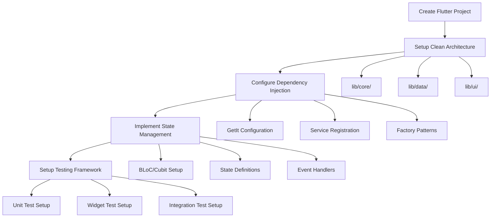
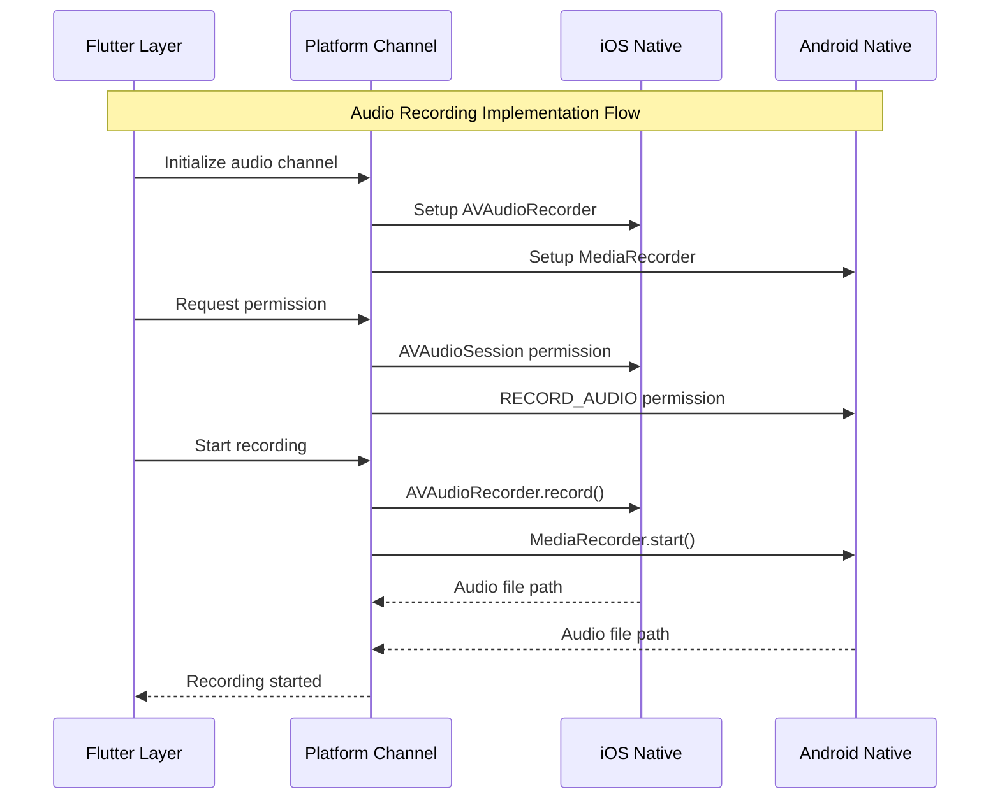

# 🛣️ Flutter Voice Bridge Implementation Roadmap
# Comprehensive Development Pathways & AI-Guided Workflows

**Last Updated**: 29 July 2025  
**Version**: 1.0.0  
**Status**: Production Implementation Guide

---

## 🎯 **Roadmap Overview**

This comprehensive implementation roadmap provides AI-assisted development pathways for building production-ready Flutter applications with advanced native integration, offline AI capabilities, and immersive animation systems.

### **🚀 Development Philosophy**

#### **Progressive Complexity Approach**
1. **Foundation Layer** → Core architecture and basic functionality
2. **Integration Layer** → Platform channels and native features  
3. **AI Enhancement Layer** → Offline transcription and GPU acceleration
4. **Experience Layer** → Advanced animations and user interactions
5. **Production Layer** → Performance optimization and deployment

---

## 📋 **Development Phases**

### **Phase 1: Foundation Setup (Week 1-2)**

#### **🏗️ Project Architecture Foundation**

##### **Step 1.1: Project Initialization**


**Implementation Checklist:**
- [ ] Create Flutter project with latest stable version
- [ ] Setup folder structure following Clean Architecture
- [ ] Configure `get_it` for dependency injection
- [ ] Implement base BLoC/Cubit patterns
- [ ] Setup testing framework with mocks

**Code Templates:**
```dart
// lib/di.dart - Dependency Injection Setup
final getIt = GetIt.instance;

Future<void> setupDependencies() async {
  // Core services
  getIt.registerLazySingleton<AudioService>(() => PlatformAudioService());
  getIt.registerLazySingleton<TranscriptionService>(() => WhisperFFIService());
  getIt.registerLazySingleton<VoiceMemoService>(() => VoiceMemoServiceImpl());
  
  // Factories for stateful components
  getIt.registerFactory<HomeCubit>(() => HomeCubit(
    audioService: getIt<AudioService>(),
    transcriptionService: getIt<TranscriptionService>(),
    voiceMemoService: getIt<VoiceMemoService>(),
  ));
}
```

##### **Step 1.2: Core Domain Models**
```dart
// lib/data/models/voice_memo.dart
class VoiceMemo extends Equatable {
  final String id;
  final String title;
  final String audioPath;
  final DateTime createdAt;
  final String? transcription;
  final List<String> keywords;
  final Duration duration;
  
  const VoiceMemo({
    required this.id,
    required this.title,
    required this.audioPath,
    required this.createdAt,
    this.transcription,
    this.keywords = const [],
    this.duration = Duration.zero,
  });
  
  // JSON serialization for persistence
  Map<String, dynamic> toJson() => {
    'id': id,
    'title': title,
    'audioPath': audioPath,
    'createdAt': createdAt.toIso8601String(),
    'transcription': transcription,
    'keywords': keywords,
    'duration': duration.inMilliseconds,
  };
  
  factory VoiceMemo.fromJson(Map<String, dynamic> json) => VoiceMemo(
    id: json['id'],
    title: json['title'],
    audioPath: json['audioPath'],
    createdAt: DateTime.parse(json['createdAt']),
    transcription: json['transcription'],
    keywords: List<String>.from(json['keywords'] ?? []),
    duration: Duration(milliseconds: json['duration'] ?? 0),
  );
  
  @override
  List<Object?> get props => [id, title, audioPath, createdAt, transcription, keywords, duration];
}
```

**AI Development Assistant Prompts:**
- "Generate complete state management structure for voice recording app"
- "Create production-ready dependency injection configuration"
- "Design comprehensive error handling hierarchy"

---

### **Phase 2: Platform Integration (Week 3-4)**

#### **🔌 Platform Channels Implementation**

##### **Step 2.1: Audio Platform Channels**


**Implementation Steps:**

##### **Flutter Side Implementation**
```dart
// lib/core/platform/platform_channels.dart
class PlatformChannels {
  static const String _audioChannelName = 'voice.bridge/audio';
  static const MethodChannel _audioChannel = MethodChannel(_audioChannelName);
  
  static Future<bool> hasAudioPermission() async {
    try {
      final bool hasPermission = await _audioChannel.invokeMethod('hasPermission');
      return hasPermission;
    } catch (e) {
      developer.log('Permission check failed: $e', name: 'PlatformChannels');
      return false;
    }
  }
  
  static Future<bool> requestAudioPermission() async {
    try {
      final bool granted = await _audioChannel.invokeMethod('requestPermission');
      return granted;
    } catch (e) {
      developer.log('Permission request failed: $e', name: 'PlatformChannels');
      return false;
    }
  }
  
  static Future<String> startRecording() async {
    try {
      final String filePath = await _audioChannel.invokeMethod('startRecording');
      developer.log('✅ Recording started: $filePath', name: 'PlatformChannels');
      return filePath;
    } on PlatformException catch (e) {
      developer.log('❌ Recording failed: ${e.code} - ${e.message}', name: 'PlatformChannels');
      throw AudioRecordingException(e.message ?? 'Recording failed');
    }
  }
  
  static Future<String> stopRecording() async {
    try {
      final String filePath = await _audioChannel.invokeMethod('stopRecording');
      developer.log('✅ Recording stopped: $filePath', name: 'PlatformChannels');
      return filePath;
    } on PlatformException catch (e) {
      developer.log('❌ Stop recording failed: ${e.code} - ${e.message}', name: 'PlatformChannels');
      throw AudioRecordingException(e.message ?? 'Stop recording failed');
    }
  }
}
```

##### **iOS Native Implementation**
```swift
// ios/Runner/AppDelegate.swift
import UIKit
import Flutter
import AVFoundation

@UIApplicationMain
@objc class AppDelegate: FlutterAppDelegate {
    private var audioRecorder: AVAudioRecorder?
    private let audioSession = AVAudioSession.sharedInstance()
    
    override func application(
        _ application: UIApplication,
        didFinishLaunchingWithOptions launchOptions: [UIApplication.LaunchOptionsKey: Any]?
    ) -> Bool {
        let controller: FlutterViewController = window?.rootViewController as! FlutterViewController
        
        let audioChannel = FlutterMethodChannel(
            name: "voice.bridge/audio",
            binaryMessenger: controller.binaryMessenger
        )
        
        audioChannel.setMethodCallHandler { [weak self] (call, result) in
            self?.handleAudioMethodCall(call, result: result)
        }
        
        GeneratedPluginRegistrant.register(with: self)
        return super.application(application, didFinishLaunchingWithOptions: launchOptions)
    }
    
    private func handleAudioMethodCall(_ call: FlutterMethodCall, result: @escaping FlutterResult) {
        switch call.method {
        case "hasPermission":
            result(audioSession.recordPermission == .granted)
        case "requestPermission":
            requestPermission(result: result)
        case "startRecording":
            startRecording(result: result)
        case "stopRecording":
            stopRecording(result: result)
        default:
            result(FlutterMethodNotImplemented)
        }
    }
    
    private func requestPermission(result: @escaping FlutterResult) {
        audioSession.requestRecordPermission { granted in
            DispatchQueue.main.async {
                result(granted)
            }
        }
    }
    
    private func startRecording(result: @escaping FlutterResult) {
        guard audioSession.recordPermission == .granted else {
            result(FlutterError(code: "PERMISSION_DENIED", 
                               message: "Microphone permission required", 
                               details: nil))
            return
        }
        
        do {
            // Configure audio session for recording
            try audioSession.setCategory(.playAndRecord, mode: .default)
            try audioSession.setActive(true)
            
            // Setup recording settings (WAV format for Whisper compatibility)
            let settings: [String: Any] = [
                AVFormatIDKey: Int(kAudioFormatLinearPCM),
                AVSampleRateKey: 16000.0,  // 16kHz for speech recognition
                AVNumberOfChannelsKey: 1,   // Mono
                AVLinearPCMBitDepthKey: 16, // 16-bit depth
                AVLinearPCMIsFloatKey: false,
                AVLinearPCMIsBigEndianKey: false
            ]
            
            // Create unique file path
            let documentsPath = FileManager.default.urls(for: .documentDirectory, 
                                                        in: .userDomainMask)[0]
            let audioDir = documentsPath.appendingPathComponent("audio")
            
            // Create directory if needed
            if !FileManager.default.fileExists(atPath: audioDir.path) {
                try FileManager.default.createDirectory(at: audioDir, 
                                                       withIntermediateDirectories: true, 
                                                       attributes: nil)
            }
            
            let timestamp = Int64(Date().timeIntervalSince1970 * 1000)
            let audioURL = audioDir.appendingPathComponent("voice_memo_\(timestamp).wav")
            
            // Create and start recorder
            audioRecorder = try AVAudioRecorder(url: audioURL, settings: settings)
            audioRecorder?.record()
            
            NSLog("✅ [iOS] Recording started: \(audioURL.path)")
            result(audioURL.path)
            
        } catch {
            NSLog("❌ [iOS] Recording error: \(error)")
            result(FlutterError(code: "RECORDING_ERROR", 
                               message: error.localizedDescription, 
                               details: nil))
        }
    }
    
    private func stopRecording(result: @escaping FlutterResult) {
        guard let recorder = audioRecorder, recorder.isRecording else {
            result(FlutterError(code: "NOT_RECORDING", 
                               message: "No active recording", 
                               details: nil))
            return
        }
        
        let audioURL = recorder.url
        recorder.stop()
        audioRecorder = nil
        
        // Deactivate audio session
        do {
            try audioSession.setActive(false, options: .notifyOthersOnDeactivation)
        } catch {
            NSLog("⚠️ [iOS] Failed to deactivate audio session: \(error)")
        }
        
        NSLog("✅ [iOS] Recording stopped: \(audioURL.path)")
        result(audioURL.path)
    }
}
```

##### **Android Native Implementation**
```kotlin
// android/app/src/main/kotlin/com/example/flutter_voice_bridge/MainActivity.kt
package com.example.flutter_voice_bridge

import io.flutter.embedding.android.FlutterActivity
import io.flutter.embedding.engine.FlutterEngine
import io.flutter.plugin.common.MethodChannel
import android.media.MediaRecorder
import android.content.pm.PackageManager
import android.Manifest
import androidx.core.app.ActivityCompat
import androidx.core.content.ContextCompat
import java.io.File
import android.util.Log
import android.os.Build

class MainActivity: FlutterActivity() {
    private val CHANNEL = "voice.bridge/audio"
    private val TAG = "VoiceBridge"
    private val PERMISSION_REQUEST_CODE = 123
    
    private var mediaRecorder: MediaRecorder? = null
    private var audioFilePath: String? = null
    private var pendingResult: MethodChannel.Result? = null
    
    override fun configureFlutterEngine(flutterEngine: FlutterEngine) {
        super.configureFlutterEngine(flutterEngine)
        
        MethodChannel(flutterEngine.dartExecutor.binaryMessenger, CHANNEL)
            .setMethodCallHandler { call, result ->
                when (call.method) {
                    "hasPermission" -> result.success(hasAudioPermission())
                    "requestPermission" -> requestAudioPermission(result)
                    "startRecording" -> startRecording(result)
                    "stopRecording" -> stopRecording(result)
                    else -> result.notImplemented()
                }
            }
    }
    
    private fun hasAudioPermission(): Boolean {
        return ContextCompat.checkSelfPermission(
            this, 
            Manifest.permission.RECORD_AUDIO
        ) == PackageManager.PERMISSION_GRANTED
    }
    
    private fun requestAudioPermission(result: MethodChannel.Result) {
        if (hasAudioPermission()) {
            result.success(true)
        } else {
            pendingResult = result
            ActivityCompat.requestPermissions(
                this,
                arrayOf(Manifest.permission.RECORD_AUDIO),
                PERMISSION_REQUEST_CODE
            )
        }
    }
    
    private fun startRecording(result: MethodChannel.Result) {
        if (!hasAudioPermission()) {
            result.error("PERMISSION_DENIED", "Audio recording permission required", null)
            return
        }
        
        try {
            // Create audio directory
            val audioDir = File(filesDir, "audio")
            if (!audioDir.exists()) {
                audioDir.mkdirs()
            }
            
            // Generate unique filename
            val timestamp = System.currentTimeMillis()
            audioFilePath = File(audioDir, "voice_memo_$timestamp.wav").absolutePath
            
            // Setup MediaRecorder
            mediaRecorder = if (Build.VERSION.SDK_INT >= Build.VERSION_CODES.S) {
                MediaRecorder(this)
            } else {
                @Suppress("DEPRECATION")
                MediaRecorder()
            }.apply {
                setAudioSource(MediaRecorder.AudioSource.MIC)
                setOutputFormat(MediaRecorder.OutputFormat.MPEG_4)
                setAudioEncoder(MediaRecorder.AudioEncoder.AAC)
                setAudioSamplingRate(16000)  // 16kHz for speech recognition
                setAudioChannels(1)          // Mono
                setOutputFile(audioFilePath)
                
                prepare()
                start()
            }
            
            Log.d(TAG, "✅ Recording started: $audioFilePath")
            result.success(audioFilePath!!)
            
        } catch (e: Exception) {
            Log.e(TAG, "❌ Recording failed: ${e.message}")
            result.error("RECORDING_ERROR", "Failed to start recording: ${e.message}", null)
        }
    }
    
    private fun stopRecording(result: MethodChannel.Result) {
        try {
            mediaRecorder?.apply {
                stop()
                release()
            }
            mediaRecorder = null
            
            Log.d(TAG, "✅ Recording stopped: $audioFilePath")
            result.success(audioFilePath ?: "")
            
        } catch (e: Exception) {
            Log.e(TAG, "❌ Stop recording failed: ${e.message}")
            result.error("STOP_ERROR", "Failed to stop recording: ${e.message}", null)
        }
    }
    
    override fun onRequestPermissionsResult(
        requestCode: Int,
        permissions: Array<out String>,
        grantResults: IntArray
    ) {
        super.onRequestPermissionsResult(requestCode, permissions, grantResults)
        
        if (requestCode == PERMISSION_REQUEST_CODE) {
            val granted = grantResults.isNotEmpty() && 
                         grantResults[0] == PackageManager.PERMISSION_GRANTED
            pendingResult?.success(granted)
            pendingResult = null
        }
    }
}
```

**AI Development Assistant Prompts:**
- "Generate platform channel implementation for audio recording with error handling"
- "Create comprehensive permission management strategy for iOS and Android"
- "Design audio file format optimization for speech recognition"

---

### **Phase 3: AI Integration (Week 5-6)**

#### **🤖 Whisper.cpp FFI Implementation**

##### **Step 3.1: Native Library Setup**
```bash
# scripts/build_whisper.sh
#!/bin/bash
set -e

echo "🏗️ Building Whisper.cpp for Flutter Voice Bridge..."

# Create native directory structure
mkdir -p native/whisper
cd native/whisper

# Clone Whisper.cpp (if not exists)
if [ ! -d "whisper.cpp" ]; then
    echo "📥 Cloning Whisper.cpp..."
    git clone https://github.com/ggerganov/whisper.cpp.git
fi

cd whisper.cpp

# Build for macOS/iOS
if [[ "$OSTYPE" == "darwin"* ]]; then
    echo "🍎 Building for macOS/iOS..."
    
    # macOS build
    mkdir -p build-macos
    cd build-macos
    cmake .. -DCMAKE_OSX_ARCHITECTURES="arm64;x86_64" -DWHISPER_METAL=ON
    make -j$(sysctl -n hw.ncpu)
    
    # Copy library
    cp libwhisper.a ../../../macos/Runner/
    cd ..
    
    # iOS build
    mkdir -p build-ios
    cd build-ios
    cmake .. -DCMAKE_SYSTEM_NAME=iOS -DCMAKE_OSX_ARCHITECTURES=arm64 -DWHISPER_METAL=ON
    make -j$(sysctl -n hw.ncpu)
    
    # Copy library
    cp libwhisper.a ../../../ios/Runner/
    cd ..
fi

# Download Whisper model
echo "📦 Downloading Whisper model..."
if [ ! -f "ggml-base.en.bin" ]; then
    curl -L "https://huggingface.co/ggerganov/whisper.cpp/resolve/main/ggml-base.en.bin" \
         -o ggml-base.en.bin
fi

# Copy model to assets
mkdir -p ../../../assets/models/
cp ggml-base.en.bin ../../../assets/models/

# Copy model to platform directories
mkdir -p ../../../ios/Runner/Models/
mkdir -p ../../../macos/Runner/Models/
cp ggml-base.en.bin ../../../ios/Runner/Models/
cp ggml-base.en.bin ../../../macos/Runner/Models/

echo "✅ Whisper.cpp build completed!"
```

##### **Step 3.2: C++ Wrapper Implementation**
```cpp
// native/whisper/whisper_wrapper.cpp
#include "whisper_wrapper.h"
#include "whisper.cpp/whisper.h"
#include <iostream>
#include <fstream>
#include <vector>
#include <cstring>

// Global context for model reuse
static whisper_context* g_whisper_context = nullptr;

extern "C" {
    // Initialize Whisper with model file
    whisper_context* whisper_ffi_init(const char* model_path) {
        if (g_whisper_context != nullptr) {
            return g_whisper_context; // Reuse existing context
        }
        
        try {
            struct whisper_context_params cparams = whisper_context_default_params();
            cparams.use_gpu = true; // Enable Metal GPU on Apple Silicon
            
            g_whisper_context = whisper_init_from_file_with_params(model_path, cparams);
            
            if (g_whisper_context == nullptr) {
                std::cerr << "Failed to initialize Whisper context" << std::endl;
                return nullptr;
            }
            
            std::cout << "✅ Whisper context initialized successfully" << std::endl;
            return g_whisper_context;
            
        } catch (const std::exception& e) {
            std::cerr << "Exception during Whisper initialization: " << e.what() << std::endl;
            return nullptr;
        }
    }
    
    // Read WAV file for Whisper processing
    bool read_wav_file(const std::string& filename, std::vector<float>& pcmf32) {
        std::ifstream file(filename, std::ios::binary);
        if (!file) {
            std::cerr << "Failed to open WAV file: " << filename << std::endl;
            return false;
        }
        
        // Read WAV header
        char header[44];
        file.read(header, 44);
        
        // Validate WAV format
        if (strncmp(header, "RIFF", 4) != 0 || strncmp(header + 8, "WAVE", 4) != 0) {
            std::cerr << "Invalid WAV file format" << std::endl;
            return false;
        }
        
        // Read audio data
        int16_t sample;
        while (file.read(reinterpret_cast<char*>(&sample), sizeof(int16_t))) {
            pcmf32.push_back(static_cast<float>(sample) / 32768.0f);
        }
        
        std::cout << "📁 Read " << pcmf32.size() << " audio samples" << std::endl;
        return true;
    }
    
    // Transcribe audio file
    char* whisper_ffi_transcribe(whisper_context* ctx, const char* audio_path) {
        if (!ctx || !audio_path) {
            std::cerr << "Invalid parameters for transcription" << std::endl;
            return nullptr;
        }
        
        try {
            std::vector<float> pcmf32;
            
            // Read and validate audio file
            if (!read_wav_file(audio_path, pcmf32)) {
                std::cerr << "Failed to read audio file: " << audio_path << std::endl;
                return nullptr;
            }
            
            // Configure Whisper parameters
            whisper_full_params wparams = whisper_full_default_params(WHISPER_SAMPLING_GREEDY);
            wparams.print_progress = false;
            wparams.print_special = false;
            wparams.print_realtime = false;
            wparams.print_timestamps = false;
            wparams.translate = false;
            wparams.language = "en";
            wparams.n_threads = std::min(4, (int) std::thread::hardware_concurrency());
            
            std::cout << "🎵 Starting transcription..." << std::endl;
            
            // Run transcription
            if (whisper_full(ctx, wparams, pcmf32.data(), pcmf32.size()) != 0) {
                std::cerr << "Whisper transcription failed" << std::endl;
                return nullptr;
            }
            
            // Extract transcription text
            const int n_segments = whisper_full_n_segments(ctx);
            std::string result_text = "";
            
            for (int i = 0; i < n_segments; ++i) {
                const char* text = whisper_full_get_segment_text(ctx, i);
                if (text != nullptr) {
                    result_text += text;
                }
            }
            
            // Remove leading/trailing whitespace
            result_text.erase(0, result_text.find_first_not_of(" \t\n\r"));
            result_text.erase(result_text.find_last_not_of(" \t\n\r") + 1);
            
            std::cout << "✅ Transcription completed: " << result_text.length() << " characters" << std::endl;
            
            // Return heap-allocated string (caller must free)
            char* result = new char[result_text.length() + 1];
            strcpy(result, result_text.c_str());
            return result;
            
        } catch (const std::exception& e) {
            std::cerr << "Exception during transcription: " << e.what() << std::endl;
            return nullptr;
        }
    }
    
    // Clean up string memory
    void whisper_ffi_free_string(char* str) {
        if (str) {
            delete[] str;
        }
    }
    
    // Clean up Whisper context
    void whisper_ffi_free(whisper_context* ctx) {
        if (ctx && ctx == g_whisper_context) {
            whisper_free(ctx);
            g_whisper_context = nullptr;
            std::cout << "🧹 Whisper context cleaned up" << std::endl;
        }
    }
}
```

##### **Step 3.3: Dart FFI Service Implementation**
```dart
// lib/core/transcription/whisper_ffi_service.dart
import 'dart:ffi';
import 'dart:io';
import 'dart:typed_data';
import 'package:ffi/ffi.dart';
import 'package:flutter/services.dart';
import 'package:path_provider/path_provider.dart';
import 'package:path/path.dart' as path;
import 'dart:developer' as developer;

// FFI function signatures
typedef WhisperInitNative = Pointer<Void> Function(Pointer<Utf8> modelPath);
typedef WhisperInit = Pointer<Void> Function(Pointer<Utf8> modelPath);

typedef WhisperTranscribeNative = Pointer<Utf8> Function(Pointer<Void> ctx, Pointer<Utf8> audioPath);
typedef WhisperTranscribe = Pointer<Utf8> Function(Pointer<Void> ctx, Pointer<Utf8> audioPath);

typedef WhisperFreeNative = Void Function(Pointer<Void> ctx);
typedef WhisperFree = void Function(Pointer<Void> ctx);

typedef WhisperFreeStringNative = Void Function(Pointer<Utf8> str);
typedef WhisperFreeString = void Function(Pointer<Utf8> str);

class WhisperFFIService implements TranscriptionService {
  static const String _logName = 'VoiceBridge.WhisperFFI';

  late final DynamicLibrary _whisperLib;
  late final WhisperInit _whisperInit;
  late final WhisperTranscribe _whisperTranscribe;
  late final WhisperFree _whisperFree;
  late final WhisperFreeString _whisperFreeString;

  Pointer<Void>? _whisperContext;
  bool _isInitialized = false;
  String? _modelPath;

  @override
  Future<void> initialize([String? modelPath]) async {
    if (_isInitialized) return;

    try {
      developer.log('🤖 Initializing Whisper FFI service...', name: _logName);
      
      // Load native library
      _loadLibrary();
      
      // Bind FFI functions
      _bindFunctions();
      
      // Setup model path
      _modelPath = modelPath ?? await _getDefaultModelPath();
      
      // Initialize Whisper context
      await _initializeWhisperContext();
      
      _isInitialized = true;
      developer.log('✅ Whisper FFI service initialized successfully', name: _logName);
      
    } catch (e) {
      developer.log('❌ Whisper FFI initialization failed: $e', name: _logName, error: e);
      rethrow;
    }
  }

  void _loadLibrary() {
    developer.log('📚 Loading Whisper native library...', name: _logName);
    
    if (Platform.isIOS || Platform.isMacOS) {
      _loadAppleLibrary();
    } else if (Platform.isAndroid) {
      _loadAndroidLibrary();
    } else {
      throw UnsupportedError('Platform not supported for Whisper FFI');
    }
  }

  void _loadAppleLibrary() {
    // Multi-path loading strategy for robustness
    final List<String> libraryPaths = [
      'libwhisper_ffi.dylib',                    // Standard @rpath
      'macos/Runner/libwhisper_ffi.dylib',       // Development path
      'Frameworks/libwhisper_ffi.dylib',         // App bundle
      '/usr/local/lib/libwhisper_ffi.dylib',     // System path
      './libwhisper_ffi.dylib',                  // Local path
    ];

    Exception? lastException;
    for (final libraryPath in libraryPaths) {
      try {
        _whisperLib = DynamicLibrary.open(libraryPath);
        developer.log('✅ Loaded library from: $libraryPath', name: _logName);
        return;
      } catch (e) {
        lastException = e is Exception ? e : Exception(e.toString());
        developer.log('⚠️ Failed to load from $libraryPath: $e', name: _logName);
        continue;
      }
    }

    throw Exception('Failed to load Whisper library from any path. Last error: $lastException');
  }

  void _loadAndroidLibrary() {
    try {
      _whisperLib = DynamicLibrary.open('libwhisper_ffi.so');
      developer.log('✅ Loaded Android Whisper library', name: _logName);
    } catch (e) {
      throw Exception('Failed to load Android Whisper library: $e');
    }
  }

  void _bindFunctions() {
    developer.log('🔗 Binding FFI functions...', name: _logName);
    
    try {
      _whisperInit = _whisperLib
          .lookupFunction<WhisperInitNative, WhisperInit>('whisper_ffi_init');
      
      _whisperTranscribe = _whisperLib
          .lookupFunction<WhisperTranscribeNative, WhisperTranscribe>('whisper_ffi_transcribe');
      
      _whisperFree = _whisperLib
          .lookupFunction<WhisperFreeNative, WhisperFree>('whisper_ffi_free');
      
      _whisperFreeString = _whisperLib
          .lookupFunction<WhisperFreeStringNative, WhisperFreeString>('whisper_ffi_free_string');
      
      developer.log('✅ FFI functions bound successfully', name: _logName);
      
    } catch (e) {
      throw Exception('Failed to bind FFI functions: $e');
    }
  }

  Future<String> _getDefaultModelPath() async {
    try {
      // Try to load from assets first
      final ByteData assetData = await rootBundle.load('assets/models/ggml-base.en.bin');
      final Directory tempDir = await getTemporaryDirectory();
      final String modelTempPath = path.join(tempDir.path, 'ggml-base.en.bin');
      
      final File modelFile = File(modelTempPath);
      await modelFile.writeAsBytes(assetData.buffer.asUint8List());
      
      developer.log('📦 Model extracted to: $modelTempPath', name: _logName);
      return modelTempPath;
      
    } catch (e) {
      // Fallback to platform-specific paths
      if (Platform.isIOS) {
        return 'ios/Runner/Models/ggml-base.en.bin';
      } else if (Platform.isMacOS) {
        return 'macos/Runner/Models/ggml-base.en.bin';
      } else {
        throw Exception('Could not locate Whisper model: $e');
      }
    }
  }

  Future<void> _initializeWhisperContext() async {
    developer.log('🤖 Initializing Whisper context with model: $_modelPath', name: _logName);
    
    final modelPathPtr = _modelPath!.toNativeUtf8();
    try {
      _whisperContext = _whisperInit(modelPathPtr);
      if (_whisperContext == nullptr) {
        throw Exception('Failed to initialize Whisper context - returned null');
      }
      developer.log('✅ Whisper context initialized successfully', name: _logName);
      
    } finally {
      malloc.free(modelPathPtr);
    }
  }

  @override
  Future<String> transcribeAudio(String audioFilePath) async {
    if (!_isInitialized || _whisperContext == null) {
      throw StateError('Whisper FFI service not initialized');
    }

    developer.log('🎵 Starting transcription for: $audioFilePath', name: _logName);

    // Validate audio file
    final audioFile = File(audioFilePath);
    if (!await audioFile.exists()) {
      throw FileSystemException('Audio file not found', audioFilePath);
    }

    final audioPathPtr = audioFilePath.toNativeUtf8();
    Pointer<Utf8> resultPtr = nullptr;

    try {
      // Call native transcription function
      resultPtr = _whisperTranscribe(_whisperContext!, audioPathPtr);
      
      if (resultPtr == nullptr) {
        throw Exception('Transcription failed - null result returned');
      }

      // Convert result to Dart string
      final transcription = resultPtr.toDartString().trim();
      
      if (transcription.isEmpty) {
        developer.log('⚠️ Transcription returned empty result', name: _logName);
        return "Could not transcribe audio. Please try speaking more clearly.";
      }

      developer.log('✅ Transcription completed successfully', name: _logName);
      developer.log('📄 Result: "$transcription"', name: _logName);
      
      return transcription;

    } finally {
      // Always cleanup memory
      malloc.free(audioPathPtr);
      if (resultPtr != nullptr) {
        _whisperFreeString(resultPtr);
      }
    }
  }

  @override
  Future<List<String>> extractKeywords(String text) async {
    if (text.isEmpty) return [];

    // Simple keyword extraction with stop-word filtering
    const stopWords = {
      'the', 'a', 'an', 'and', 'or', 'but', 'in', 'on', 'at', 'to', 'for', 'of', 'with',
      'by', 'from', 'up', 'about', 'into', 'through', 'during', 'before', 'after',
      'above', 'below', 'between', 'among', 'is', 'am', 'are', 'was', 'were', 'being',
      'been', 'be', 'have', 'has', 'had', 'do', 'does', 'did', 'will', 'would', 'could',
      'should', 'may', 'might', 'can', 'this', 'that', 'these', 'those', 'i', 'you',
      'he', 'she', 'it', 'we', 'they', 'me', 'him', 'her', 'us', 'them'
    };

    final words = text
        .toLowerCase()
        .replaceAll(RegExp(r'[^\w\s]'), '') // Remove punctuation
        .split(RegExp(r'\s+'))              // Split on whitespace
        .where((word) => word.length > 2)    // Filter short words
        .where((word) => !stopWords.contains(word)) // Remove stop words
        .toSet()                            // Remove duplicates
        .toList();

    // Sort by length (longer words first)
    words.sort((a, b) => b.length.compareTo(a.length));
    
    // Return top 10 keywords
    return words.take(10).toList();
  }

  @override
  Future<bool> isInitialized() async {
    return _isInitialized && _whisperContext != null;
  }

  @override
  Future<void> dispose() async {
    if (_whisperContext != null) {
      _whisperFree(_whisperContext!);
      _whisperContext = null;
    }
    _isInitialized = false;
    developer.log('🧹 Whisper FFI service disposed', name: _logName);
  }
}
```

**AI Development Assistant Prompts:**
- "Generate production-ready FFI implementation for Whisper.cpp with memory safety"
- "Create comprehensive error handling for AI transcription service"
- "Design GPU acceleration integration for Apple Silicon devices"

---

### **Phase 4: Animation System (Week 7-8)**

#### **🎨 Advanced Animation Implementation**

##### **Step 4.1: Master Animation Controller**
```dart
// lib/ui/components/advanced_audio_visualizer.dart
import 'package:flutter/material.dart';
import 'package:flutter/services.dart';
import 'dart:math' as math;

enum AudioVisualizationMode { waveform, spectrum, particles, radial }

class AdvancedAudioVisualizer extends StatefulWidget {
  final bool isRecording;
  final double height;
  final Color primaryColor;
  final Color secondaryColor;
  final Color tertiaryColor;
  final AudioVisualizationMode mode;
  final VoidCallback? onTap;
  
  // External animation control for fullscreen mode
  final bool? externalAnimationState;
  final double? externalAnimationSpeed;
  final double? externalAnimationScale;
  final bool showControls;

  const AdvancedAudioVisualizer({
    Key? key,
    required this.isRecording,
    this.height = 120.0,
    required this.primaryColor,
    required this.secondaryColor,
    required this.tertiaryColor,
    this.mode = AudioVisualizationMode.waveform,
    this.onTap,
    this.externalAnimationState,
    this.externalAnimationSpeed,
    this.externalAnimationScale,
    this.showControls = true,
  }) : super(key: key);

  @override
  State<AdvancedAudioVisualizer> createState() => _AdvancedAudioVisualizerState();
}

class _AdvancedAudioVisualizerState extends State<AdvancedAudioVisualizer>
    with TickerProviderStateMixin {
  
  // Master animation controller for synchronization
  late AnimationController _masterController;
  late Animation<double> _masterAnimation;
  
  // Derived animations for different phases
  late Animation<double> _primaryPhase;
  late Animation<double> _secondaryPhase;
  late Animation<double> _pulsePhase;
  late Animation<double> _globalPhase;
  
  // Animation parameters
  bool _isAnimationPlaying = true;
  double _animationSpeed = 1.0;
  double _animationScale = 1.0;
  AudioVisualizationMode _currentMode = AudioVisualizationMode.waveform;
  
  // Master timeline duration (2400ms base for smooth synchronization)
  static const Duration _baseDuration = Duration(milliseconds: 2400);

  @override
  void initState() {
    super.initState();
    _currentMode = widget.mode;
    _setupAnimationController();
    _loadAnimationSettings();
  }

  void _setupAnimationController() {
    _masterController = AnimationController(
      duration: _baseDuration,
      vsync: this,
    );

    _masterAnimation = Tween<double>(begin: 0.0, end: 1.0).animate(_masterController);
    
    // Create synchronized phases for different animation elements
    _primaryPhase = Tween<double>(begin: 0.0, end: 1.0).animate(
      CurvedAnimation(parent: _masterController, curve: Curves.linear)
    );
    
    _secondaryPhase = Tween<double>(begin: 0.0, end: 1.5).animate(
      CurvedAnimation(parent: _masterController, curve: Curves.linear)
    );
    
    _pulsePhase = Tween<double>(begin: 0.0, end: 0.5).animate(
      CurvedAnimation(parent: _masterController, curve: Curves.linear)
    );
    
    _globalPhase = Tween<double>(begin: 0.0, end: 0.8).animate(
      CurvedAnimation(parent: _masterController, curve: Curves.linear)
    );

    // Start animation if recording
    if (widget.isRecording) {
      _startAnimation();
    }
  }

  Future<void> _loadAnimationSettings() async {
    try {
      final settings = await AnimationPreferences.getAnimationSettings();
      setState(() {
        _animationSpeed = settings.speed;
        _animationScale = settings.scale;
        _currentMode = settings.mode;
        _isAnimationPlaying = settings.isPlaying;
      });
      _updateAnimationSpeed();
    } catch (e) {
      // Use defaults if loading fails
    }
  }

  void _startAnimation() {
    if (_isAnimationPlaying) {
      _masterController.repeat();
    }
  }

  void _stopAnimation() {
    _masterController.stop();
  }

  void _updateAnimationSpeed() {
    final newDuration = Duration(
      milliseconds: (_baseDuration.inMilliseconds / _animationSpeed).round()
    );
    _masterController.duration = newDuration;
    
    if (_isAnimationPlaying && _masterController.isAnimating) {
      _masterController.repeat();
    }
  }

  @override
  void didUpdateWidget(AdvancedAudioVisualizer oldWidget) {
    super.didUpdateWidget(oldWidget);
    
    // Handle external state changes for fullscreen mode
    if (widget.externalAnimationState != null && 
        widget.externalAnimationSpeed != null &&
        widget.externalAnimationScale != null) {
      
      bool stateChanged = false;
      
      if (widget.externalAnimationState != _isAnimationPlaying) {
        _isAnimationPlaying = widget.externalAnimationState!;
        stateChanged = true;
      }
      
      if (widget.externalAnimationSpeed != _animationSpeed) {
        _animationSpeed = widget.externalAnimationSpeed!;
        _updateAnimationSpeed();
        stateChanged = true;
      }
      
      if (widget.externalAnimationScale != _animationScale) {
        _animationScale = widget.externalAnimationScale!;
        stateChanged = true;
      }
      
      if (stateChanged) {
        if (_isAnimationPlaying) {
          _startAnimation();
        } else {
          _stopAnimation();
        }
      }
    }
    
    // Handle recording state changes
    if (widget.isRecording != oldWidget.isRecording) {
      if (widget.isRecording) {
        _startAnimation();
      } else {
        _stopAnimation();
      }
    }
  }

  @override
  Widget build(BuildContext context) {
    return GestureDetector(
      onTap: widget.onTap,
      child: Container(
        height: widget.height,
        decoration: BoxDecoration(
          borderRadius: BorderRadius.circular(12),
          color: Colors.black.withOpacity(0.1),
        ),
        child: AnimatedBuilder(
          animation: _masterAnimation,
          builder: (context, child) {
            return CustomPaint(
              size: Size.infinite,
              painter: AdvancedAudioPainter(
                primaryPhase: _primaryPhase.value,
                secondaryPhase: _secondaryPhase.value,
                pulsePhase: _pulsePhase.value,
                globalPhase: _globalPhase.value,
                primaryColor: widget.primaryColor,
                secondaryColor: widget.secondaryColor,
                tertiaryColor: widget.tertiaryColor,
                mode: _currentMode,
                isRecording: widget.isRecording,
                scale: _animationScale,
                amplitude: widget.isRecording ? 1.0 : 0.3,
              ),
            );
          },
        ),
      ),
    );
  }

  @override
  void dispose() {
    _masterController.dispose();
    super.dispose();
  }
}

// Custom painter for advanced audio visualizations
class AdvancedAudioPainter extends CustomPainter {
  final double primaryPhase;
  final double secondaryPhase;
  final double pulsePhase;
  final double globalPhase;
  final Color primaryColor;
  final Color secondaryColor;
  final Color tertiaryColor;
  final AudioVisualizationMode mode;
  final bool isRecording;
  final double scale;
  final double amplitude;

  AdvancedAudioPainter({
    required this.primaryPhase,
    required this.secondaryPhase,
    required this.pulsePhase,
    required this.globalPhase,
    required this.primaryColor,
    required this.secondaryColor,
    required this.tertiaryColor,
    required this.mode,
    required this.isRecording,
    required this.scale,
    required this.amplitude,
  });

  @override
  void paint(Canvas canvas, Size size) {
    // Apply scaling to effective size
    final effectiveWidth = size.width * scale;
    final effectiveHeight = size.height * scale;
    
    // Center the scaled visualization
    canvas.save();
    canvas.translate(
      (size.width - effectiveWidth) / 2,
      (size.height - effectiveHeight) / 2,
    );
    
    final effectiveSize = Size(effectiveWidth, effectiveHeight);
    
    switch (mode) {
      case AudioVisualizationMode.waveform:
        _paintWaveform(canvas, effectiveSize);
        break;
      case AudioVisualizationMode.spectrum:
        _paintSpectrum(canvas, effectiveSize);
        break;
      case AudioVisualizationMode.particles:
        _paintParticles(canvas, effectiveSize);
        break;
      case AudioVisualizationMode.radial:
        _paintRadial(canvas, effectiveSize);
        break;
    }
    
    canvas.restore();
  }

  void _paintWaveform(Canvas canvas, Size size) {
    final intensityMultiplier = isRecording ? amplitude : amplitude * 0.3;
    
    // Paint multiple wave layers for depth
    _paintWaveLayer(canvas, size, 0.7 * intensityMultiplier, primaryColor.withValues(alpha: 0.8), 1.0);
    _paintWaveLayer(canvas, size, 0.5 * intensityMultiplier, secondaryColor.withValues(alpha: 0.6), 1.5);
    _paintWaveLayer(canvas, size, 0.3 * intensityMultiplier, tertiaryColor.withValues(alpha: 0.4), 2.0);
  }

  void _paintWaveLayer(Canvas canvas, Size size, double intensity, Color color, double frequency) {
    final paint = Paint()
      ..color = color
      ..strokeWidth = 2.0
      ..style = PaintingStyle.stroke
      ..strokeCap = StrokeCap.round;

    final path = Path();
    final centerY = size.height / 2;
    final amplitude = intensity * size.height * 0.3;

    for (int i = 0; i <= size.width.toInt(); i += 2) {
      final x = i.toDouble();
      final normalizedX = x / size.width;
      
      // Complex wave function with harmonics
      final waveValue = math.sin(primaryPhase * 2 * math.pi * frequency + normalizedX * 4 * math.pi) *
                       math.sin(secondaryPhase * math.pi * frequency + normalizedX * 2 * math.pi) *
                       amplitude;
      
      final y = centerY + waveValue;

      if (i == 0) {
        path.moveTo(x, y);
      } else {
        path.lineTo(x, y);
      }
    }

    canvas.drawPath(path, paint);
  }

  void _paintSpectrum(Canvas canvas, Size size) {
    const barCount = 64;
    final barWidth = size.width / barCount;
    final intensityMultiplier = isRecording ? amplitude : amplitude * 0.5;

    for (int i = 0; i < barCount; i++) {
      final normalizedIndex = i / (barCount - 1);
      
      // Generate pseudo-random height based on phases
      final height1 = math.sin(primaryPhase * 2 * math.pi + normalizedIndex * 8 * math.pi);
      final height2 = math.sin(secondaryPhase * math.pi + normalizedIndex * 6 * math.pi);
      final combinedHeight = (height1 + height2 * 0.5).abs();
      
      final barHeight = combinedHeight * size.height * 0.8 * intensityMultiplier;
      
      // Color mapping across spectrum (HSV)
      final hue = normalizedIndex * 280; // From red to blue
      final vibrantColor = HSVColor.fromAHSV(1.0, hue, 0.8, 0.9).toColor();
      final blendedColor = Color.lerp(vibrantColor, primaryColor, 0.2)!;
      
      final paint = Paint()
        ..color = blendedColor.withValues(alpha: 0.8)
        ..style = PaintingStyle.fill;

      final rect = Rect.fromLTWH(
        i * barWidth + 1,
        size.height - barHeight,
        barWidth - 2,
        barHeight,
      );
      
      canvas.drawRRect(
        RRect.fromRectAndRadius(rect, const Radius.circular(1)),
        paint,
      );
    }
  }

  void _paintParticles(Canvas canvas, Size size) {
    const particleCount = 120;
    final maxRadius = math.min(size.width, size.height) / 2 * 0.75;
    final center = Offset(size.width / 2, size.height / 2);
    final intensityMultiplier = isRecording ? amplitude : amplitude * 0.4;

    for (int i = 0; i < particleCount; i++) {
      final normalizedIndex = i / particleCount;
      
      // Orbital motion with varying radii
      final baseRadius = maxRadius * (0.3 + 0.7 * normalizedIndex);
      final radiusVariation = math.sin(primaryPhase * 2 * math.pi + normalizedIndex * 4 * math.pi) * 0.2;
      final radius = baseRadius * (1 + radiusVariation * intensityMultiplier);
      
      // Angular position with drift
      final angle = normalizedIndex * 2 * math.pi + globalPhase * 2 * math.pi;
      
      final x = center.dx + radius * math.cos(angle);
      final y = center.dy + radius * math.sin(angle);
      
      // Particle size variation
      final sizeBase = 2 + 6 * normalizedIndex;
      final sizeVariation = math.sin(secondaryPhase * 2 * math.pi + normalizedIndex * 6 * math.pi);
      final particleSize = (sizeBase + sizeVariation * 2) * intensityMultiplier;
      
      // Rainbow color cycling
      final hue = (normalizedIndex * 360 + globalPhase * 50) % 360;
      final particleColor = HSVColor.fromAHSV(1.0, hue, 0.8, 0.9).toColor();
      
      final paint = Paint()
        ..color = particleColor.withValues(alpha: 0.8)
        ..style = PaintingStyle.fill;

      // Add glow effect
      final glowPaint = Paint()
        ..color = particleColor.withValues(alpha: 0.3)
        ..style = PaintingStyle.fill
        ..maskFilter = const MaskFilter.blur(BlurStyle.normal, 8);

      canvas.drawCircle(Offset(x, y), particleSize * 2, glowPaint);
      canvas.drawCircle(Offset(x, y), particleSize, paint);
    }
  }

  void _paintRadial(Canvas canvas, Size size) {
    const ringCount = 7;
    final center = Offset(size.width / 2, size.height / 2);
    final maxRadius = math.min(size.width, size.height) / 2 * 0.9;
    final intensityMultiplier = isRecording ? amplitude : amplitude * 0.4;

    // Draw concentric rings
    for (int ring = 0; ring < ringCount; ring++) {
      final normalizedRing = ring / (ringCount - 1);
      final baseRadius = maxRadius * (0.2 + 0.8 * normalizedRing);
      
      // Wave interference pattern
      final waveOffset = math.sin((primaryPhase * 2) + (ring * 0.5)) * 
                        amplitude * (maxRadius * 0.15) * intensityMultiplier;
      
      final radius = baseRadius + waveOffset;
      
      // Color gradient
      final colorMix = normalizedRing;
      final ringColor = Color.lerp(
        Color.lerp(primaryColor, secondaryColor, colorMix)!,
        tertiaryColor,
        math.sin(globalPhase * math.pi) * 0.3,
      )!;
      
      final paint = Paint()
        ..color = ringColor.withValues(alpha: 0.6)
        ..strokeWidth = 2.0
        ..style = PaintingStyle.stroke;

      canvas.drawCircle(center, radius, paint);
    }

    // Central pulsing dot
    final centerSize = 4 + math.sin(pulsePhase * 4 * math.pi) * 6 * intensityMultiplier;
    final centerPaint = Paint()
      ..color = primaryColor.withValues(alpha: 0.9)
      ..style = PaintingStyle.fill;

    canvas.drawCircle(center, centerSize, centerPaint);
  }

  @override
  bool shouldRepaint(covariant AdvancedAudioPainter oldDelegate) {
    return oldDelegate.primaryPhase != primaryPhase ||
           oldDelegate.secondaryPhase != secondaryPhase ||
           oldDelegate.pulsePhase != pulsePhase ||
           oldDelegate.globalPhase != globalPhase ||
           oldDelegate.amplitude != amplitude ||
           oldDelegate.isRecording != isRecording ||
           oldDelegate.scale != scale ||
           oldDelegate.mode != mode;
  }
}
```

**AI Development Assistant Prompts:**
- "Generate advanced animation system with GPU-accelerated custom painters"
- "Create synchronized animation timeline with multiple phases"
- "Design particle system with orbital motion and rainbow effects"

---

## 🎯 **Quality Assurance & Testing Strategy**

### **Testing Implementation Roadmap**

#### **Unit Testing Framework**
```dart
// test/unit/home_cubit_test.dart
import 'package:flutter_test/flutter_test.dart';
import 'package:mockito/mockito.dart';
import 'package:bloc_test/bloc_test.dart';

class MockAudioService extends Mock implements AudioService {}
class MockTranscriptionService extends Mock implements TranscriptionService {}

void main() {
  group('HomeCubit', () {
    late MockAudioService mockAudioService;
    late MockTranscriptionService mockTranscriptionService;
    late HomeCubit homeCubit;

    setUp(() {
      mockAudioService = MockAudioService();
      mockTranscriptionService = MockTranscriptionService();
      homeCubit = HomeCubit(
        audioService: mockAudioService,
        transcriptionService: mockTranscriptionService,
      );
    });

    tearDown(() {
      homeCubit.close();
    });

    blocTest<HomeCubit, HomeState>(
      'emits RecordingInProgress when startRecording succeeds',
      build: () {
        when(mockAudioService.startRecording())
            .thenAnswer((_) async => '/path/to/recording.wav');
        return homeCubit;
      },
      act: (cubit) => cubit.startRecording(),
      expect: () => [
        const RecordingInProgress(),
      ],
      verify: (_) {
        verify(mockAudioService.startRecording()).called(1);
      },
    );

    blocTest<HomeCubit, HomeState>(
      'emits TranscriptionCompleted after successful recording and transcription',
      build: () {
        when(mockAudioService.startRecording())
            .thenAnswer((_) async => '/path/to/recording.wav');
        when(mockAudioService.stopRecording())
            .thenAnswer((_) async => '/path/to/recording.wav');
        when(mockTranscriptionService.transcribeAudio(any))
            .thenAnswer((_) async => 'Hello world');
        when(mockTranscriptionService.extractKeywords(any))
            .thenAnswer((_) async => ['hello', 'world']);
        return homeCubit;
      },
      act: (cubit) async {
        await cubit.startRecording();
        await cubit.stopRecording();
      },
      expect: () => [
        const RecordingInProgress(),
        isA<TranscriptionInProgress>(),
        isA<TranscriptionCompleted>()
            .having((state) => state.transcribedText, 'transcribedText', 'Hello world')
            .having((state) => state.extractedKeywords, 'extractedKeywords', ['hello', 'world']),
      ],
    );
  });
}
```

---

## 📊 **Performance Optimization Strategy**

### **Memory Management Implementation**
```dart
// lib/core/performance/memory_profiler.dart
class MemoryProfiler {
  static Future<MemorySnapshot> captureSnapshot(String label) async {
    final memoryInfo = await ProcessInfo.memoryInfo;
    
    return MemorySnapshot(
      label: label,
      timestamp: DateTime.now(),
      residentMemoryBytes: memoryInfo.residentSize,
      virtualMemoryBytes: memoryInfo.virtualSize,
      peakResidentMemoryBytes: memoryInfo.peakResidentSize,
    );
  }
  
  static Future<void> profileOperation(
    String operationName,
    Future<void> Function() operation,
  ) async {
    final beforeSnapshot = await captureSnapshot('$operationName - Before');
    
    final stopwatch = Stopwatch()..start();
    await operation();
    stopwatch.stop();
    
    final afterSnapshot = await captureSnapshot('$operationName - After');
    
    final memoryDelta = afterSnapshot.residentMemoryBytes - beforeSnapshot.residentMemoryBytes;
    
    developer.log(
      '📊 Performance Profile - $operationName:\n'
      '   Duration: ${stopwatch.elapsedMilliseconds}ms\n'
      '   Memory: ${_formatBytes(memoryDelta)}\n'
      '   Peak Memory: ${_formatBytes(afterSnapshot.peakResidentMemoryBytes)}',
      name: 'PerformanceProfiler',
    );
  }
  
  static String _formatBytes(int bytes) {
    if (bytes < 1024) return '${bytes}B';
    if (bytes < 1024 * 1024) return '${(bytes / 1024).toStringAsFixed(1)}KB';
    return '${(bytes / (1024 * 1024)).toStringAsFixed(1)}MB';
  }
}
```

---

## ✅ **Implementation Checklist**

### **Phase 1: Foundation (Week 1-2)**
- [ ] Flutter project setup with Clean Architecture
- [ ] Dependency injection configuration
- [ ] State management with BLoC/Cubit
- [ ] Testing framework setup
- [ ] Core domain models implementation

### **Phase 2: Platform Integration (Week 3-4)**
- [ ] Platform channel implementation for audio
- [ ] iOS native audio recording (AVAudioRecorder)
- [ ] Android native audio recording (MediaRecorder)
- [ ] Permission handling for both platforms
- [ ] Error handling and recovery strategies

### **Phase 3: AI Integration (Week 5-6)**
- [ ] Whisper.cpp compilation and setup
- [ ] C++ wrapper implementation
- [ ] Dart FFI service with memory management
- [ ] Model loading and initialization
- [ ] GPU acceleration configuration

### **Phase 4: Animation System (Week 7-8)**
- [ ] Master animation controller implementation
- [ ] 4 animation modes (Waveform, Spectrum, Particles, Radial)
- [ ] Fullscreen animation experience
- [ ] Dynamic controls (size, speed, mode, play/pause)
- [ ] Animation settings persistence

### **Phase 5: Production Optimization (Week 9-10)**
- [ ] Performance profiling and optimization
- [ ] Memory leak detection and fixes
- [ ] Comprehensive testing (unit, integration, widget)
- [ ] Documentation completion
- [ ] Production deployment preparation

---

**🛣️ This comprehensive implementation roadmap provides AI-guided development pathways for building production-ready Flutter applications with advanced native integration, offline AI capabilities, and immersive animation systems while maintaining the highest standards of code quality and user experience.** 